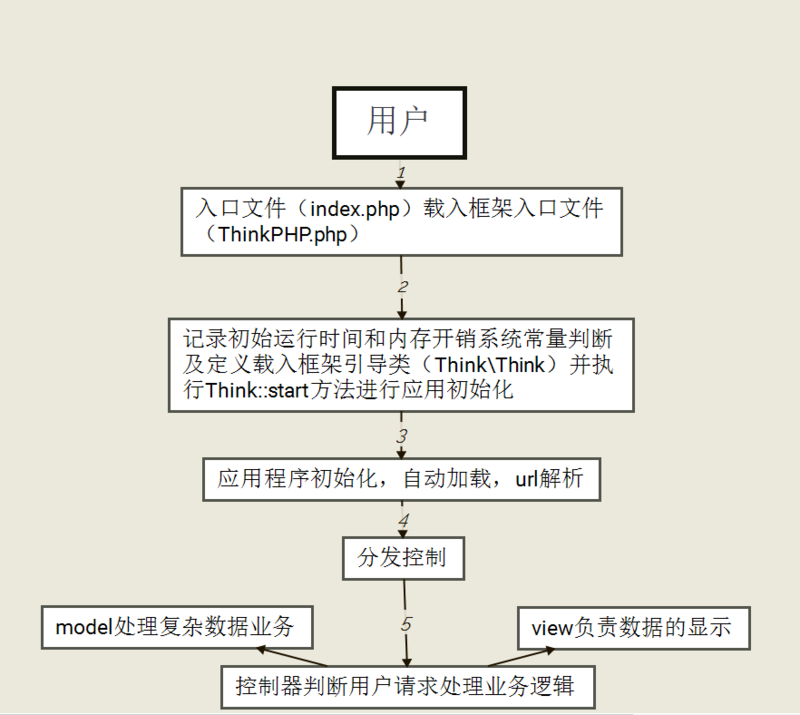
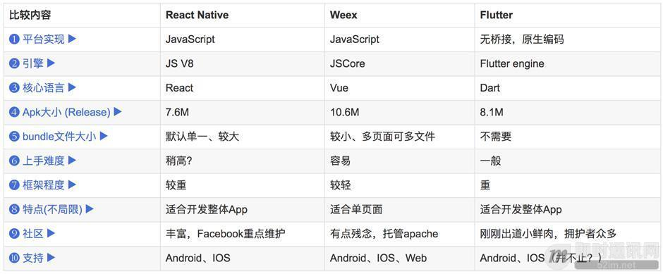

#####CGI(协议),FastCGI(常驻CGI),CLI,Web,ISAPI(PHP5.3后废弃)

##### PHP的运行模式：
> PHP两种运行模式是WEB模式、CLI模式。无论哪种模式，PHP工作原理都是一样的，作为一种SAPI运行。

+ 1、当我们在终端敲入php这个命令的时候，它使用的是CLI。
	- 它就像一个web服务器一样来支持php完成这个请求，请求完成后再重新把控制权交给终端。
+ 2、当使用Apache或者别web服务器作为宿主时，当一个请求到来时，PHP会来支持完成这个请求。一般有：
    + 多进程(通常编译为apache的模块来处理PHP请求)
    + 多线程模式

##### CGI

> CGI本质：以socket编程实现TCP或UDP协议服务器，启动时，创建TCP/UDP协议的服务器的socket监听， 并接收相关请求进行处理。这只是请求的处理，在此基础上添加模块初始化，sapi初始化，模块关闭，sapi关闭等就构成了整个CGI的生命周期。

CGI(任何语言：标准输入、输出和环境变量)：可以让一个客户端，从网页浏览器向执行在Web服务器上的程序请求数据。描述了客户端和这个程序之间传输数据的一种标准。

	每个请求，先创建CGI的子进程，处理请求，结束这个子进程，这就是Fork-And-Execute模式。
	请求数量非常多时，会大量挤占系统的资源如内存，CPU时间等，造成效能低下。
	所以用CGI方式的服务器有多少连接请求就会有多少CGI子进程，子进程反复加载是CGI性能低下的主要原因。

+ 当web server收到/index.php这个请求后，会启动对应的CGI程序，这里就是PHP的解析器。
+ 接下来PHP解析器会解析php.ini文件，初始化执行环境，然后处理请求，
+ 再以规定CGI规定的格式返回处理后的结果，退出进程。
+ web server再把结果返回给浏览器。

##### FastCGI

它可以一直执行着，只要激活后，不会每次都要花费时间去 fork 一次 (这是 CGI 最为人诟病的 fork-and-execute 模式)。 

+ Web Server启动时载入FastCGI进程管理器【PHP的FastCGI进程管理器是PHP-FPM(php-FastCGI Process Manager)】（IIS ISAPI或Apache Module)
+ FastCGI进程管理器自身初始化，启动多个CGI解释器进程 (可见多个php-cgi.exe或php-cig)并等待来自Web Server的连接；
+ 当客户端请求到达Web Server时，FastCGI进程管理器选择并连接到一个CGI解释器。Web server将CGI环境变量和标准输入发送到FastCGI子进程php-cgi
+ FastCGI子进程完成处理后将标准输出和错误信息从同一连接返回Web Server。当FastCGI子进程关闭连接时，请求便告处理完成。FastCGI子进程接着等待并处理来自FastCGI进程管理器（运行在 WebServer中）的下一个连接。
+ 在正常的CGI模式中，php-cgi.exe在此便退出了。在CGI模式中，你可以想象 CGI通常有多慢。每一个Web请求PHP都必须重新解析php.ini、重新载入全部dll扩展并重初始化全部数据结构。使用FastCGI，所有这些都只在进程启动时发生一次。一个额外的好处是，持续数据库连接（Persistent database connection）可以工作。

> 备注：PHP的FastCGI进程管理器是PHP-FPM（PHP-FastCGI Process Manager）

+ 优点
    + 从稳定性上看，FastCGI是以独立的进程池来运行CGI，单独一个进程死掉，系统可以很轻易的丢弃，然后重新分配新的进程来运行逻辑；
    + 从安全性上看，FastCGI支持分布式运算。FastCGI和宿主的Server完全独立，FastCGI怎么down也不会把Server搞垮；
    + 从性能上看，FastCGI把动态逻辑的处理从Server中分离出来，大负荷的IO处理还是留给宿主Server，这样宿主Server可以一心一意作IO，对于一个普通的动态网页来说, 逻辑处理可能只有一小部分，大量的是图片等静态。
+ 不足
	+ 因为是多进程，所以比CGI多线程消耗更多的服务器内存，PHP-CGI解释器每进程消耗7至25兆内存，将这个数字乘以50或100就是很大的内存数。

> Nginx 0.8.46+PHP 5.2.14(FastCGI)服务器在3万并发连接下，开启的10个Nginx进程消耗150M内存（15M*10=150M），开启的64个php-cgi进程消耗1280M内存（20M*64=1280M），加上系统自身消耗的内存，总共消耗不到2GB内存。如果服务器内存较小，完全可以只开启25个php-cgi进程，这样php-cgi消耗的总内存数才500M。

##### CLI

命令行运行的接口，区别于在Web服务器上运行的PHP环境（PHP-CGI，ISAPI等）。

>也就是说，PHP不单可以写前台网页，它还可以用来写后台的程序。 PHP的CLI Shell脚本适用于所有的PHP优势，使创建要么支持脚本或系统甚至与GUI应用程序的服务端，在Windows和Linux下都是支持PHP-CLI模式的。

我们在Linux下经常使用”php –m”查找PHP安装了那些扩展就是PHP命令行运行模式；

##### SAPI运行PHP都经过的几个阶段

+ 1.模块初始化阶段(Module init)
     + 即调用每个拓展源码中的的PHP_MINIT_FUNCTION中的方法初始化模块,进行一些模块所需变量的申请,内存分配等。
+ 2.请求初始化阶段(Request init)
     + 即接受到客户端的请求后调用每个拓展的PHP_RINIT_FUNCTION中的方法,初始化PHP脚本的执行环境。
+ 3.执行PHP脚本
+ 4.请求结束(Request Shutdown)
    + 这时候调用每个拓展的PHP_RSHUTDOWN_FUNCTION方法清理请求现场,并且ZE开始回收变量和内存
+ 5.关闭模块(Module shutdown)
    + Web服务器退出或者命令行脚本执行完毕退出会调用拓展源码中的PHP_MSHUTDOWN_FUNCTION 方法

##### 单进程SAPI生命周期

CLI/CGI模式的PHP属于单进程的SAPI模式。这类的请求在处理一次请求后就关闭。
> 也就是只会经过如下几个环节： 开始 - 请求开始 - 请求关闭 - 结束 SAPI接口实现就完成了其生命周期。

##### 多进程SAPI生命周期

>通常PHP是编译为apache的一个模块来处理PHP请求。

Apache一般会采用多进程模式， Apache启动后会fork出多个子进程，每个进程的内存空间独立，每个子进程都会经过开始和结束环节

> 每个进程的开始阶段只在进程fork出来以来后进行，在整个进程的生命周期内可能会处理多个请求。
只有在Apache关闭或者进程被结束之后才会进行关闭阶段，在这两个阶段之间会随着每个请求重复请求开始-请求关闭的环节。 

##### 多线程的SAPI生命周期

多线程模式和多进程中的某个进程类似，不同的是在整个进程的生命周期内会并行的重复着 请求开始-请求关闭的环节.

> 在这种模式下，只有一个服务器进程在运行着，但会同时运行很多线程，这样可以减少一些资源开销，向Module init和Module shutdown就只需要运行一遍就行了，一些全局变量也只需要初始化一次，因为线程独具的特质，使得各个请求之间方便的共享一些数据成为可能。

##### 基本执行过程：

+ 我们从未手动开启过PHP的相关进程，它是随着Apache的启动而运行的；
+ PHP通过mod_php5.so模块和Apache相连（具体说来是SAPI，即服务器应用程序编程接口）；
+ PHP总共有三个模块：内核、Zend引擎、以及扩展层；
+ PHP内核用来处理请求、文件流、错误处理等相关操作；
+ Zend引擎（ZE）用以将源文件转换成机器语言，然后在虚拟机上运行它；
+ 扩展层是一组函数、类库和流，PHP使用它们来执行一些特定的操作。比如，我们需要mysql扩展来连接MySQL数据库；
+ 当ZE执行程序时可能会需要连接若干扩展，这时ZE将控制权交给扩展，等处理完特定任务后再返还；
+ 最后，ZE将程序运行结果返回给PHP内核，它再将结果传送给SAPI层，最终输出到浏览器上。

###### 深入探讨
+ Apache启动后，PHP解释程序也随之启动；
+ PHP的启动过程有两步；
+ 第一步是初始化一些环境变量，这将在整个SAPI生命周期中发生作用；
+ 第二步是生成只针对当前请求的一些变量设置。
    
###### PHP启动第一步
　　不清楚什么第一第二步是什么？别担心，我们接下来详细讨论一下。让我们先看看第一步，也是最主要的一步。要记住的是，第一步的操作在任何请求到达之前就发生了。

    启动Apache后，PHP解释程序也随之启动；
    PHP调用各个扩展的MINIT方法，从而使这些扩展切换到可用状态。看看php.ini文件里打开了哪些扩展吧；
    MINIT的意思是“模块初始化”。各个模块都定义了一组函数、类库等用以处理其他请求。

　　一个典型的MINIT方法如下：
PHP_MINIT_FUNCTION(extension_name){
/* Initialize functions, classes etc */
}

###### PHP启动第二步

    当一个页面请求发生时，SAPI层将控制权交给PHP层。于是PHP设置了用于回复本次请求所需的环境变量。同时，它还建立一个变量表，用来存放执行过程中产生的变量名和值。
    PHP调用各个模块的RINIT方法，即“请求初始化”。一个经典的例子是Session模块的RINIT，如果在php.ini中启用了Session模块，那在调用该模块的RINIT时就会初始化$_SESSION变量，并将相关内容读入；
    RINIT方法可以看作是一个准备过程，在程序执行之间就会自动启动。

　　一个典型的RINIT方法如下：

	PHP_RINIT_FUNCTION(extension_name) {
	/* Initialize session variables, pre-populate variables, redefine global variables etc */
	}

###### PHP关闭第一步
　　如同PHP启动一样，PHP的关闭也分两步：

    一旦页面执行完毕（无论是执行到了文件末尾还是用exit或die函数中止），PHP就会启动清理程序。它会按顺序调用各个模块的RSHUTDOWN方法。
    RSHUTDOWN用以清除程序运行时产生的符号表，也就是对每个变量调用unset函数。

　　一个典型的RSHUTDOWN方法如下：
PHP_RSHUTDOWN_FUNCTION(extension_name) {
/* Do memory management, unset all variables used in the last PHP call etc */
}

###### PHP关闭第二步
　　最后，所有的请求都已处理完毕，SAPI也准备关闭了，PHP开始执行第二步：

    PHP调用每个扩展的MSHUTDOWN方法，这是各个模块最后一次释放内存的机会。

　　一个典型的RSHUTDOWN方法如下：

	PHP_MSHUTDOWN_FUNCTION(extension_name) {
	/* Free handlers and persistent memory etc */
	}

　　这样，整个PHP生命周期就结束了。要注意的是，只有在服务器没有请求的情况下才会执行“启动第一步”和“关闭第二步”。

##### PHP底层
 
+ ①Zend引擎

	+ Zend整体用纯c实现，是php的内核部分，它将php代码翻译（词法、语法解析等一系列编译过程）为可执行opcode的处理并实现相应的处理方法、实现了基本的数据结构（如hashtable、oo）、内存分配及管理、提供了相应的api方法供外部调用，是一切的核心，所有的外围功能均围绕zend实现。

+ ②Extensions

	+ 围绕着zend引擎，extensions通过组件式的方式提供各种基础服务，我们常见的各种内置函数（如array系列）、标准库等都是通过extension来实现，用户也可以根据需要实现自己的extension以达到功能扩展、性能优化等目的（如贴吧正在使用的php中间层、富文本解析就是extension的典型应用）。

+ ③Sapi

	+ Sapi全称是Server Application Programming Interface，也就是服务端应用编程接口，sapi通过一系列钩子函数，使得php可以和外围交互数据，这是php非常优雅和成功的一个设计，通过sapi成功的将php本身和上层应用解耦隔离，php可以不再考虑如何针对不同应用进行兼容，而应用本身也可以针对自己的特点实现不同的处理方式。后面将在sapi章节中介绍

+ ④上层应用

	+ 这就是我们平时编写的php程序，通过不同的sapi方式得到各种各样的应用模式，如通过webserver实现web应用、在命令行下以脚本方式运行等等。

###### 构架思想：

> 引擎(Zend)+组件(ext)的模式降低内部耦合

> 中间层(sapi)隔绝web server和php

##### LAMP架构：从下往上四层：

+ ①liunx 属于操作系统的底层

+ ②apache服务器，属于次服务器，沟通linux和PHP

+ ③php:属于服务端编程语言，通过php_module 模块 和apache关联

+ ④mysql和其他web服务：属于应用服务，通过PHP的Extensions外 挂模块和mysql关联

##### Apache请求处理循环详解 

Apache请求处理循环的11个阶段都做了哪些事情呢？

+ 1、Post-Read-Request阶段
    + 在正常请求处理流程中，这是模块可以插入钩子的第一个阶段。对于那些想很早进入处理请求的模块来说，这个阶段可以被利用。
+ 2、URI Translation阶段 
    + Apache在本阶段的主要工作：将请求的URL映射到本地文件系统。模块可以在这阶段插入钩子，执行自己的映射逻辑。mod_alias就是利用这个阶段工作的。
+ 3、Header Parsing阶段 
    + Apache在本阶段的主要工作：检查请求的头部。由于模块可以在请求处理流程的任何一个点上执行检查请求头部的任务，因此这个钩子很少被使用。mod_setenvif就是利用这个阶段工作的。
+ 4、Access Control阶段 
    + Apache在本阶段的主要工作：根据配置文件检查是否允许访问请求的资源。Apache的标准逻辑实现了允许和拒绝指令。mod_authz_host就是利用这个阶段工作的。
+ 5、Authentication阶段 
     + Apache在本阶段的主要工作：按照配置文件设定的策略对用户进行认证，并设定用户名区域。模块可以在这阶段插入钩子，实现一个认证方法。
+ 6、Authorization阶段 
    + Apache在本阶段的主要工作：根据配置文件检查是否允许认证过的用户执行请求的操作。模块可以在这阶段插入钩子，实现一个用户权限管理的方法。
+ 7、MIME Type Checking阶段 
    + Apache在本阶段的主要工作：根据请求资源的MIME类型的相关规则，判定将要使用的内容处理函数。标准模块mod_negotiation和mod_mime实现了这个钩子。
+ 8、FixUp阶段 
    + 这是一个通用的阶段，允许模块在内容生成器之前，运行任何必要的处理流程。和Post_Read_Request类似，这是一个能够捕获任何信息的钩子，也是最常使用的钩子。
+ 9、Response阶段 
    + Apache在本阶段的主要工作：生成返回客户端的内容，负责给客户端发送一个恰当的回复。这个阶段是整个处理流程的核心部分。
+ 10、Logging阶段 
    + Apache在本阶段的主要工作：在回复已经发送给客户端之后记录事务。模块可能修改或者替换Apache的标准日志记录。
+ 11、CleanUp阶段 
    + Apache在本阶段的主要工作：清理本次请求事务处理完成之后遗留的环境，比如文件、目录的处理或者Socket的关闭等等，这是Apache一次请求处理的最后一个阶段。
    
    
##### php生命周期(5块)

1. 模块初始化阶段  ---   php_module_startup()
2. 请求初始化阶段  ---   php_request_startup()
3. 执行脚本阶段     ---   php_execute_script()
4. 请求关闭阶段     ---   php_request_shutdown()
5. 模块关闭阶段     ---   php_module_shutdown()

##### 方法对比 

+ 获取请求方法
	+ $request->method()	<-—>Laravel 5
	+ request()->method()	<-—>ThinkPHP 5
	+ $request->method	<-—>Yii 2
+ 是否GET
	+ $request->isMethod(‘get’)	<-—>Laravel 5
	+ request()->isGet()	<-—>ThinkPHP 5
	+ $request->isGet	<-—>Yii 2
+ 是否POST
	+ $request->isMethod(‘post’)	<-—>Laravel 5
	+ request()->isPost()	<-—>ThinkPHP 5
	+ $request->isPost	<-—>Yii 2
+ 是否Ajax
	+ $request->ajax()	<-—>Laravel 5
	+ request()->isAjax()	<-—>ThinkPHP 5
	+ $request->isAjax	<-—>Yii 2

##### Laravel 的生命周期
+ 1、Laravel 采用了单一入口模式，应用的所有请求入口都是 public/index.php 文件。
+ 2、注册类文件自动加载器 : Laravel通过 composer 进行依赖管理，无需开发者手动导入各种类文件，而由自动加载器自行导入。
+ 3、创建服务容器：从 bootstrap/app.php 文件中取得 Laravel 应用实例 $app (服务容器)
	+ 创建 HTTP / Console 内核：传入的请求会被发送给 HTTP 内核或者 console 内核进行处理
+ 4、载入服务提供者至容器：在内核引导启动的过程中最重要的动作之一就是载入服务提供者到你的应用，服务提供者负责引导启动框架的全部各种组件，例如数据库、队列、验证器以及路由组件。
+ 5、分发请求：一旦应用完成引导和所有服务提供者都注册完成，Request 将会移交给路由进行分发。路由将分发请求给一个路由或控制器，同时运行路由指定的中间件

##### Yii2生命周期
+ 1.用户向入口脚本 web/index.php 发起请求。
+ 2.入口脚本加载应用配置并创建一个应用 实例去处理请求。
+ 3.应用通过请求组件解析请求的 路由。
+ 4.应用创建一个控制器实例去处理请求。
+ 5.控制器创建一个动作实例并针对操作执行过滤器。
+ 6.如果任何一个过滤器返回失败，则动作取消。
+ 7.如果所有过滤器都通过，动作将被执行。
+ 8.动作会加载一个数据模型，或许是来自数据库。
+ 9.动作会渲染一个视图，把数据模型提供给它。
+ 10.渲染结果返回给响应组件。
+ 11.响应组件发送渲染结果给用户浏览器。

##### Tp5生命周期

+ 1、入口文件

用户发起的请求都会经过应用的入口文件，通常是 public/index.php文件。当然，你也可以更改或者增加新的入口文件。

通常入口文件的代码都比较简单，一个普通的入口文件代码如下：

	// 应用入口文件
	
	// 定义项目路径
	define('APP_PATH', __DIR__ . '/../application/');
	// 加载框架引导文件
	require __DIR__ . '/../thinkphp/start.php';

一般入口文件以定义一些常量为主，支持的常量请参考后续的内容或者附录部分。

    通常，我们不建议在应用入口文件中加入过多的代码，尤其是和业务逻辑相关的代码。

+ 2、引导文件

接下来就是执行框架的引导文件，start.php文件就是系统默认的一个引导文件。在引导文件中，会依次执行下面操作：

    加载系统常量定义；
    加载环境变量定义文件；
    注册自动加载机制；
    注册错误和异常处理机制；
    加载惯例配置文件；
    执行应用；

start.php引导文件首先会调用base.php基础引导文件，某些特殊需求下面可能直接在入口文件中引入基础引导文件。

    如果在你的应用入口文件中更改了默认的引导文件，则上述执行流程可能会跟随发生变化。

+ 3、注册自动加载

系统会调用 Loader::register()方法注册自动加载，在这一步完成后，所有符合规范的类库（包括Composer依赖加载的第三方类库）都将自动加载。

系统的自动加载由下面主要部分组成：

    注册系统的自动加载方法 \think\Loader::autoload
    注册系统命名空间定义
    加载类库映射文件（如果存在）
    如果存在Composer安装，则注册**Composer**自动加载
    注册extend扩展目录

一个类库的自动加载检测顺序为：

    是否定义类库映射；
    PSR-4自动加载检测；
    PSR-0自动加载检测；

可以看到，定义类库映射的方式是最高效的。

+ 4、注册错误和异常机制

执行Error::register()注册错误和异常处理机制。

由三部分组成：

    应用关闭方法：think\Error::appShutdown
    错误处理方法：think\Error::appError
    异常处理方法：think\Error::appException

> 注册应用关闭方法是为了便于拦截一些系统错误。

在整个应用请求的生命周期过程中，如果抛出了异常或者严重错误，均会导致应用提前结束，并响应输出异常和错误信息。

+ 5、应用初始化

执行应用的第一步操作就是对应用进行初始化，包括：

    加载应用（公共）配置；
    加载扩展配置文件（由extra_config_list定义）；
    加载应用状态配置；
    加载别名定义；
    加载行为定义；
    加载公共（函数）文件；
    注册应用命名空间；
    加载扩展函数文件（由extra_file_list定义）；
    设置默认时区；
    加载系统语言包；

+ 6、URL访问检测

应用初始化完成后，就会进行URL的访问检测，包括PATH_INFO检测和URL后缀检测。

5.0的URL访问必须是PATH_INFO方式（包括兼容方式）的URL地址，例如：

> http://serverName/index.php/index/index/hello/val/value

所以，如果你的环境只能支持普通方式的URL参数访问，那么必须使用

> http://serverName/index.php?s=/index/index/hello&val=value

如果是命令行下面访问入口文件的话，则通过

> $php index.php index/index/hello/val/value...

获取到正常的$_SERVER['PATH_INFO']参数后才能继续。

+ 7、路由检测

如果开启了url_route_on参数的话，会首先进行URL的路由检测。

如果一旦检测到匹配的路由，根据定义的路由地址会注册到相应的URL调度。
5.0的路由地址支持如下方式：

    路由到模块/控制器/操作；
    路由到外部重定向地址；
    路由到控制器方法；
    路由到闭包函数；
    路由到类的方法；

> 路由地址可能会受域名绑定的影响。

如果关闭路由或者路由检测无效则进行默认的模块/控制器/操作的分析识别。

    如果在应用初始化的时候指定了应用调度方式，那么路由检测是可选的。
    可以使用 \think\App::dispatch() 进行应用调度，例如：
    App::dispatch(['type' => 'module', 'module' => 'index/index']);

+ 8、分发请求

在完成了URL检测和路由检测之后，路由器会分发请求到对应的路由地址，这也是应用请求的生命周期中最重要的一个环节。

> 在这一步骤中，完成应用的业务逻辑及数据返回。

建议统一使用return返回数据，而不是echo输出，如非必要，请不要使用exit或者die中断执行。

> 直接echo输出的数据将无法进行自动转换响应输出的便利。

下面是系统支持的分发请求机制，可以根据情况选择：

###### 模块/控制器/操作

这是默认的分发请求机制，系统会根据URL或者路由地址来判断当前请求的模块、控制器和操作名，并自动调用相应的访问控制器类，执行操作对应的方法。
该机制下面，首先会判断当前模块，并进行模块的初始化操作（和应用的初始化操作类似），模块的配置参数会覆盖应用的尚未生效的配置参数。

> 支持模块映射、URL参数绑定到方法，以及操作绑定到类等一些功能。

###### 控制器方法

和前一种方式类似，只是无需判断模块、控制器和操作，直接分发请求到一个指定的控制器类的方法，因此没有进行模块的初始化操作。

###### 外部重定向

可以直接分发请求到一个外部的重定向地址，支持指定重定向代码，默认为301重定向。

###### 闭包函数

路由地址定义的时候可以直接采用闭包函数，完成一些相对简单的逻辑操作和输出。

###### 类的方法

除了以上方式外，还支持分发请求到类的方法，包括：
	静态方法： 'blog/:id'=>'\org\util\Blog::read'
	类的方法：'blog/:id'=>'\app\index\controller\Blog@read'

+ 9、响应输出

控制器的所有操作方法都是return返回而不是直接输出，系统会调用Response::send方法将最终的应用返回的数据输出到页面或者客户端，并自动转换成default_return_type参数配置的格式。所以，应用执行的数据输出只需要返回一个正常的PHP数据即可。

+ 10、应用结束

事实上，在应用的数据响应输出之后，应用并没真正的结束，系统会在应用输出或者中断后进行日志保存写入操作。

> 系统的日志包括用户调试输出的和系统自动生成的日志，统一会在应用结束的时候进行写入操作。

而日志的写入操作受日志初始化的影响。

##### 一切的开始: SAPI接口

通常我们编写php Web程序都是通过Apache或者Nginx这类Web服务器来测试脚本. 或者在命令行下通过php程序来执行PHP脚本. 执行完成脚本后，服务器应答，浏览器显示应答信息,或者在命令结束后在标准输出显示内容. 我们很少关心PHP解释器在哪里. 虽然通过Web服务器和命令行程序执行脚本看起来很不一样. 实际上她们的工作是一样的. 命令行程序和Web程序类似, 命令行参数传递给要执行的脚本,相当于通过url 请求一个PHP页面. 脚本戳里完成后返回响应结果,只不过命令行响应的结果是显示在终端上. 脚本执行的开始都是通过SAPI接口进行的. 

+ 1)、启动apache：当给定的SAPI启动时，例如在对/usr/local/apache/bin/apachectl start的响应中，PHP由初始化其内核子系统开始。在接近启动例程的末尾，它加载每个扩展的代码并调用其模块初始化例程（MINIT）。这使得每个扩展可以初始化内部变量、分配资源、注册资源处理器，以及向ZE注册自己的函数，以便于脚本调用这其中的函数时候ZE知道执行哪些代码。

+ 2)、请求处理初始化：接下来，PHP等待SAPI层请求要处理的页面。对于CGI或CLI等SAPI，这将立刻发生且只发生一次。对于Apache、IIS或其他成熟的web服务器SAPI，每次远程用户请求页面时都将发生，因此重复很多次，也可能并发。不管请求如何产生，PHP开始于要求ZE建立脚本的运行环境，然后调用每个扩展的请求初始化 （RINIT）函数。RINIT使得扩展有机会设定特定的环境变量，根据请求分配资源，或者执行其他任务，如审核。 session扩展中有个RINIT作用的典型示例，如果启用了session.auto_start选项，RINIT将自动触发用户空间的session_start()函数以及预组装$_SESSION变量。

+ 3)、执行php代码： 一旦请求被初始化了，ZE开始接管控制权，将PHP脚本翻译成符号，最终形成操作码并逐步运行之。如任一操作码需要调用扩展的函数，ZE将会把参数绑定到该函数，并且临时交出控制权直到函数运行结束。

+ 4)、脚本结束：脚本运行结束后，PHP调用每个扩展的请求关闭（RSHUTDOWN）函数以执行最后的清理工作（如将session变量存入磁盘）。接下来，ZE执行清理过程（垃圾收集）－有效地对之前的请求期间用到的每个变量执行unset()。

+ 5)、sapi关闭：一旦完成，PHP继续等待SAPI的其他文档请求或者是关闭信号。对于CGI和CLI等SAPI，没有“下一个请求”，所以SAPI立刻开始关闭。关闭期间，PHP再次遍历每个扩展，调用其模块关闭（MSHUTDOWN）函数，并最终关闭自己的内核子系统。

简要的过程如下：

  1. PHP是随着Apache的启动而运行的；
  2. PHP通过mod_php5.so模块和Apache相连（具体说来是SAPI，即服务器应用程序编程接口）；
  3. PHP总共有三个模块：内核、Zend引擎、以及扩展层；
  4. PHP内核用来处理请求、文件流、错误处理等相关操作；
  5. Zend引擎（ZE）用以将源文件转换成机器语言，然后在虚拟机上运行它；
  6. 扩展层是一组函数、类库和流，PHP使用它们来执行一些特定的操作。比如，我们需要mysql扩展来连接MySQL数据库；
  7. 当ZE执行程序时可能会需要连接若干扩展，这时ZE将控制权交给扩展，等处理完特定任务后再返还；
  8. 最后，ZE将程序运行结果返回给PHP内核，它再将结果传送给SAPI层，最终输出到浏览器上。

##### Apache一般使用多进程模式prefork

在linux下使用#http –l 命令可以查看当前使用的工作模式。也可以使用#apachectl -l命令。
> 看到的prefork.c，说明使用的prefork工作模式。

prefork 进程池模型，用在 UNIX 和类似的系统上比较多，主要是由于写起来方便，也容易移植，还不容易出问题。要知道，如果采用线程模型的话，用户线程、内核线程和混合型线程有不同的特性，移植起来就麻烦。prefork 模型，即预先 fork() 出来一些子进程缓冲一下，用一个锁来控制同步，连接到来了就放行一个子进程，让它去处理。

    prefork MPM 使用多个子进程，每个子进程只有一个线程。每个进程在某个确定的时间只能维持一个连接。在大多数平台上，Prefork MPM在效率上要比Worker MPM要高，但是内存使用大得多。prefork的无线程设计在某些情况下将比worker更有优势：他能够使用那些没有处理好线程安全的第三方模块，并 且对于那些线程调试困难的平台而言，他也更容易调试一些。

##### PHP的开始和结束阶段

+ 开始阶段有两个过程：

	+ 第一个过程: apache启动的过程，即在任何请求到达之前就发生。
     
是在整个SAPI生命周期内(例如Apache启动以后的整个生命周期内或者命令行程序整个执行过程中)的开始阶段(MINIT),该阶段只进行一次.。启动Apache后，PHP解释程序也随之启动； PHP调用各个扩展（模块）的MINIT方法，从而使这些扩展切换到可用状态。看看php.ini文件里打开了哪些扩展吧； MINIT的意思是“模块初始化”。各个模块都定义了一组函数、类库等用以处理其他请求。 模块在这个阶段可以进行一些初始化工作,例如注册常量, 定义模块使用的类等等.
     
典型的的模块回调函数MINIT方法如下：

    PHP_MINIT_FUNCTION(myphpextension) { /* Initialize functions, classes etc */ }
    {
        // 注册常量或者类等初始化操作
        return SUCCESS; 
    }

	+ 第二个过程: 发生在请求阶段,当一个页面请求发生时.则在每次请求之前都会进行初始化过程(RINIT请求开始).

请求到达之后，SAPI层将控制权交给PHP层，PHP初始化本次请求执行脚本所需的环境变量,例如创建一个执行环境,包括保存php运行过程中变量名称和变量值内容的符号表. 以及当前所有的函数以及类等信息的符号表.例如是Session模块的RINIT，如果在php.ini中启用了Session 模块，那在调用该模块的RINIT时就会初始化$_SESSION变量，并将相关内容读入；  然后PHP会调用所有模块RINIT函数,即“请求初始化”。 在这个阶段各个模块也可以执行一些相关的操作, 模块的RINIT函数和MINIT函数类似 ，RINIT方法可以看作是一个准备过程，在程序执行之间就会自动启动。

    PHP_RINIT_FUNCTION(myphpextension)
    {
        // 例如记录请求开始时间
        // 随后在请求结束的时候记录结束时间.这样我们就能够记录下处理请求所花费的时间了
        return SUCCESS; 
    }

+ 结束阶段分为两个环节：

请求处理完后就进入了结束阶段, 一般脚本执行到末尾或者通过调用exit()或者die()函数,PHP都将进入结束阶段. 和开始阶段对应,结束阶段也分为两个环节,一个在请求结束后(RSHUWDOWN),一个在SAPI生命周期结束时(MSHUTDOWN).

	+ 第一个环节：请求处理完后结束阶段：请求处理完后就进入了结束阶段，PHP就会启动清理程序。它会按顺序调用各个模块的RSHUTDOWN方法。 RSHUTDOWN用以清除程序运行时产生的符号表，也就是对每个变量调用unset函数。典型的RSHUTDOWN方法如下：

    PHP_RSHUTDOWN_FUNCTION(myphpextension)
    {
        // 例如记录请求结束时间, 并把相应的信息写入到日至文件中.
        return SUCCESS; 
    }

	+ 第二个环节：最后，所有的请求都已处理完毕，SAPI也准备关闭了， PHP调用每个扩展的MSHUTDOWN方法，这是各个模块最后一次释放内存的机会。（这个是对于CGI和CLI等SAPI，没有“下一个请求”，所以SAPI立刻开始关闭。）

典型的RSHUTDOWN方法如下：

	PHP_MSHUTDOWN_FUNCTION(extension_name) { 
	    /* Free handlers and persistent memory etc */ 
	    return SUCCESS; 
	}

这样，整个PHP生命周期就结束了。要注意的是，只有在服务器没有请求的情况下才会执行“启动第一步”和“关闭第二步”。

##### 依赖注入

依赖倒置原则，它转换了依赖，高层模块不依赖于低层模块的实现，而低层模块依赖于高层模块定义的接口。通俗的讲，就是高层模块定义接口，低层模块负责实现。

> 最早在java的spring提出了依赖注入的思想，即依赖类不由程序员实例化，而是通过spring容器帮我们new指定实例并且将实例注入到需要该对象的类中。目前许多主流PHP框架也使用了依赖注入容器，如ThinkPHP、Laravel等。

+ 容器：装对象、对象的描述（类、接口）或者是提供对象的回调(闭包)，可以实现 “解耦”、“依赖注入”。

##### IoC - Inversion of Control 控制反转 
控制反转是从容器的角度在描述，即：容器控制应用程序，由容器反向的向应用程序注入应用程序所需要的外部资源。 

##### DI - Dependency Injection 依赖注入 
依赖注入是从应用程序的角度在描述，可以把依赖注入，即：应用程序依赖容器创建并注入它所需要的外部资源。

备注：依赖注入和控制反转说的是同一个东西，是一种设计模式，这种设计模式用来减少程序间的耦合，从某个方面讲，就是它们描述的角度不同。 

依赖注入的思想就是即用即实例，反转类与类之间的控制关系，实现由调用类A类控制后续的依赖关系，这样可以让B类随意的更改所需依赖和实例化的类（C类或D类），达到解耦的目的。

##### 依赖注入方式：

> 1、构造方法注入；2、set属性注入；3、静态工厂方法注入；

上述的例子使用的就是构造方法注入的方式，将对象作为参数传递到构造方法中；同样的set属性注入也是相类似的方法，不同的仅仅是在set一个类的成员的属性时传递这个对象参数，在此就不一一举例了。
除此之外，还有静态工厂方法注入的方式，这种方法与静态工厂方法类似。
我们知道静态工厂方法就是通过一个类来管理需要实例化的多个相似的类，该类会定义一个方法用于获取需要实例化的对象，而具体要实例化哪个对象就依赖于传递进来的对象名参数了。

对于静态工厂方式的注入，与一般的静态工厂方法不同之处在于这个传进来的参数是一个已经实例化过的对象。

##### 依赖注入容器(Ioc容器)
大多数时侯，在使用依赖注入方式解耦组件时，并不需要用到容器。
当一段程序需要实例化的类太多或者依赖太多的时候，重复依赖注入的代码是比较繁琐的事情

> 思路是应用程序需要到A类，就从容器内取得A类。具体过程是容器创建C类，再创建B类并把C注入，再创建A类，并把B类注入A。应用程序调用A类方法， A类调用B类方法，接着做些其它工作.总之容器负责实例化，注入依赖，处理依赖关系等工作。

对于实际开发中复杂多变的代码环境，我们并不能完全知道现在的类在未来会扩展成什么情况，因此我们需要在有新的依赖类加入的时候，通过容器去实现实例化该类的方法。因此，在实例化未知类的时候，最能探索一个类的内部结构和实例化的方法就是利用反射，由此可知，反射是容器管理各个依赖类的核心。

+ IOC的基本概念是：
	+ 不创建对象，但是描述创建它们的方式。在代码中不直接与对象和服务连接，但在配置文件中描述哪一个组件需要哪一项服务。Spring容器负责将这些联系在一起。也就是说，Spring的IOC负责管理各种对象的创建、清除以及它们之间的联系。

+ IoC思想
	+ IoC核心思想是通过IoC容器管理对象的生成、资源取得、销毁等生命周期，在IoC容器中建立对象与对象之间的依赖关系，IoC容器启动后，所有对象直接取用，不再使用new操作符产生对象和建立对象之间的依赖关系。
在开始讲解之前，首先明确一件事：IoC不是一种编程技术，它是一种优雅的编程思想。如果您正在阅读相关框架源码，或者正在写一个自己的框架，不妨花半个小时阅读一下这篇文章，读完这篇文章你或许会对某些框架的源码细节茅塞顿开，你也可以将IoC的思想运用在你自己的框架中。

##### 相关概念
+ 依赖倒置原则（DIP）：一种软件架构设计的原则（抽象概念）。

+ 控制反转（IoC）：一种反转流、依赖和接口的方式（DIP的具体实现方式）。

+ 依赖注入（DI）：IoC的一种实现方式，用来反转依赖（IoC的具体实现方式）。

+ IoC容器：依赖注入的框架，用来映射依赖，管理对象创建和生存周期（DI框架）。

+ IoC - Inversion of Control  控制反转

+ DI  - Dependency Injection  依赖注入

依赖注入和控制反转说的实际上是同一个东西，它们是一种设计模式，这种设计模式用来减少程序间的耦合

##### 面向应用部署托管

+ BAE：百度
+ SAE：新浪
+ GAE：骨骼

从数据库、应用配置、计费、域名绑定、平台服务对比了 BAE、SAE 以及 GAE 的优劣，最后给出云平台选型的建议。

+ SAE 不支持 InnoDB（可申请支持），BAE 默认支持。

+ BAE 不支持数据库连接池（c3p0、BoneCP 已测不支持），数据库连接不能长时间保持。

+ GAE 使用 Datasotre 存取数据，最近也提供了云 SQL（MySQL），但申请比较困难，配额/性能笔者未测试过。

另外，SAE 显式给出了主从库的访问方式，应用可以比较灵活地设计存取策略，例如读写分离。并且 SAE 是每个应用都拥有自己的数据库，而 BAE 是所有应用共用一个库。

GAE 提供了比较完整的服务平台，覆盖了应用的生命周期，最近也提供了云 MySQL服务以吸引更多开发者。GAE相对于国内云SAE和BAE来说开源性更好，技术更成熟，平台更稳定，易用性更强，但GFW的存在使‘被墙’的问题始终是GAE的一大劣势。

> 相比GAE，国内SAE 与 BAE 主要还是面向应用部署托管，普通应用修改后易迁移部署到 BAE 或SAE。新应用开发可以选择和平台绑死（依赖平台服务）或按照普通应用开发。使用配置工具来上传、更新应用配置其实是非常好的方式，但目前 SAE、BAE都没有提供客户端配置工具，这增加了使用者的维护工作量，也使得开发者的开发难度相对较大。

SAE相对BAE来说开发时间更长，技术要比BAE完善，对于国内开发者来说SAE的最大优点是速度快，但缺点也还存在，比如访问不稳定，说明文档少，对API的支持和说明极其简陋等，而且，由于SAE刚开发的时候是从支持PHP+sql入手，故目前对Python的支持不是很好。而对于BAE来说，最大的优点是具有百度的巨大平台和搜索引擎，但其开发时间短，目前支持的服务有限，相比于SAE来说要差一些。

##### TPS&&QPS

###### 一、TPS：

> Transactions Per Second（每秒传输的事物处理个数），即服务器每秒处理的事务数。TPS包括一条消息入和一条消息出，加上一次用户数据库访问。（业务TPS = CAPS × 每个呼叫平均TPS）

TPS是软件测试结果的测量单位。一个事务是指一个客户机向服务器发送请求然后服务器做出反应的过程。客户机在发送请求时开始计时，收到服务器响应后结束计时，以此来计算使用的时间和完成的事务个数。

一般的，评价系统性能均以每秒钟完成的技术交易的数量来衡量。系统整体处理能力取决于处理能力最低模块的TPS值。

###### 二、QPS：

> 每秒查询率QPS是对一个特定的查询服务器在规定时间内所处理流量多少的衡量标准，在因特网上，作为域名系统服务器的机器的性能经常用每秒查询率来衡量。

对应fetches/sec，即每秒的响应请求数，也即是最大吞吐能力。

> 在日常工作中，我们会有时会开慢查询去记录一些执行时间比较久的SQL语句，找出这些SQL语句并不意味着完事了，些时我们常常用到explain这个命令来查看一个这些SQL语句的执行计划，查看该SQL语句有没有使用上了索引，有没有做全表扫描，这都可以通过explain命令来查看。所以我们深入了解MySQL的基于开销的优化器，还可以获得很多可能被优化器考虑到的访问策略的细节，以及当运行SQL语句时哪种策略预计会被优化器采用。（QEP：sql生成一个执行计划query Execution plan）

##### SQL的执行过程；
+ 1. 客户端发送一条查询给服务器；
+ 2. 服务器通过权限检查之后,先会检查查询缓存，如果命中了缓存，则立即返回存储在缓存中的结果。否则进入下一阶段；
+ 3. 服务器端进行SQL解析、预处理，再由优化器根据该SQL所涉及到的数据表的统计信息进行计算，生成对应的执行计划；
+ 4. MySQL根据优化器生成的执行计划，调用存储引擎的API来执行查询；
+ 5. 将结果返回给客户端。

SQL执行的最大瓶颈在于磁盘的IO，即数据的读取；不同SQL的写法，会造成不同的执行计划的执行，而不同的执行计划在IO的上面临完全不一样的数量级，从而造成性能的差距；
所以,我们说,优化SQL,其实就是让查询优化器根据程序猿的计划选择匹配的执行计划,来减少查询中产生的IO;

##### JOIN:
+ 1,JOIN的原理:
   + 在mysql中使用Nested Loop Join来实现join；
   + A JOIN B：通过A表的结果集作为循环基础，一条一条的通过结果集中的数据作为过滤条件到下一个表中查询数据，然后合并结果；

+ 2,JOIN的优化原则:
	+ 1，尽可能减少Join 语句中的Nested Loop 的循环总次数，用小结果集驱动大结果集；
	+ 2，优先优化Nested Loop 的内层循环；
	+ 3，保证Join 语句中被驱动表上Join 条件字段已经被索引；
	+ 4，扩大join buffer的大小；

##### AST: Abstract Syntax Tree, 抽象语法树

AST在PHP编译过程作为一个中间件的角色, 替换原来直接从解释器吐出opcode的方式, 让解释器(parser)和编译器(compliler)解耦, 可以减少一些Hack代码, 同时, 让实现更容易理解和可维护.

+ PHP5 : PHP代码 -> Parser语法解析 -> OPCODE -> 执行 
+ PHP7 : PHP代码 -> Parser语法解析 -> AST -> OPCODE -> 执行

##### TDD&&BDD&&DDD

+ 1. TDD
	+ TDD指的是Test Drive Development，很明显的意思是测试驱动开发
+ 2. BDD
	+ BDD指的是Behavior Drive Development，也就是行为驱动开发
+ 3. DDD
	+ DDD指的是Domain Drive Design，也就是领域驱动开发

> 分层式设计可以达至如下目的：分散关注、松散耦合、逻辑复用、标准定义。

##### 持久层Persistence：
把数据保存起来，一般是指保存至数据库或者文件，也可以负责完成与之相关的行为。Java中的Hibernate做的就是持久化的操作，主要是对数据库底层的OR映射，这样我们就不必关心讨厌的关系映射了，直接操作对象就可以了。

##### DAL  Data Access Layer，数据访问层
DAL是三层架构(表现层，业务逻辑层，数据访问层)中的数据访问层，是一个概念或者说是一个方案，它由许多DAO组成，或者说由DAO具体实现，是把和数据库相关的代码封装起来，这样当我们执行分库时，便只用调整DAO的代码了，模型根本不用关心它使用的数据是放在A库还是B库。

> 设计数据访问层接口的目的是让业务逻辑层不去调用具体的数据访问层的实现（不依赖于数据访问层具体的实现技术），这样的好处是，业务逻辑不必管数据访问层具体是什么技术来实现的，接口是不变的。

##### DAO data access object，数据访问对象，
DAO是一个软件设计的指导原则，在核心J2EE模式中是这样介绍DAO模式的：为了建立一个健壮的J2EE应用，应该将所有对数据源的访问操作抽象封装在一个公共API中。用程序设计的语言来说，就是建立一个接口，接口中定义了此应用程序中将会用到的所有事务方法。在这个应用程序中，当需要和数据源进行交互的时候则使用这个接口，并且编写一个单独的类来实现这个接口在逻辑上对应这个特定的数据存储。

> 顾名思义就是与数据库打交道，夹在业务逻辑与数据库资源中间，是DAL的具体实现。
简单的说 dao层 就是对数据库中数据的增删改查等操作封装在专门的类里面，在业务逻辑层中如果要访问数据的时候，直接调用该dao类（包括了如何访问数据库和数据的增删改查等等代码），就可以返回数据，而不需要再在业务逻辑层中写这些代码。

##### ORM object-relational mapping，对象关系映射
ORM也是一种对数据库访问的封装，然而ORM不像DAO只是一种软件设计的指导原则，强调的是系统应该层次分明，更像是一种工具，有着成熟的产品，比如JAVA界非常有名的Hibernate，以及很多PHP框架里自带的ORM库。他们的好处在于能将你程序中的数据对象自动地转化为关系型数据库中对应的表和列，数据对象间的引用也可以通过这个工具转化为表之间的JOIN。

> 使用ORM的好处就是使得你的开发几乎不用接触到SQL语句。创建一张表，声明一个对应的类，然后你就只用和这个类的实例进行交互了，至于这个对象里的数据该怎么存储又该怎么获取，通通不用关心。

##### Active Record
Active Record则是随着ruby on rails的流行而火起来的一种ORM模式，它是把负责持久化的代码也集成到数据对象中，即这个数据对象知道怎样把自己存到数据库里。这与以往的ORM有不同，传统的ORM会把数据对象和负责持久化的代码分开，数据对象只是一个单纯包含数据的结构体，在模型层和ORM层中传递。而在Active Record中，模型层集成了ORM的功能，他们既代表实体，包含业务逻辑，又是数据对象，并负责把自己存储到数据库中，当然，存储的这一部分代码是早已在模型的父类中实现好了的，属于框架的一部分，模型只需简单的调用父类的方法来完成持久化而已。

> 遵循标准的ORM模型：表映射到记录，记录映射到对象，字段映射到对象属性。配合遵循的命名和配置惯例，能够很大程度的快速实现模型的操作，而且简洁易懂。

##### ActiveRecord的主要思想是：
+ 1. 每一个数据库表对应创建一个类，类的每一个对象实例对应于数据库中表的一行记录；通常表的每个字段在类中都有相应的Field；
+ 2. ActiveRecord同时负责把自己持久化，在ActiveRecord中封装了对数据库的访问，即CURD；
+ 3. ActiveRecord是一种领域模型(Domain Model)，封装了部分业务逻辑；

##### ActiveRecord比较适用于：
+ 1. 业务逻辑比较简单，当你的类基本上和数据库中的表一一对应时, ActiveRecord是非常方便的，即你的业务逻辑大多数是对单表操作；
+ 2. 当发生跨表的操作时, 往往会配合使用事务脚本(Transaction Script)，把跨表事务提升到事务脚本中；
+ 3. ActiveRecord最大优点是简单, 直观。 一个类就包括了数据访问和业务逻辑. 如果配合代码生成器使用就更方便了；
这些优点使ActiveRecord特别适合WEB快速开发。

##### I18N&&L10N&&G11N

+ I18N －－是“Internationalization” 的缩写，由于 “Internationalization” 单词较长，所以为了书写简便，通常缩写为“I18N” 。

中间的 18 代表在首字母“I” 和尾字母“N” 之间省略了 18 个字母。单词“Internationalization” 翻译成中文是“ 国际化” 的意思－是使产品或软件具有不同国际市场的普遍适应性，从而无需重新设计 就可适应多种语言和文化习俗的过程。真正的国际化要在软件设计和文档开发过程中，使产品或软件的功能和代码设计能处理多种语言和文化习俗，具有良好的本地化能力。

+ G11N －－ 是“Globalization” 的缩写，由于“Globalization” 单词较长，所以为了书写简便，通常缩写为“G11N” ，中间的 11 代表在首字母“G” 和尾字母“N” 之间省略了 11 个字母。

单词“Globalization” 翻译成中文是“ 全球化” 的 意思－是使产品或软件进入全球市场而进行的有关的商务活动。包括正确的国际化设计，本地化集成，以及在全球市场进行的市场推广、销售和支持的全部过程。企 业通过全球化实现其全球化发展战略，实现全球化业务，扩大市场规模，降低软件成本，提升综合竞争力，展现企业发展实力，增强用户信心，树立市场形象。

+ L10N －－是“Localization” 的缩写，由于“Localization” 单词较长，所以为了书写简便，通常缩写为“L10N” ，中间的 10 代表在首字母“L” 和尾字母“N” 之间省略了 10 个字母。

单词“Localization” 翻译成中文是“ 本地化” 的意思，是将产品或软件针对特定国际语言和文化进行加工，使之符合特定区域市场的过程。真正的本地化要考虑目标区域市场的语言、文化、习俗、特征和标准。通常包括改变软件的书写系统（输入法）、键盘使用、字体、日期、时间和货币格式等。 

#### RBAC

基于角色的权限访问控制（Role-Based Access Control）作为传统访问控制（自主访问，强制访问）的有前景的代替受到广泛的关注。在RBAC中，权限与角色相关联，用户通过成为适当角色的成员而得到这些角色的权限。这就极大地简化了权限的管理。在一个组织中，角色是为了完成各种工作而创造，用户则依据它的责任和资格来被指派相应的角色，用户可以很容易地从一个角色被指派到另一个角色。角色可依新的需求和系统的合并而赋予新的权限，而权限也可根据需要而从某角色中回收。角色与角色的关系可以建立起来以囊括更广泛的客观情况。

RBAC支持三个著名的安全原则：最小权限原则，责任分离原则和数据抽象原则。

##### 片段缓存

片段缓存指的是缓存页面内容中的某个片段。例如，一个页面显示了逐年销售额的摘要表格， 可以把表格缓存下来，以消除每次请求都要重新生成表格的耗时。 片段缓存是基于数据缓存实现的。

##### 高级必备

+ 分布式：将不同的业务分布在不同的地方，他们之间可以通过网络共享内存进行消息传送！

+ 集群：将几台服务器集中在一起，实现同一业务。它们之间通过网络实现进程间的通信

+ 负载均衡：核心是分摊压力，提供廉价有效的方法扩展服务器带宽和增加吞吐量，加强网络数据处理能力，提高网络的灵活性和可用性。

> 后台架构初识——负债均衡，集群，分布式(高可用/并发)

##### 集群：

同一个系统部署在多台服务器，集中(并行)处理同一种服务，客户端开来只有一个服务器，备份确保整个系统正常运行。它们之间通过网络实现进程间的通信

> 类似备份，把同一项目部署在不同主机上，即使其中一台挂了，另一台也能处理。当然也可以做负载均衡。

网站访问的人多了，可以做一个集群，前面放一个响应服务器，后面几台服务器完成同一种业务。如果有业务访问的时候，响应服务器看哪台服务器的负载不是很重，就将给哪一台去完成。 一台服务器垮了，其它的服务器可以顶上来。

+ 1）负载均衡集群（LB:load balancing）
 该系统使负载可以在计算机集群中尽可能平均地分摊处理。
+ 2）高可用性集群（HA:High Availability）
 使集群的整体服务尽可能可用，以便考虑计算硬件和软件的易错性。侧重备份机器， 利用集群中系统 的冗余，当系统中某台机器发生损坏的时候，其他后备的机器可以迅速的接替它来启动服务。
+ 3）高性能(科学计算)集群（HP:High Performance）
 为集群开发并行编程应用程序，以解决复杂的科学问题，这是并行计算的基础。

##### 分布式：
不同的业务分布在不同的地方,一个系统拆分成多个业务单元，网站/APP的每个功能都可以拆分出来独立部署，每一个都可以做成集群，主系统对子系统调用，子系统也可以相互调用,他们之间可以通过网络共享内存进行消息传送！

> 简单点说就是：就是多台计算机同时处理同一程序。简单来说，一个或多个项目跑在不止一台服务器上都可以叫分布式项目。

##### 高可用HA（High Availability）

是分布式系统架构中必须考虑的因素之一，它通常是指，通过设计减少系统不能提供服务的时间。
  
高可用HA的实现。方法论上，高可用保证的原则是“集群化”，或者叫“冗余”：只有一个单点，挂了服务会受影响；如果有冗余备份，挂了还有其他backup能够顶上。有了冗余之后，还不够，每次出现故障需要人工接入恢复势必会增加系统的不可服务时间。所以，有往往是通过“自动故障转移”来实现系统的高可用。

> 总结：通过冗余+自动故障转移来保证系统的高可用特性。
  
##### 高并发（High Concurrency）

是互联网分布式系统架构设计中必须考虑的因素之一，它通常是指，通过设计保证系统能够同时并行处理很多请求。高并发相关常用的一些指标有响应时间（Response Time），吞吐量（Throughput），每秒查询率QPS（Query Per Second），并发用户数等。

高并发的实现。互联网分布式架构设计，提高系统并发能力的方式，方法论上主要有两种：垂直扩展（Scale Up）与水平扩展（Scale Out)。
  
+ 垂直扩展：提高单机处理能。垂直扩展的方式有两种：
	+ （1）增强单机硬件性能。例如：增加CPU核数如32核，网卡如万兆，硬盘如SSD，内存等。
	+ （2）提升单机架构性能。例如：使用Cache来减少IO次数，使用异步来增加单服务吞吐量，使用无锁数据结构来减少响应时间；

+ 水平扩展：只是增加服务器数量，就能线性扩充系统性能。水平扩展对系统架构设计是有要求的，如何在架构各层进行可水平扩展的设计，以及互联网公司架构各层常见的水平扩展实践

##### 负载均衡：

协助集群服务器分工。将请求分摊到多个操作单元(即分开部署的服务器上)，可以用nginx做反向代理服务器。核心是分摊压力，提供廉价有效的方法扩展服务器带宽和增加吞吐量，加强网络数据处理能力，提高网络的灵活性和可用性。

负载均衡一般是web服务项目上使用，就是把大量的请求均衡或者按权重分配到web项目主机上。（配合集群使用）

 + DNS负载均衡（比较常用）、IP负载均衡、反向代理负载均衡. 
 + 当用户来一个请求，有负载均衡器的算法决定由哪台机器来处理
 
小饭店原来只有一个厨师，切菜洗菜备料炒菜全干。后来客人多了，厨房一个厨师忙不过来，又请了个厨师，两个厨师都能炒一样的菜，这两个厨师的关系是集群，为了让厨师专心炒菜，把菜做到极致，又请了个配菜师负责切菜，备菜，备料，厨师和配菜师的关系是分布式，一个配菜师也忙不过来了，又请了个配菜师，两个配菜师关系是集群。有新的菜需要炒的时候，看那个厨师比较闲，就由那个厨师负责，同时需要配菜的时候，那个配菜师比较闲，就有那个厨师配菜，这就是负载均衡。

> 大数据，云计算，人工智能，微服务

##### 大数据
顾名思义就是海量的数据处理和存储，例如百度的搜索，要在数以亿计的搜索条目中查找关键字就得用到大数据存储查找.有兴趣的可以找hadoop相关资料看看。
##### 云计算
无论公有云还是私有云，通俗来说，就是买了一堆主机，把它们串联起来，组成一个硬件池，里面有大量的内存，CPU,带宽等，在需要的时候就动态分配一部分出来使用，给每个使用者分配权限，阿里云服务器，腾讯云服务器都是云计算产品。有兴趣的可以找openstack,zstack相关资料看看。
##### 人工智能: 
人工智能是一门基于计算机科学，生物学，心理学，神经科学，数学和哲学等学科的科学和技术。人工智能的一个主要推动力要开发与人类智能相关的计算机功能，例如推理，学习和解决问题的能力。
##### 微服务
最近两三年挺火的，就是把一个传统项目拆分成若干小的项目，让它们单独运行。

我来详细说说吧。为什么要这么做？以前我开发一个CRM系统，这是传统工程，所有业务都写在里边，整个项目足足有五六百兆，不含jar包，每次放到weblogic上启动都要十分钟以上，简直受不了，而且运行起来内存超过了6G，开发人员根本没法在自己的电脑上运行，所以只能在公司部署了一台开发环境机器，但是，因为是多个人一起开发，如果你想要重启测试，其他人就用不了，非常的麻烦。后来就把它拆成了好几个项目，每个小项目都跑在开发机上，相互不影响，而开发人员只需要部署自己需要的项目到自己电脑上即可。这些小项目就是微服务。原理很简单，但是涉及到的东西远远不是单项目能够比拟的，比如微服务之间的同步异步通信，事务处理等，这也是现在很多大牛主攻的方向。具体的可以找dubbo或者spring cloud,redis,rabbitmq,flume,elasticsearch,kibana,zookeeper,jenkins,nginx,
lvs,fastdfs这些技术看一下。

##### 高大上的比特币，区块链初识

+ 比特币：
	+ 虚拟货币是什么？我们就拿比特币来说，我想必大家也听说过比特币，可是真正了解它的人很少，比特币是中本聪这个人首先提出来的，也可以说中本聪就是比特币的“父亲”，一提到比特币，大家肯定会想到它的增长速度很快，之前是一文不值到现在大约1个比特币要50000多人民币，不过近期比特币价格浮动很大。比特币是一个区中心化的虚拟货币，也就是说这个币不是纸质币，是一串代码。
+ 区块链：
	+ 区块链就是节点与节点相连接信息的传输，可以这么理解，就是把很多绳子两两打结，就像蜘蛛网一样，这样就构成一个区块链，区块链有什么好处呢？区块链是去中心化的，不受任何中介机构控制，这大大节省了人力和物力，省了不少成本，是不可篡改和加密安全等特点。

区块链是比特币背后所应用的技术，比特币是区块链技术应用的一个较为成功知名度高的作品。区块链的区块用比特币来解释就是，包含有一次比特币交易信息的数据块，把这些数据块链接起来就是区块链。

##### DNS与CDN的再次解读

+ DNS:域名系统,万维网上作为域名和IP地址相互映射的一个分布式数据库，能够是用户更方便的访问互联网，而不用去记住能够被及其直接读取的IP数值串。通过域名，最终得到该域名对应的IP地址的过程叫做域名解析（或主机名解析）。DNS协议运行在UDP协议之上，使用端口是53。

+ CDN就可以理解为分布在每个城市或者区域的服务器节点，用户在浏览网站的时候，CDN会选择一个离用户最近的CDN边缘节点来响应用户的请求。解决了跨运营商和跨地域访问的问题(降低延时)。大部分请求在CDN边缘节点完成，起到了分流作用，减轻了源站的负载。

	+ 普通请求：用户提交域名→浏览器对域名进行解释→得到目的主机的IP地址→根据IP地址访问发出请求→得到请求数据并回复
	+ CND请求：
        + 1)、用户向浏览器提供要访问的域名；
        + 2)、浏览器调用域名解析库对域名进行解析，由于CDN对域名解析过程进行了调整，所以解析函数库一般得到的是该域名对应的CNAME记录，为了得到实际IP地址，浏览器需要再次对获得的CNAME域名进行解析以得到实际的IP地址；在此过程中，使用的全局负载均衡DNS解析，如根据地理位置信息解析对应的IP地址，使得用户能就近访问。
        + 3)、此次解析得到CDN缓存服务器的IP地址，浏览器在得到实际的IP地址以后，向缓存服务器发出访问请求；
        + 4)、缓存服务器根据浏览器提供的要访问的域名，通过Cache内部专用DNS解析得到此域名的实际IP地址，再由缓存服务器向此实际IP地址提交访问请求；
        + 5)、缓存服务器从实际IP地址得得到内容以后，一方面在本地进行保存，以备以后使用，另一方面把获取的数据返回给客户端，完成数据服务过程；
        + 6)、客户端得到由缓存服务器返回的数据以后显示出来并完成整个浏览的数据请求过程。
        
通过以上的分析我们可以得到，为了实现既要对普通用户透明(即加入缓存以后用户客户端无需进行任何设置，直接使用被加速网站原有的域名即可访问，又要在为指定的网站提供加速服务的同时降低对ICP的影响，只要修改整个访问过程中的域名解析部分，以实现透明的加速服务，下面是CDN网络实现的具体操作过程。
	
	+ 1)、作为ICP，只需要把域名解释权交给CDN运营商，其他方面不需要进行任何的修改；操作时，ICP修改自己域名的解析记录，一般用cname方式指向CDN网络Cache服务器的地址。
	+ 2)、作为CDN运营商，首先需要为ICP的域名提供公开的解析，为了实现sortlist，一般是把ICP的域名解释结果指向一个CNAME记录；
	+ 3)、当需要进行sortlist时，CDN运营商可以利用DNS对CNAME指向的域名解析过程进行特殊处理，使DNS服务器在接收到客户端请求时可以根据客户端的IP地址，返回相同域名的不同IP地址；
	+ 4)、由于从cname获得的IP地址，并且带有hostname信息，请求到达Cache之后，Cache必须知道源服务器的IP地址，所以在CDN运营商内部维护一个内部DNS服务器，用于解释用户所访问的域名的真实IP地址；
	+ 5)、在维护内部DNS服务器时，还需要维护一台授权服务器，控制哪些域名可以进行缓存，而哪些又不进行缓存，以免发生开放代理的情况。

> 主从同步与读写分离

### 主从同步与读写分离

> 在mysql做了主从同步之后，php就需要进行读写分离操作了。每次判断sql语句起始是否为select来区分去连接到哪台数据库服务器。查询分到从库，增加、删除、修改操作都分到主库中去操作。
 
当网站并发量大时，最先扛不住的可能是数据库了。所以需要多台服务器进行分担压力。这时会用到mysql主从同步，把mysql服务器数据分到多台服务器中。

	//截取SQL语句字符串
	$str = strtolower(trim(substr($sql,0,6)));
	//如果是select，就连接slave从服务器
	if($str == 'select'){
	    $slave_server='192.168.1.100:3306';
	    $dsn="mysql:host=$slave_server;dbname=test";
	    $user='root';
	    $pass='root';
	    $dbh=new PDO($dsn, $user, $pass);
	    $res=$dbh->query($sql)->fetchAll(PDO::FETCH_ASSOC);
	}else{
	    //如果不是select，就连接master主服务器
	    $master_server='192.168.1.101:3306';
	    $dsn="mysql:host=$master_server;dbname=test";
	    $user='root';
	    $pass='123456';
	    $dbh=new PDO($dsn, $user, $pass);
	    $res=$dbh->exec($sql);
	}

+ 主从同步的优点

	+ 1、做数据的热备，作为后备数据库，主数据库服务器故障后，可切换到从数据库继续工作，避免数据丢失。
	+ 2、架构的扩展。业务量越来越大，I/O访问频率过高，单机无法满足，此时做多库的存储，降低磁盘I/O访问的频率，提高单个机器的I/O性能。
	+ 3、读写分离，使数据库能支撑更大的并发。在报表中尤其重要。由于部分报表sql语句非常的慢，导致锁表，影响前台服务。如果前台使用master，报表使用slave，那么报表sql将不会造成前台锁，保证了前台速度。

##### php+redis实现消息队列

php+redis消息队列是php+mysql性能不足时的一个中间间处理方案。通过这个中间的处理，保证的数据的可用性和准确性。用于服务器瞬间请求大，数据库压力大的情况。如并发量大导致的超卖、并发量大导致的数据重复情况。

> 流程：php接受请求和数据 -> php把数据写入redis队列中（入队） -> shell定时调用php读取队列数据写入mysql（出队）

##### MongoDB

MongoDB是基于文档的存储的（而非表），是一个基于分布式文件存储的数据库, 由C++语言编写。旨在为WEB应用提供可扩展的高性能数据存储解决方案, 是一个介于关系数据库和非关系数据库之间的产品.Mongo主要解决的是海量数据的访问效率问题。因为Mongo主要是支持海量数据存储的，所以Mongo还自带了一个出色的分布式文件系统GridFS，可以支持海量的数据存储。Mongo最大的特点是他支持的查询语言非常强大，其语法有点类似于面向对象的查询语言，几乎可以实现类似关系数据库单表查询的绝大部分功能，而且还支持对数据建立索引。

##### redis

Redis(Remote Dictionary Server-远程数据服务)是一个开源的使用ANSI C语言编写、支持网络、可基于内存亦可持久化的日志型、Key-Value数据库，并提供多种语言的API。

+ redis是一个key-value高性能存储数据库。和Memcached类似。但比memcached更优秀。

+ redis把数据存储与系统内存中，数据读取数据的速度是硬盘速度读取的几百倍，内存中读取数据不受像硬盘中的IO影响。

+ redis支持多种数据类型的存储。支持包括string(字符串)、list(链表)、set(集合)、zset(有序集合)和hash（哈希类型）。        

+ redis 会把数据存储到硬盘中，即使系统重启，redis会从硬盘中读取数据，不会丢失。

在php中redis主要用于高并发读取数据中。把mysql数据库的数据缓存存储到redis中。可以很好的提高网站的性能。让服务器支持大量的用户同时访问。

	$redis = new redis();
	$redis -> connect('127.0.0.1','6379');
	if($redis->ping()){
	    echo 'connect successfully';
	} else {
	    echo 'connection failed';
	}

##### 简单服务器架构设计与应用实战

总共准备了四台阿里云的主机，架设分别是A，B1，B2，C

+ A在集群的最前面，B1和B2在A的后面，C在最后面。A主要用的nginx，用nginx做反向代理的功能实在是强大。nginx把来自80的http请求都转发到B1和B2上，B1和B2主要是两台apache，用于php解析。B1和B2来连接C上的mysql。A上的nginx除了做基本的反向代理工作之外（这里可以采用负载均衡），还进行静态文件的缓存和处理。

> www.icocos.cn  

+ 对于一些静态页面的请求，nginx直接就把它处理了，不会把请求转发到后面的apache上，这样就减少了apache的负载。apache解析php的稳定性和正确性导致了它在这个架构中的地位。网上的资料都说apache相对nginx解析php的稳定性和正确性等都强一些，我看未必，我现在也没有做过测试。
 
+ 最后面的是mysql，apache去连接mysql都是通过内网去连接的，一是保证安全性，二是效率也高。同样的nginx转发到nginx也是通过内网去实现。
 
整个结构的实现大大的提高了站点的并发量，我做了测试，一分钟访问2000次左右，结果nginx所在的A主机内存很高，但是cpu几乎不耗，原因是因为nginx基本上都是只做转发和静态页面的响应，所以cpu很高。而后面的B1和B2就相对而言apache解析php损耗的cpu就比较高。最后面的C上的mysql消耗也比较高。

##### MySQL的流程分析

+ 1.连接
	+ 1.1客户端发起一条Query请求，监听客户端的‘连接管理模块’接收请求
	+ 1.2将请求转发到‘连接进/线程模块’
	+ 1.3调用‘用户模块’来进行授权检查
	+ 1.4通过检查后，‘连接进/线程模块’从‘线程连接池’中取出空闲的被缓存的连接线程和客户端请求对接，如果失败则创建一个新的连接请求
+ 2.处理
	+ 2.1先查询缓存，检查Query语句是否完全匹配，接着再检查是否具有权限，都成功则直接取数据返回
	+ 2.2上一步有失败则转交给‘命令解析器’，经过词法分析，语法分析后生成解析树
	+ 2.3接下来是预处理阶段，处理解析器无法解决的语义，检查权限等，生成新的解析树
	+ 2.4再转交给对应的模块处理
	+ 2.5如果是SELECT查询还会经由‘查询优化器’做大量的优化，生成执行计划
	+ 2.6模块收到请求后，通过‘访问控制模块’检查所连接的用户是否有访问目标表和目标字段的权限
	+ 2.7有则调用‘表管理模块’，先是查看table cache中是否存在，有则直接对应的表和获取锁，否则重新打开表文件
	+ 2.8根据表的meta数据，获取表的存储引擎类型等信息，通过接口调用对应的存储引擎处理
	+ 2.9上述过程中产生数据变化的时候，若打开日志功能，则会记录到相应二进制日志文件中
+ 3.结果
	+ 3.1Query请求完成后，将结果集返回给‘连接进/线程模块’
	+ 3.2返回的也可以是相应的状态标识，如成功或失败等
	+ 3.3‘连接进/线程模块’进行后续的清理工作，并继续等待请求或断开与客户端的连接
+ 4:小结
	+ 1:用户模块校验用户,然后去线程连接池拿线程(连接足够的话),找命令分发器,到查询缓存模块查SQL语句,如果没有,走命令解析器,然后访问控制模块,设定用户的权限,设定好后走表管理模块,获取锁和缓存,然后获取各种信息,存储的方式:存储引擎,从存储引擎获取数据,然后返回

##### 正向代理与反向代理

	正向代理 是一个位于客户端和原始服务器(origin server)之间的服务器，为了从原始服务器取得内容，客户端向代理发送一个请求并指定目标(原始服务器)，然后代理向原始服务器转交请求并将获得的内容返回给客户端。客户端必须要进行一些特别的设置才能使用正向代理。

　　初次接触方向代理的感觉是，客户端是无感知代理的存在的，反向代理对外都是透明的，访问者者并不知道自己访问的是一个代理。因为客户端不需要任何配置就可以访问。

　　反向代理（Reverse Proxy）实际运行方式是指以代理服务器来接受internet上的连接请求，然后将请求转发给内部网络上的服务器，并将从服务器上得到的结果返回给internet上请求连接的客户端，此时代理服务器对外就表现为一个服务器。

+ 正向proxy和client属于同一个Lan，对服务器透明
+ 正向proxy和server属于同一个Lan，对客户端透明

总结：代为收发请求和响应，结构上看是相互互换

+ 正向代理：
	+ 正向代理通过上面的图理解其实就是用户想从服务器拿资源数据，但是只能通过proxy服务器才能拿到，所以用户A只能去访问proxy服务器然后通过proxy服务器去服务器B拿数据，这种情况用户是明确知道你要访问的是谁，在我们生活中最典型的案例就是“翻墙“了，也是通过访问代理服务器最后访问外网的。
+ 反向代理：
	+ 反向代理其实就是客户端去访问服务器时，他并不知道会访问哪一台，感觉就是客户端访问了Proxy一样，而实则就是当proxy关口拿到用户请求的时候会转发到代理服务器中的随机（算法）某一台。而在用户看来，他只是访问了Proxy服务器而已，典型的例子就是负载均衡了。

+ 云计算：海亮数据进场管理，通过互联网来提供动态易扩展且经常是虚拟化的资源，但是提供云计算平台的往往是一个中心化机构。而区块链组成的网络一般是没有特定的机构，所以区块链更接近分布式计算系统的定义，属于分布式计算的一种。
+ 大数据: "大数据"是一个体量特别大/广，数据类别特别大的数据集，并且这样的数据集无法用传统数据库工具对其内容进行抓取、管理和处理
+ 人工智能：人工智能就是能够在各类环境中自主地，或交互地执行各种拟人任务（anthropomorphic tasks）的一类机器。它是计算机科学中涉及研究、设计和应用智能机器的一个分支，其近期主要目标在于研究用机器来模仿和执行人脑的某些智力功能，探究相关理论、研发相应技术，如：判断、推理、证明、识别、感知、理解、通信、设计、思考、规划、学习和问题求解等思维活动。
+ 区块链：，没有中心化中介的计入情况实现数据安全可靠，全民参与记账的方式（同步所有），所有的系统背后都有一个数据库，你可以把数据库看成是就是一个大账本。由于每个人都有相同的账本，能确保账本记录过程是公开透明的。
+ 比特币：区块链技术是比特币的底层技术，比特币在没有任何中心化机构运营和管理的情况下，多年运行非常稳定，没有出现过任何问题，所以有人注意到了它的底层技术，把比特币技术抽象提取出来，称之为区块链技术，或者分布式账本技术。

##### 名称介绍

+ EP :设备提供商
+ AP(运营商) :应用提供商=CP(原始制作) :内容提供商
+ SP :服务提供商

+ DAU是日活跃用户数，通过用户ID排重统计数据。
+ UV是独立访客。通过用户IP排重统计数据。
+ PV：(pageview)，即页面浏览量，或点击量
+ MAU : 月活跃用户量
+ MOU : 平均每户每月通话时间(minutesof usage)

+ UGC : 互联网术语，全称为User Generated Content，也就是用户生成内容的意思。UGC的概念最早起源于互联网领域，即用户将自己原创的内容通过互联网平台进行展示或者提供给其他用户
+ UED ：(user experience design)用户体验设计。UED的本意是用户体验设计，是英文User Experience Design的缩写

##### UGC、PGC和OGC的区别

+ UGC（User-generated Content，用户生产内容，也称UCC，User-created Content）功不可没。
+ 网上内容的创作又被细分出PGC（Professionally-generated Content，专业生产内容，也称PPC，Professionally-produced Content）
+ OGC（Occupationally-generated Content，职业生产内容）。

> 这三者之间既有密切联系又有明显的区别。一个平台（网站）的PGC和UGC有交集,表明部分专业内容生产者,既是该平台的用户,也以专业身份（专家）贡献具有一定水平和质量的内容，如微博平台的意见领袖、科普作者和政务微博。PGC和OGC也有交集，表明一部分专业内容生产者既有专业身份（资质、学识），也以提供相应内容为职业（职务），如媒体平台的记者、编辑，既有新闻的专业背景，也以写稿为职业领取报酬。

+ SOHO : 即Small Office Home Office，家居办公，大多指那些专门的自由职业者
+ SNS：Social NetworkingServices，即社会性网络服务，是指个人之间的关系网络,这种基于社会网络关系系统思想的网站就是社会性网络网站(SNS网站)
+ SPAM：互联网上到处散布垃圾广告消息的现象。在搜索引擎上的Spam通常也称为作弊。

+ TMT：数字新媒体，或叫TMT(Technology，Media，Telecom)产业。TMT是电信、媒体和科技三个英文单词的缩写的第一个字头，整合在一起，实际是未来电信、媒体科技(互联网)，包括信息技术这样一个融合趋势所产生的大的背景，这就是TMT产业。

+ LBS : 基于位置的服务

+ ACG：为英文Animation、Comic、Game的缩写，是动画、漫画、游戏的总称
+ ARPU : (Average Revenue Per User)即每用户平均收入，用于衡量电信运营商和互联网公司业务收入的指标。
+ CPA：每行动成本，Cost Per Action，指投放按广告实际效果，即按回应的有效问卷或定单来计费，而不限广告投 放量
+ CPC : 网络中最常见的一种广告形式，它是英文单词Cost Per Click的缩写意思就是每次点击付费广告
+ CPM : Cost Per Mille，或者Cost Per Thousand;Cost PerImpressions，广告投放过程中，听到或者看到某广告的每一人平 均分担到多少广告成本
+ CPP：每购买成本,Cost Per Purchase,广告主为规避广告费用风险，只有在网络用户点击旗帜广告并进行在线交易后，才按销售笔 数付给广告站点费用。
+ CPR：每回应成本，Cost Per Response，以浏览者的每一个回应计费。
+ IP：“Intellectual Property”的缩写，即知识产权
+ KOL：关键意见领袖(Key Opinion Leader，KOL) 基本上就是在微博上有话语权的那些人
+ KPI :关键绩效指标法，是企业绩效考核的方法之一，其特点是考核指标围绕关键成果领域进行选取
+ OTT : “Over The Top”的缩写，是指通过互联网向用户提供各种应用服务
+ PFP：按业绩付费,Pay-For-Performance

+ RISC：英文全称是Reduced Instruction Set Computer，中文是精简指令集计算机。特点是所有指令的格式都是一致的，所有指令的指令周期也是相同的，并且采用流水线技术
+ SEO：(Search Engine Optimization)汉译为搜索引擎优化。seo优化是专门利用搜索引擎的搜索规则来提高目前网站在有关搜索引擎内的自然排名的方式

+ 马太效应：(Matthew Effect)，指强者愈强、弱者愈弱、好的愈好，坏的愈坏，多的愈多，少的愈少的现象
+ 羊群效应：指人们经常受到多数人影响，从而跟从大众的思想或行为，也被称为“从众效应”。人们会追随大众所同意的，将自己的意见默认否定，且不会主观上思考事件的意义。羊群效应是诉诸群众谬误的基础。
+ 霍桑效应：指那些意识到自己正在被别人观察的个人具有改变自己行为的倾向。
+ 病毒式营销：源于英文词汇viralmarketing。常用于进行网站推广、品牌推广等。利用的是用户口碑传播的原理
+ 斯德哥尔摩综合征：指犯罪的被害者对于犯罪者产生情感，甚至反过来帮助犯罪者的一种情结
+ 长尾理论 : 网络时代兴起的一种新理论，由于成本和效率的因素，当商品储存流通展示的场地和渠道足够宽广，商品生产成本急剧下降以至于个人都可以进行生产，并且商品的销售成本急剧降低时，几乎任何以前看似需求极低的产品，只要有卖，都会有人买

+ VR：虚拟现实Virtual Reality的英语缩写。
虚拟现实技术是一种可以创建和体验虚拟世界的计算机仿真系统它利用计算机生成一种模拟环境是一种多源信息融合的交互式的三维动态视景和实体行为的系统仿真使用户沉浸到该环境中。

+ AR：是增强现实Augmented Reality的英文缩写。
增强现实是一种实时地计算摄影机影像的位置及角度并加上相应图像的技术，这种技术的目标是在屏幕上把虚拟世界套在现实世界并进行互动。这种技术最早于1990年提出。随着随身电子产品运算能力的提升，增强现实的用途越来越广。

+ MR：是混合现实Mixed Reality的英文缩写。
混合现实技术是虚拟现实技术的进一步发展，该技术通过在虚拟环境中引入现实场景信息，在虚拟世界、现实世界和用户之间搭起一个交互反馈的信息回路，以增强用户体验的真实感。

+ VR：Virtual Reality即虚拟现实(简称VR)
计算机生成的，可交互的三维环境成为虚拟环境，即Virtual Environment(简称VE)
虚拟现实技术实现的载体是虚拟现实仿真平台，即Virtual Reality Platform(简称VRP)

+ VR(Virtual Reality)虚拟现实
这是知名度最高的概念，也是最先将在2016年迎来市场起飞的行业。行业中最著名的企业是Oculus VR、Sony、HTC，它们都将在2016年发售自己的VR设备，包括头显和VR专用交互设备。

+ Oculus VR
VR目前最重要标志的是：用户需要佩戴“头戴式显示器(Head Mounted Display)”，简称“头显(HMD)”。显示的内容可来自个人电脑、游戏机或手机。
VR与之前所有的显示设备(如电视、显示器、iMax屏幕)相比，最大的突破就是“沉浸感”，因此目前的VR技术也被称为：沉浸式虚拟现实技术。用户戴上头显后，被完全“包裹”在虚拟世界中，当用户转动头部(甚至四处走动)时，他看到的虚拟世界会完全随着眼睛的位置和角度而改变，就如同在真实世界中一样。
VR中另一个最常被提到的词是“临场感(Presence)”。VR的力量就在于可以“欺骗”用户的大脑，让人在某种程度上相信自己确实处于虚拟世界里。所以临场感的强弱是检验VR设备及内容是否优秀的最重要标准。
+ AR(Augmented Reality)增强现实
AR通常也是通过头戴式设备实现的，其中最著名的是谷歌眼镜，但也可以通过移动终端(如谷歌的Project Tango)，甚至普通的手机也可以实现一些基本的AR功能。
+ 谷歌眼镜 Google glass
AR中的关键词是“功能(Utility)”，AR 技术让用户在观察真实世界的同时，能接收和真实世界相关的数字化的信息和数据，从而对用户的工作和行为产生帮助。一个典型的应用场景：用户戴着AR眼镜，当他看到真实世界中的一家餐厅，眼镜会马上显示这家餐厅的特点、价格等信息。
虽然AR听上去不如VR那么新奇，但由于在政府，企业及消费市场上都有广泛的应用前景，大多数市场机构都认为AR的市场将远远大于VR。
+ MR(Mixed Reality)混合现实
MR是最晚出现的，但也是听起来最高大上的概念。实际上是VR和AR的一种结合。
利用MR技术，用户可以看到真实世界(AR的特点)，同时也会看到虚拟的物体(VR的特点)。MR将虚拟物体置于真实世界中，并让用户可以与这些虚拟物体进行互动。
HoloLense 客厅大战外星侵略生物
最典型的MR应用场景，就是微软在HoloLense发布会上展示的，用户可以在自家的客厅里大战入侵的外星生物。
相对于VR和AR，MR技术的成熟度最低。大家最熟悉的MR技术应该是微软的HoloLense和谷歌投资的Magic Leap。但这两家公司发布的相关视频明显都有“人为处理”的痕迹。而且还没有任何一家公司敢于公布产品上市的时间
+ CR(Cinematic Reality)影像现实
CR是Magic Leap曾经宣扬的概念，说自己是Cinematic Reality，影像现实，意思是虚拟场景跟电影特效一样逼真。但是后来好像他们的发言人也把自己归做MR了，那我们就把它跟MR归为一类吧。
有一点很重要，就是Magic Leap并不是裸眼观看的，不要被曾经红极一时的鲸鱼视频误导，Magic Leap同样需要一个头戴显示器，鲸鱼视频应该是后期做的特效。

2015年刷爆朋友圈的：鲸鱼视频刷爆朋友圈的Magic Leap
人类希望能凭空看到一个虚拟物体，已经想了几百年了，各种科幻电影里也出现了很多在空气中的全息影像。其实想想本质就知道，这事从物理上很难实现的：纯空气中没有可以反射或折射光的介质。显示东西最重要的是介质。
说完了以上AR、VR、MR、CR的概念后，我们来说说他们之间的区别吧。

+ VR(虚拟现实)和VR(增强现实)的区别
简单来说，虚拟现实(VR)，看到的场景和人物全是假的，是把你的意识代入一个虚拟的世界。增强现实(AR)，看到的场景和人物一部分是真一部分是假，是把虚拟的信息带入到现实世界中。

+ 交互区别
VR设备：因为VR是纯虚拟场景，所以VR装备更多的是用于用户与虚拟场景的互动交互，更多的使用是：位置跟踪器、数据手套(5DT之类的)、动捕系统、数据头盔等等。
AR设备：由于AR是现实场景和虚拟场景的结合，所以基本都需要摄像头，在摄像头拍摄的画面基础上，结合虚拟画面进行展示和互动，比如GOOGLE GLASS这些(其实严格的来说，IPAD，手机这些带摄像头的只能产品，都可以用于AR，只要安装AR的软件就可以。)

+ 技术区别
类似于游戏制作，创作出一个虚拟场景供人体验，其核心是graphics的各项技术的发挥。和我们接触最多的就是应用在游戏上，可以说是传统游戏娱乐设备的一个升级版，主要关注虚拟场景是否有良好的体验。而与真实场景是否相关，他们并不关心。VR设备往往是浸入式的，典型的设备就是oculus rift。
AR应用了很多computer vision的技术。AR设备强调复原人类的视觉的功能，比如自动去识别跟踪物体，而不是我手动去指出;自主跟踪并且对周围真实场景进行3D建模，而不是我打开Maya照着场景做一个极为相似的。典型的AR设备就是普通移动端手机，升级版如Google Project Tango。
AR(增强现实)和MR(混合现实)、CR(影像现实)的区别

看到这里，关于VR和AR概念，相信不需要更多解释了。而AR和MR的概念与区别可能是很多人都需要深入理解。据说，当有人问微软的发言人“HoloLense是如何应用AR技术”时，微软的哥们立马大声驳斥：“我们用的不是AR!是MR、MR、MRRRR!!!”
其实上面介绍MR时就说了，MR就是 VR和AR的结合的产品，而CR就是MR的一个分支，就是也是属于MR。
OK，全部说完了，如果还有不懂，就倒回去看看吧。

> 最后，我想说讲了这么多，这些技术叫什么R不重要，这些概念也不重要。很多情况下，都是某些企业为了迎合市场需求，争相去成为行业标准的制定者，这样也显得他们自己牛X一些。有句话叫“一流的企业做标准，二流的企业做品牌，三流的企业做产品”，发明这些概念的企业估计也是为了争当“一流”的企业吧。

最后中国增强现实产业联盟简称AR联盟或ARA再提供一个简化版本，供大家更粗略地去理解：

+ VR=虚拟世界
+ AR=真实世界 + 数字化信息
+ MR=VR + AR=真实世界 + 虚拟世界+ 数字化信息 

# 架构设计

MGJRouter＋ModuleManager方案 （蘑菇街方案）

	•	MGJRouter单例对象，维护一个“URL -> block”格式的注册表(保存服务方的block)。
	•	在提供服务的组件中提前注册block，将各个模块的URL规则和block绑定。
	•	URL规则和block一一映射，然后通过Url来获取对象并对服务方block发起调用

CTMediator+Target-Action方案 （反革命方案）

	•	通过runtime+约定命名规范(硬编码)的方式查找(主动发现)服务方
	•	接口内部通过performTarget方法调用服务方组件的Target、Action
	•	区分本地调用和远程调用，本地调用通过Target-Action获取服务，同时为远程调用提供服务，远程调用的规则需约定好
	•	数传递统一用Dictionary实现(文档规范),通过category的形式拆分中间件的代码，使其分属不同组件

MGJRouter＋ComponentProtocol方案 （蘑菇街面向协议方案）

	•	在程序开始运行时将自身的Class注册到ModuleManager中，并将Protocol反射为字符串当做key
	•	通过中间件ModuleManager进行消息的调用转发，
	•	在ModuleManager内部维护一张映射表，映射表由之前的"URL -> block"变成"Protocol -> Class"。
	•	解决MGJRouter早期方案中URL硬编码，以及字典参数类型不明确等问题

+ https://github.com/meili/MGJRouter
+ https://github.com/casatwy/CTMediator

##### 项目的架构

+ 1.整个项目以功能和模式来说的话主要是MVVM，其中也有少部分的MVC，当时是因为考虑时间的原因，我并没有使用到RAC进行配合和绑定，这也是我个人觉得最欠缺的地方，所以现在我正在花时间研究RAC
+ 2.按层次来分的话，我把项目分成的数据层，逻辑层，展示层....（然后根据不同的模块，还有重用性，易于维护的角度里面分别进行的不同程度的细分）

	- ViewController(View)：管理View的层次结构、生命周期、一些组合过的View。
	- ViewModel：负责转换View需要的数据格式。
	- Model：基本数据模型，根据业务来定义。

+ 数据层：iCocosDataSource。对于数据的抽象不需要知道它是从网络、数据库还是缓存中得到的。
+ 逻辑层：根据具体的需求和考虑后期的迭代，显示View、ViewController的逻辑和核心业务逻辑
+ 展示层：这里主要是用到纯代码和少部分的StoryBoard（加载，管理和维护）：避免同一文件修改，使用桥接或加层，习惯性的提交代码，并且一定要review，避免查看和打开不属于自己的Xib文件，备份。

包括所有VC，View，Model和一个和页面跳转都会有一个基类进行最基本的处理。

状态之前的依赖，控制之前的臃肿，统一的处理机制

##### CI&&CD&&CD

+ 持续集成（CONTINUOUS INTEGRATION）

在持续集成环境中，开发人员将会频繁的提交代码到主干。这些新提交在最终合并到主线之前，都需要通过编译和自动化测试流进行验证。这样做是基于之前持续集成过程中很重视自动化测试验证结果，以保障所有的提交在合并主线之后的质量问题，对可能出现的一些问题进行预警。

+ 持续交付（CONTINUOUS DELIVERY）

持续交付就是讲我们的应用发布出去的过程。这个过程可以确保我们尽可能快的实现交付。这就意味着除了自动化测试，我们还需要有自动化的发布流，以及通过一个按键就可以随时随地实现应用的部署上线。

通过持续交付，您可以决定每天，每周，每两周发布一次，这完全可以根据自己的业务进行设置。

但是，如果您真的希望体验持续交付的优势，就需要先进行小批量发布，尽快部署到生产线，以便在出现问题时方便进行故障排除。

+ 持续部署（CONTINUOUS DEPLOYMENT）

如果我们想更加深入一步的话，就是持续部署了。通过这个方式，任何修改通过了所有已有的工作流就会直接和客户见面。没有人为干预（没有一键部署按钮），只有当一个修改在工作流中构建失败才能阻止它部署到产品线。

持续部署是一个很优秀的方式，可以加速与客户的反馈循环，但是会给团队带来压力，因为不再有“发布日”了。开发人员可以专注于构建软件，他们看到他们的修改在他们完成工作后几分钟就上线了。基本上，当开发人员在主分支中合并一个提交时，这个分支将被构建、测试，如果一切顺利，则部署到生产环境中。

##### 项目中的重要技术

+ 1.Runtime：替换系统方法，防止崩溃（消息和转发机制，字典数组），万能控制器跳转 
+ 2.JS注入，正则匹配
+ 3.直播技术，腾讯云，感觉对我来说其实没有太多可说的，我最多就是花一点时间去研究他里面的

##### React Native、weex、Flutter

[https://www.jianshu.com/p/e747f64b8d38?from=singlemessage](https://www.jianshu.com/p/e747f64b8d38?from=singlemessage)

+ 1）react native、weex均使用JavaScript作为编程语言，目前JavaScript在跨平台开发中，可谓占据半壁江山，大有“一统天下”的趋势；
+ 2）kotlin-native开始支持 iOS 和 Web 开发，（kotlin已经成为android的一级语言）也想尝试“一统天下”；
+ 3）flutter是Google跨平台移动UI框架，Dart作为谷歌的亲儿子，毫无疑问Dart成为flutter的编程语言。作为巨头新生儿，在flutter官网也可以看出，flutter同样“心怀天下”（可支持Web端、Android端、iOS端等）

###### RX原理
实现原理和前端开发不同：react native 所有的标签都不是真实控件，JS代码中所写控件的作用，类似 Map 中的 key 值。JS端通过这个 key 组合的 Dom ，最后Native端会解析这个 Dom ，得到对应的Native控件渲染，如 Android 中 标签对应 ViewGroup 控件。

> 在 react native 中，JS端是运行在独立的线程中（称为JS Thread ）。JS Thread 作为单线程逻辑，不可能处理耗时的操作。那么如 fetch 、图片加载 、 数据持久化 等操作，在 Android 中实际对应的是 okhttp 、Fresco 、SharedPreferences等。而跨线程通信，也意味着 Js Thread 和原生之间交互与通讯是异步的。可以看出，react native 跨平台的关键在于C++层，开发人员大部分时候，只专注于JS 端的代码实现。 在原生端提供的各种 Native Module 模块（如网络请求，ViewGroup控件），和 JS 端提供的各种 JS Module（如JS EventEmiter模块），都会在C++实现的so中保存起来，双方的通讯通过C++中的保存的映射，最终实现两端的交互。通信的数据和指令，在中间层会被转为String字符串传输，双向的调用流程如下图。

###### Weex原理

“Write once, run everywhere”：weex的定义就像是：写个 vue 前端，顺便帮你编译成性能还不错的 apk 和 ipa（当然，现实有时很骨感）。基于 Vue 设计模式，支持 web、android、ios 三端，原生端同样通过中间层转化，将控件和操作转化为原生逻辑来提高用户体验。

> 在 weex 中，主要包括三大部分：JS Bridge、Render、Dom，分别对应WXBridgeManager、WXRenderManager、WXDomManager，三部分通过WXSDKManager统一管理。其中 JS Bridge 和 Dom 都运行在独立的 HandlerThread 中，而 Render 运行在 UI 线程。JS Bridge 主要用来和 JS 端实现进行双向通信，比如把 JS 端的 dom 结构传递给 Dom 线程。Dom 主要是用于负责 dom 的解析、映射、添加等等的操作，最后通知UI线程更新。而 Render 负责在UI线程中对 dom 实现渲染。

实现原理和 react native一样——weex 所有的标签也不是真实控件，JS 代码中所生成存的 dom，最后都是由 Native 端解析，再得到对应的Native控件渲染，如 Android 中  标签对应 WXTextView 控件。weex 中文件默认为 .vue ，而 vue 文件是被无法直接运行的，所以 vue 会被编译成 .js 格式的文件，Weex SDK会负责加载渲染这个js文件。Weex可以做到跨三端的原理在于：在开发过程中，代码模式、编译过程、模板组件、数据绑定、生命周期等上层语法是一致的。不同的是在 JS Framework 层的最后，web 平台和 Native 平台，对 Virtual DOM 执行的解析方法是有区别的。

###### flutter
Flutter 是谷歌2018年发布的跨平台移动UI框架。相较于本人已经在项目中使用过 react native 和 Weex，Flutter目前仅仅是简单运行过Demo，毕竟还是beta 阶段，这里更多的聊一下它的实现机制和效果。与 react native 和 weex 的通过 Javascript 开发不同，Flutter 的编程语言是Drat，所以执行时并不需要 Javascript 引擎，但实际效果最终也通过原生渲染。

> Flutter 主要分为 Framework 和 Engine，我们基于Framework 开发App，运行在 Engine 上。Engine 是 Flutter 的独立虚拟机，由它适配和提供跨平台支持，目前猜测 Flutter 应用程序在 Android 上，是直接运行 Engine 上 所以在是不需要Dalvik虚拟机（这是比kotlin更彻底，抛弃JVM的纠缠？）

在Flutter中，大多数东西都是widget，而widget是不可变的，仅支持一帧，并且在每一帧上不会直接更新，要更新而必须使用Widget的状态。无状态和有状态 widget 的核心特性是相同的，每一帧它们都会重新构建，有一个State对象，它可以跨帧存储状态数据并恢复它。Flutter 上 Android 自带了 Skia，Skia是一个 2D的绘图引擎库，跨平台，所以可以被嵌入到 Flutter的 iOS SDK中，也使得 Flutter Android SDK要比 iOS SDK小很多。

###### 项目中用遇到的问题

+ 1.进入界面卡顿，尤其是首次进来的时候
控制器相关和引用类，读取消息列表，渲染和显示

考虑到是否重用，验证没有问题。检查所有操作是否异步。

Instrument发现CoreText渲染时间很长，当时文本消息使用CoreText绘制：文本消息的高度计算和超链接的检测

github，博客，stack，google，Instrument跑了一下

> 解决方案：

> 以空间换时间，文本消息的高度计算和超链接的检测信息存到数据库和缓存里面（启动一个后台子线程），下次启动就不需要重新计算

+ 2.加载网页出现，运营商的广告，需要移除，并且对别人的网页进行个性化的修改
运营商的广告，当时想到了各种方式，最终在StackOverFlow里面发现了一种方式就是使用JS注入的方式，但是那里只是提到了注入，这个时候为了更好的解决这个问题，我使用正则比配的方式去处理了。
个性化的修改，需求：比如我看到今日头条有篇文章我很喜欢，我就想收藏到我们自己做的app里，后台是支持url和文字收藏，并且后期需要做一些操作。

那个 app 支持分享的话，你可以让你的 app 支持被分享（share extension），这样在对方 app 里吧文章通过分享的形式分享给你的 app，然后你的 app 保存到云端

+ 一、客户端发送的请求数量和服务端接收的数量不一致。原因可能是服务端并发请求数量设置的过小。
+ 二、利用循环请求数据时小概率的引起程序崩溃。原因可能是两个线程同时对一个数据源进行了操作。
+ 三、绘制分时、k线时线条模糊，举行时会出现四条边不一样粗细。原因就是IOS绘机制的问题。
+ 四、利用tableView的headerViewForSection:方法获取headerView时一直是nil。原因应该是设置headerView时利用- (UIView *)tableView: viewForHeaderInSection:的代理方法返回的UIView应该是UITableViewHeaderFooterView类型的，很多时候被他的返回值（UIView *）误导了。
+ 五、由于项目比较大，页面多而且复杂，有时就需要从当前的responder通过nextResponder（一个甚至多个）找到深层次的VeiwController。
+ 六、项目中需要用到循环刷新数据，利用NSTimer来实现，但是想在VC销毁时停掉timer（就是在dealloc方法中停掉），结果发现dealloc根本不调用，原本以为是引用计数没有减到0，可是问题不在此，而就在NSTimer这。结果在viewDidDisappear:停掉timer后就调用dealloc方法了。
+ 七、利用viewWithTag:寻找子View时，出现绝对性的错误，对象类型都不对。问题出现在设置的tag有重复，要注意的是子View在包括子View的子View的tag都不可以重复，所以建议另外创建一个文件专门设定tag，就像android中的R.java文件一样来确保tag的唯一。 

# 对项目做过哪些优化

### 开发中的优化

+ Table View（CollectionView）很多值得优化的地方
+ Date/Number的formatter，这个是耗性能比较严重的
+ 正则表达式：Web中的
+ SQLite语句优化
+ 关于界面和数据这一块，异步，缓存，懒加载类的

> 时间和空间的考虑

### 启动中的优化

+ App启动过程
+ 链接并加载Framework和static lib
+ UIKit初始化
+ 应用程序callback
+ 动画之后的显示

链接并加载Framework及static lib时需要注意：

* 每个Framework都会增加启动时间和占用的内存
* 不必要的Framework，不要链接
* 必要的Framework，不要票房为Optional
* 只在使用在Deployment Target之后发布的Framework时，才使用Optional（比如你的Deployment Target是iOS 3.0，需要链接StoreKit的时候）
* 避免创建全局的C++对象

初始化UIKit时需要注意：

* 字体、状态栏、user defaults、main nib会被初始化
* 保持main nib尽可能的小
* User defaults本质上是一个plist文件，保存的数据是同时被反序列化的，不要在user defaults里面保存图片等大数据

应用程序的回调：

* application:willFinishLaunchingWithOptions:
* 恢复应用程序的状态
* application:didFinishLaunchingWithOptions:

我一直认为设计的本质是折衷。当你为了100ms的启动速度优化欢欣不已，而无视那长达10秒的启动动画时，应该想想究竟什么是应该做的。做正确的事情比把事情做好更重要。

> 预处理 -> 词法分析 （token ） ->语法分析 -> 中间代码生成 -> 生成字节码-> 优化 -> 生成汇编代码 -> Link -> 目标文件 ->生层可执行文件。

Run 之后 App 进行编译（预处理、词法分析、语法分析、语义分析、生成中间代码、生成目标代码以及目标代码优化）、汇编、链接（动态和静态）、代码签名以及415次你的

### 主线程

* 最小化主线程的CPU占用：Time Profiler找到，调用堆栈的CPU时间占用百分比
* 将工作“搬离”主线程：View和layer的动画，图片音视频编解码，逻辑处理，尤其是比较复杂的，使用多线程方案
* 不要阻塞主线程：读写文件，网络数据，获得锁，IPC。System Trace这个Instrumentor，记录了所有的系统调用，以及每次调用的等待时间

### 线程安全

* UIKit必须要在主线程使用，除了UIGraphics，UIBezierPath，UIImage
* 大多数CG、CA、Foundation的类，不是线程安全的
* 如果你使用了ojbc runtime来进行introspection，由于它是thread safe的，可能会导致竞争

### 跨域：

代理，设置header头，服务器Apache和Nginx ，jsonp技术，Cors

### PHP中的单词函数
+ I接收函数
+ M:实例化基础模型类
+ D:实例化自定义模型类
+ U:对URL地址进行组装

###查找文件：
+ find
+ -name根据文件名字进行查找
+ -group ：根据文件的所属组进行搜索
+ -user ：根据文件的拥有者进行搜索
+ locate指令，用于检索数据
+ locate 文件名称
+ df指令：显示磁盘信息
+ -l ：显示本地磁盘信息
+ -h ：以1024进制显示磁盘信息
+ -H ：以1000进制显示磁盘信息
+ -T ：显示磁盘格式信息
+ -t ：显示指定格式的磁盘信息
+ cd 用户名：进入用于
+ cd ~ :回到家
+ yy:复制 p :粘贴
+ vim 文件名： 查看文件

### hppt的状态码？？

+ 1、301 MovedPermanently：被请求的资源已永久移动到新位置，并且将来任何对此资源的引用都应该使用本响应返回的若干个 URI 之一。永久重定向。
+ 2、302 Move temporarily：请求的资源临时从不同的URI响应请求。由于这样的重定向是临时的，客户端应当继续向原有地址发送以后的请求
+ 3、404 Not Found：请求失败，请求所希望得到的资源未被在服务器上发现。没有信息能够告诉用户这个状况到底是暂时的还是永久的
+ 4、200 OK：请求已成功，请求所希望的响应头或数据体将随此响应返回。出现此状态码是

表示正常状态。
+ 200（成功）：服务器已成功处理了请求。通常，这表示服务器提供了请求的网页
+ 201（已创建）：请求成功并且服务器创建了新的资源
+ 202（已接受）：服务器已接受请求，但尚未处理
+ 203（非授权信息）：服务器已成功处理了请求，但返回的信息可能来自另一来源
+ 204（无内容）：服务器成功处理了请求，但没有返回任何内容
+ 205（重置内容）：服务器成功处理了请求，但没有返回任何内容
+ 206 （部分内容）：服务器成功处理了部分GET 请求
+ 404（未找到）：服务器找不到请求的网页
+ 500（服务器内部错误）：服务器遇到错误，无法完成请求

### 存储引擎有几个？有什么区别？？

+ Mysiam与innodb

MyISAM 类型不支持事务处理等高级处理，而 InnoDB 类型支持。
MyISAM 类型的表强调的是性能，其执行速度比 InnoDB 类型更快，但是不提供事务支持，而 InnoDB 提供事务支持以及外部键等高级数据库功能。
创建索引：alert tabletablename add index (`字段名`)

###Redis默认端口号？数据类型？

+ 6379
+ String、hash、list（链表）、set（集合）、zset（有序集合）

### 秒杀：

使用Redis的list链表，pop操作，即使是很多用户同时到达也是依次执行
+ 1、现将商品表的库存存入队列
+ 2、抢购开始，设置库存的缓存周期
+ 3、客户端执行下单操作，下单前判断redis队列库存量

### memcache默认端口号？？，Memcache跟Redis的区别??

+ 27017,28017

Memcache 缓存是把所有的数据保存在内存中，采用hash 表的方式，把每条数据有 key 和 value 组成，每个 key 独一无二的，当要访问的某个值的时候先按照找到值，然后在返回结果，Memcache采用 LRU 算法来逐渐把过期的数据清除掉

### MySQL中的左链接跟右链接有什么区别？？

+ Left join（左联接）：是已左表为准，左表中的记录都会出现在查询结果中，如果右表没有相匹配的记录，则以 null 填充。
+ Right join（右联接）：是以右表为准，右表中的记录都会出现在查询结果中，如果左表没有相匹配的记录，则以 null 填充。
+ Inner join（内联接）：两张表地位是平等的，符合联接条件的记录才会出现在查询结果中。

### 数据库优化从哪几个方面做？？

+ 1、设计数据库方面
+ 2、建立索引
+ 3、读写分离
+ 4、缓存

### 优化MySQL的查询

+ 1、避免全表查询，给相应字段建立索引
+ 2、避免查询语句过长，分批查询。
+ 3、where后面不能有函数运算
+ 4、左原则like第一个字段要有索引
+ 5、在where和group by后面建立索引

## php优化 nginx优化 mysql优化

### php优化：
+ 1、将类的方法定义为static。
+ 2、尽量使用单引号。
+ 3、修改php－fpm进程数。
+ 4、修改单个脚本最大可使用内存。
+ 5、大的数组使用完之后要及时释放。
+ 6、循环的时候，制定最大循环次数 
+ 7、不使用@屏蔽错误
+ 8、尽量采用大量的 PHP 内置函数
+ 9、使用require代替require_once

### nginx优化：
+ 1、修改nginx的子进程数。 ［ 最多65535 ］
+ 2、开启静态缓存
+ 3、修改主进程数。建议按照cpu 数目来指定，一般为它的倍数 (如,2个四核的cpu计为8)
+ 4、开启gzip输出 ［ 开启gzip，ob函数就不能用了 ］
+ 5、keepalive_timeout 设置连接超时时间

### mysql优化：
+ 1、避免子查询
+ 2、有顺序的读取
+ 3、避免重复的读写
+ 4、设置自增id
+ 5、避免使用select * 
+ 6、合理设置字段类型
+ 7、读写分离
+ 8、分区、分表
+ 9、建立合适的索引
+ 10、避免使用耗费资源的操作 null
+ 11、不要使用rand（）
+ 12、尽量不要使用 or 查询
+ 13、查询一条数据的时候加上LIMIT 1 
+ 14、开启查询缓存
+ 15、前期对数据进行合理的评估，进行分区、分表
+ 16、避免使用 %前缀的模糊查询 
+ 17、避免使用mysql自带函数
+ 18、使用多从解决查询慢的问题

### nginx平滑重启

nginx 运行新的工作进程并从容关闭旧的工作进程，通知工作进程关闭监听套接字，但是继续为当前连接的客户提供服务。所有的客户端的服务完成后，旧的工作进程被
关闭。如果新的配置文件应用失败，nginx 将继续使用旧的配置文件进行工作。
说简单点就是 nginx会继续处理之前的请求，并且启动一个新的进程来处理新的请求，旧的进程处理完成之后会被kill。

### 秒杀如何实现？

我们做的秒杀并发量就是十几万、下边的版本是十几万的：

+ 1、专门对秒杀服务器 ［ps：量大的话这么说，如果小的话就不用了 ］
+ 2、生成静态页面。 ［ ps：如果还很大的可以把这个文件放在 cdn上 ］
+ 3、倒计时以及库存从服务端获取 ［ 一段时间内只获取一次，倒计时结束之后会请求下服务端，是否已经开始 ］
+ 4、把要秒杀的数据库存放到redis中 ［ key value ］ stock=10
+ 5、设置一个redis队列 ［ 使用list做队列 ］ lpop rpush
+ 6、用户在请求的时候，判断用户是否参与过秒杀，没有参加过把用户数据写入队列中，同时库存减1 ，参加过就提示已经参加过
ps：这块用到了redid的原子性操作、以及事务 multi 和 watch
redis乐观锁 cas ==== 就是设置之前判断下这个值有没有改变 
+ 7、库存减0就不能进行秒杀
+ 8、异步脚本处理队列数据 ［ crontab + php文件 ］

如果你说是1-3万的话，就不用单独去租服务器了

如果问到业务相关的问题的话，就随机应变吧！！！！

	比如说： 10 个用户买了都不支付怎么办？
	第一种说法 ： 
	就说当时的产品需求是不支付也没有问题，其它用户也不可以买了，当时在做的和产品讨论了，产品说正常的话用户都会支付，因为比较便宜
	第二种说法：
	会开启下一轮的秒杀。 比如说小米的 2小时之后还可以继续买！！
	第三站说法：
	会。。。。

### 怎么保证不超买 ？
减库存的时候是原子性操作，使用cas乐观锁。测试的时候没有出现过超买的情况

还有就是秒杀的时候就不用购物车了，点击的时候就排队了

+ Q1:防刷是怎么做的？一般抢购都有很大优惠。如果有人恶意刷，那正常的用户就失去了购买的机会。比如，抢购的商品数为1000，有人恶意刷了900，那只有 100 被正常用户抢到。
等恶意抢到的 900 经过后面的支付环节验证后，可能已经过了抢购时间了。就算恶意抢到的 900 都支付成功，那对正常用户也是不公平的。
在这个业务场景中，我们做的是商品展示、商品的购买权的发放，真正产生消费是在第三方。那么，用户刷的问题，需要我们和第三方支付页面一起来控制。在用户通过排
队机制，获得了购买名额后，跳转去第三方时候，我们按照和第三方约定的加密方式传递加密信息，第三方按照约定的解密方式解密成功后才允许用户支付，加密解密的过程中可以
带具有生命周期的内容。这样，用户在高频请求支付页面获取商品时候，实际只有：1）加密对；2）第一次，才可能获得。不过，第三方都是为了销售出商品，所以这类合作的成功
几率不大。恶意刷，的确会在我们的业务层面展示商品没量了。导致想买的用户没了机会，但可以保证第三方不受损。这种刷的情况，若想在我们业务层规避，我想这就是一个通用
的防SPAM的问题了。这块自己真懂得不多。

+ Q2:要想准确的放刷，判断的维度就多，逻辑就复杂；与之矛盾的，抢购要求的是响应迅速。
对的，抢购业务因为请求压力大、热门商品抢购并发高，切忌增加过多逻辑，切忌过多后端依赖，越简单效果越好。我们在设计系统时候，很多事不是咱们一个系统能cover
的，多少需要一些前置模块、能力的构建ready后，我们的系统才能run的不错。建议构建帐号体系、用户消费记录这两部分。

+ Q3:对账只是和第三方去对比商品的库存量吗，金额是否去对比？
对账，其实是对比的消费数据。避免出现我们统计今日产生了X件商品共价值Y的消费，第三方给出的是消费了N件共M价值的消费。避免金额不一致，造成结算、分成等问题的出现。
我想你问题中的库存量的diff问题，还得靠第三方定期的通过我们数据层的接口来update他们提供的商品。其实在我们的商品库中，商品不一定只允许第三方提供，也可以允许第三
方通过接口减少商品嘛，比如和一个卖水果的第三方合作，第三方上周发布说有100件，但这周线下热销，只剩20件了，我们也应该允许第三方来update到一个低值。但这样，我们
的系统中就会复杂挺多。

+ Q4：防刷，避免第三方的推广效果达不到问题。
对的，用户ID维度、IP维度，都是有效办法。看具体场景。有帐号体系的业务，用用户ID维度效果最好，借助存储记录下每个用户的购买记录，来控制就好。市面上的电商
网站，基本是抢购业务都需要登录，并且限制每件商品单人购买数量，其实就是通过存储记录用户的消费，并且再次产生消费前查询并增加代码逻辑来控制。

+ Q5：每次抢购活动的时候用一套新的验证码？
验证码这个东东，属于图灵测试嘛，只要测试方法好，并且尽可能保证每次产生的验证信息从未出现过且无规律，就是好的验证码啦。

### 安全方面：
+ xss ：跨站脚本攻击
+ csrf : 跨站请求伪造
+ Ddos：用很多机器对网址进行请求，把服务器某方面搞挂。
+ sql注入： 通过关键字或者非法字符的注入，实现一些对数据库一些非正常的操作

#### 最简单的demo ：
在用户登陆的时候，用户名和密码的判断，密码后加上 or 1=1

#### 如何防止sql注入：
+ 关键字的过滤
+ pdo预处理
+ php 配置文件 php.ini 中的 magic_quotes_gpc选项没有打开，被置为 off
+ addslashes stripslashes
+ mysql_real_escape_string
+ 对一些数据类型做强制的校验

#### 如何防止xss攻击？
xss攻击最简单的方式就是通过地址栏输入，最简单的列子我们在php在使用一个get的a参数的时候，如何客户端传过来是,
这样的话就会在我们的浏览器弹出来1，如果是页面的跳转，或者是一些其它脚本、病毒的话，可能对我们网站的安全造成很大的隐患。

	最简单的解决办法
	不要相信客户端的任何输入，在程序做严格的判断以及处理
	htmlspecialchars进行过滤

#### csrf ：
这个我们在学curl的时候做的模拟登陆就是跨站请求伪造！！！！
最简单的大白话就是：
+ a网站往b网站请求数据。
+ 加个token防止下就行了，简单，粗暴，有效

#### Dos和Ddos防止：
+ 阿里云 高防ip
+ idc机房 
+ 放弃一部分请求不处理。

#### 正则方面的问题：

+ 贪婪模式和非贪婪模式的区别：
+ 贪婪模式匹配到内容之后会继续向后匹配
+ 非贪婪模式则不回继续匹配

### tp底层看过没有？

+ 1、看过框架的底层没有？
看过tp的数据库驱动相关。 关于配置数据库方面的，在配置文件配置就直接可以使用各种数据库类型，自己简单看了下，主要就是通过一个driver(驱动类)来判断当前连接类
型，然后调用对于的数据库操作类。

> ps：如果是要我们自己实现的话，可以借助接口，每个数据库的操作类都需要集成一个接口，然后根据具体的配置去调用每个操作类。 就算后期我修改了数据库的类型，也不
会导致程序需要改动。

+ 2、看过tp的cache类，和数据库类似，修改过redis的cache类，因为tp的redis操作类不支持认证。

主要就是在redis操作类添加了个认证
	
	$this->handler  = new \Redis;
	$options['timeout'] === false ?
	$this->handler->$func($options['host'], $options['port']) :
	$this->handler->$func($options['host'], $options['port'], $options['timeout']);
	$this -> handler->auth( C(‘REDIS_AUTH_KEY’) );

+ 3、看过tp的处理异常类

> 路径 ThinkPHP/library/Think/Think.class.php

主要使用的是php自带的错误处理相关函数

	register_shutdown_function 定义PHP程序执行完成后执行的函数
	set_error_handler 设置用户自定义的错误处理程序
	set_exception_handler 设置自己的异常处理机制

借助 get_last_error获取最后一次报错的信息
根据报错级别可以自定义写日志
这个地方我们在做接口的时候纪录了一些错误日志，帮助我们排查一些问题。
如果要看文件加载以及调用关系可以借助 print_debug_backtrace获取文件加载的顺序
	
	// 注册AUTOLOAD方法
	spl_autoload_register('Think\Think::autoload');     
	// 设定错误和异常处理
	register_shutdown_function('Think\Think::fatalError');
	set_error_handler('Think\Think::appError');
	set_exception_handler('Think\Think::appException');

+ 4、简单看了下tp的命名空间自动记载
框架下的核心类都包含进来了，其他的事借助 spl_register_autoload实现。

+ 问题 :1     MySQL里的存储引擎有什么不同，哪一个是默认的？
答案: 1    我们可以一下存储引擎： 
1. MyISAM(MySQL的默认引擎。 每个MyISAM表是分为三个文件存储在硬盘上的。文件名称是以表明开始并且有一个扩展文件名来指示文件的类型。 .frm 文件用来存储表的格式。 The data file has an数据文件被存储在 .MYD (MYData) 文件中。 索引文件的后缀是.MYI。) 
2. InnoDB(InnoDB是一种事务安全(兼容ACID)类型的存储引擎。他拥有事务提交、回滚和灾难恢复功能以保护用户的数据。) 
3. Merge 
4. Heap (MEMORY)(内存存储引擎，将数据存储在内存中。之前我们熟悉的是HEAP表。) 
5. BDB (BerkeleyDB)(Sleepycat软件公司为MySQL提供了Berkeley DB 事务存储引擎。这款引擎的缩写是BDB。 BDB表有许多非常棒的特性，包括灾难恢复并且也支持事务的提交和回滚。 ) 
6. EXAMPLE 
7. FEDERATED (这款存储引擎是以访问远程数据库来获得数据而非访问本地数据表 ) 
8. ARCHIVE (ARCHIVE存储引擎通常用来在一个非常小的脚本中需要庞大数据并且没有索引的情况) 
9. CSV (CSV存储引擎使用逗号分隔的格式将数据存储在文件中) 
10. BLACKHOLE (BLACKHOLE存储引擎就像一个“黑洞”，它接受数据但是会直接抛出并不会存储。检索的结果集总会返回空) 

+ 问题: 2    hearder()函数在php中的作用是什么？ 
答案: 2    header()函数发送原生的HTTP头请求给客户端。我们可以使用header()函数重定向网页。使用header()函数需要注意的是在使用它之前不能有任何形式的输出语句。 

+ 问题: 3    在命令行中如何执行PHP脚本？ 
答案: 3    只需要运行PHP CLI（命令行界面）程序并且提供PHP脚本文件作为命令行参数即可。 

+ 问题: 4    假设你的Zend引擎支持<? ?>语法，如何在你的配置中开启？ 
答案: 4    在php.ini file: 
设置 
short_open_tag=on 

+ 问题:5    购物车在线验证，如何配置Paypal？ 
答案: 5    我们不需要做任何额外的事情，只需要在提交之后跳转到payPal的地址，并且提供PatPal所需要的数据，如总价、地址即可。 

+ 问题: 6    nl2br()这个函数是用来干什么的？ 
答案: 6    在字符串所有新行之前插入 HTML 换行标记。 

+ 问题: 7    htaccess是什么？我们在什么地方并且为什么使用它？ 
答案: 7    .htaccess文件是apache服务器的配置文件 ，它为每个目录提供了一种配置参数。这个文件包含了一个或多个配置指令，然后放在特定的目录文件下，然后这些指令就会应用于这个目录以及它的所有子目录。 

+ 问题: 8    如何获得客户端的IP地址以及上一个页面的地址？ 
答案: 8    通过使用$_SERVER[‘REMOTE_ADDR’],$_SERVER[‘HTTP_REFERER’]。 

+ 问题: 9    选择LAMP(Linux, apache, MySQL, 
PHP)而不选择其他语言和操作系统的理由有哪些？ 
答案: 9    因为LAMP都是开源的。Linux的安全性要比window好很多。Apache在功能和安全性上比IIS强。MySQL是当下最流行的开源数据库。PHP比ASP或其他脚本语言发开快很多。 

+ 问题: 10    在MySQL中如何加密和解密MySQL表中的数据？ 
答案: 10    使用AES_ENCRYPT () 和AES_DECRYPT ()

### ThinkPHP如何防止SQL注入？（理解）   
+ （1）查询条件尽量使用数组方式，这是更为安全的方式；

+ （2）如果不得已必须使用字符串查询条件，使用预处理机制；

+ （3）开启数据字段类型验证，可以对数值数据类型做强制转换；（3.1版本开始已经强制进行字段类型验证了）

+ （4）使用自动验证和自动完成机制进行针对应用的自定义过滤；

+ （5）使用字段类型检查、自动验证和自动完成机制等避免恶意数据的输入。

#### 安全对一套程序来说至关重要，请说说在开发中应该注意哪些安全机制？

+ （1）使用验证码防止注册机灌水。

+ （2）使用预处理，绑定参数，参数过滤转义 防止sql注入

+ （3）使用token防止远程提交，使用token验证登录状态。

### AJAX的优势是什么？

ajax是异步传输技术，可以通过javascript实现，也可以通过JQuery框架实现，实现局部刷新，减轻了服务器的压力，也提高了用户体验。

### 在程序的开发中，如何提高程序的运行效率？

+ （1）优化SQL语句，查询语句中尽量不使用select *，用哪个字段查哪个字段；少用子查询可用表连接代替；少用模糊查询。

+ （2）数据表中创建索引。

+ （3）对程序中经常用到的数据生成缓存（比如使用redis缓存数据，比如使用ob进行动态页面静态化等等）。

+ （4）对mysql做主从复制，读写分离。（提高mysq执行效率和查询速度）

+ （5）使用nginx做负载均衡。（将访问压力平均分配到多态服务器）

### Print、echo、print_r有什么区别？

+ （1） echo和print都可以做输出，不同的是，echo不是函数，没有返回值，而print是一个函数有返回值，所以相对而言如果只是输出echo会更快，而print_r通常用于打印变量的相关信息，通常在调试中使用。
+ （2） print 是打印字符串
+ （3）print_r 则是打印复合类型 如数组 对象

### SQL语言包括哪几部分？每部分都有哪些操作关键字？

答：SQL语言包括数据定义(DDL)、数据操纵(DML),数据控制(DCL)和数据查询（DQL）四个部分。
+ 数据定义：Create Table,Alter Table,Drop Table, Craete/Drop Index等
+ 数据操纵：Select ,insert,update,delete,
+ 数据控制：grant,revoke
+ 数据查询：select

### 完整性约束包括哪些？

数据完整性(Data Integrity)是指数据的精确(Accuracy) 和 可靠性(Reliability)。

包括：

+ （1）实体完整性：规定表的每一行在表中是惟一的实体。

+ （2）域完整性：是指表中的列必须满足某种特定的数据类型约束，其中约束又包括取值范围、精度等规定。

+ （3）参照完整性：是指两个表的主关键字和外关键字的数据应一致，保证了表之间的数据的一致性，防止了数据丢失或无意义的数据在数据库中扩散。

+ （4） 用户定义的完整性：不同的关系数据库系统根据其应用环境的不同，往往还需要一些特殊的约束条件。用户定义的完整性即是针对某个特定关系数据库的约束条件，它反映某一具体应用必须满足的语义要求。

### 什么是事务？及其特性？

事务：是一系列的数据库操作，是数据库应用的基本逻辑单位。

特性：

+ （1）原子性：即不可分割性，事务要么全部被执行，要么就全部不被执行。

+ （2）一致性或可串性。事务的执行使得数据库从一种正确状态转换成另一种正确状态

+ （3）隔离性。在事务正确提交之前，不允许把该事务对数据的任何改变提供给任何其他事务，

+ （4） 持久性。事务正确提交后，其结果将永久保存在数据库中，即使在事务提交后有了其他故障，事务的处理结果也会得到保存。

简单理解：在事务里的操作，要么全部成功，要么全部失败。

###三范式：
1. 属性原子性，不可分离。
2. 记录的唯一性，实体唯一。
3. 字段的冗余性，不可派生。

### 单点登录的解释

单点登录（Single Sign On），简称为 SSO，是目前比较流行的企业业务整合的解决方案之一。SSO的定义是在多个应用系统中，用户只需要登录一次就可以访问所有相互信任的应用系统。

+ server端

“共享Cookie”即共享session的方式,本质上cookie只是存储session-id的介质,session-id也可以放在每次请求的url里面.session机制是一个server一个session

SSO-Token方式是因为共享session的方式不安全,所以我们不再以session-id作为身份的标识,我们另外生成一种标识,把它取名为SSO-Token,这种标识在整个server群唯一的,所以所有的server群都能验证整个token,同时拿到token 就代表拿到用户的信息

+ 浏览器端

单点登录还有非常关键的一步，这一步跟server端验证token的方式无关，用最早的“共享session”的方式还是现在的“token”方式，身份标识到了浏览器端都要面临这样的一个问题：用户登录成功拿到token(或者是session-id)后怎么让浏览器存储和分享到其它域名下？同域名很简单，把token存在cookie里，把cookie的路径设置成顶级域名下，这样所有子域都能读取cookie中的token。这就是共享cookie的方式（这才叫共享Cookie嘛，上面那个应该叫共享session）。比如：谷歌公司，google.com是他的顶级域名，邮箱服务的mail.google.com和地图服务的map.google.com都是它的子域。但是，跨域的时候怎么办？谷歌公司还有一个域名，youtube.com，提供视频服务[2] 。

##### 技术实现的机制

当用户第一次访问应用系统的时候，因为还没有登录，会被
引导到认证系统中进行登录；根据用户提供的登录信息，认证系统进行身份校验，如果通过校验，应该返回给用户一个认证的凭据－－ticket；用户再访问别的应用的时候，就会将这个ticket带上，作为自己认证的凭据，应用系统接受到请求之后会把ticket送到认证系统进行校验，检查ticket的合法性。如果通过校验，用户就可以在不用再次登录的情况下访问应用系统2和应用系统3了。
要实现SSO，需要以下主要的功能：
所有应用系统共享一个身份认证系统。

> 统一的认证系统是SSO的前提之一。认证系统的主要功能是将用户的登录信息和用户信息库相比较，对用户进行登录认证；认证成功后，认证系统应该生成统一的认证标志（ticket），返还给用户。另外，认证系统还应该对ticket进行效验，判断其有效性。
所有应用系统能够识别和提取ticket信息

要实现SSO的功能，让用户只登录一次，就必须让应用系统能够识别已经登录过的用户。应用系统应该能对ticket进行识别和提取，通过与认证系统的通讯，能自动判断当前用户是否登录过，从而完成单点登录的功能。

### NoSQL

泛指 非关系型 的数据库，可以理解为 关系型 数据库的一个有力补充。

NoSQL 在许多方面性能大大优于 非关系型 数据库的同时，往往也伴随一些特性的缺失。比较常见的是 事务功能 的缺失。 数据库事务正确执行的四个基本要素 ACID 如下：

+ A  Atomicity(原子性)
+ C  Consistency一致性
+ I  Isolation隔离性
+ D  Durability持久性

MongoDB采用的是NoSQL的设计方式，可以更加灵活的操作数据。在进行传统的RDBMS中你一定遇到过几十行甚至上百行的复杂SQL语句，传统的RDBMS的SQL语句中包含着大量关联，子查询等语句，在增加复杂性的同时还让性能调优变得更加困难。MongoDB的面向文档（document-oriented）设计中采用更为灵活的文档来作为数据模型用来取代RDBMS中的行，面向文档的设计让开发人员获取数据的方式更加灵活，甚至于开发人员仅用一条语句即可查询复杂的嵌套关系，让开发人员不必为了获取数据而绞尽脑汁。

### MongoDB还年轻

MongoDB又有众多卓越的设计，但MongoDB依然存在着许多不擅长的问题，其中包括：

1. MongoDB不支持事务，现在众多的软件依旧需要事务的管理，所以对于事务一致性要求较高的程序只能在软件层面进行管理，而无法从数据库进行管理。

2. 其他工具的支持范围，MongoDB从发布起到现在还不到5年的时间，所以会面临着许多的语言没有对应的工具包，所以如果你使用的语言没有对应的包，可能是导致你无法使用MongoDB最大的阻碍。

3. 社区的资源量，这个问题同第二个问题一样是因为MongoDB过于年轻导致的，相对于其他大型数据库的社区而言，MongoDB显然是无法与之相比的，然而社区往往也是一个重要考量因素之一，社区资源的匮乏会导致问题解决周期延长，从而拖延工作。

近几年的技术发展之快是激动人心的，每年都会出现让人眼前一亮的产品，然而它都需要经过时间的累积才能成为一个成熟的产品，MongoDB还需要成长，但他优秀的设计，肯定会让越来越多的开发者接受它。

### 主流NoSQL分类

+ 1键值(Key-Value)存储数据库
键值对NoSQL是比较流行的一种NoSQL的解决方案，特点就是采用键值对来存储数据，它的优势在于容易部署和简单性，但是如果查询的部分只是整个数据库的小部分，那性能并不是特别突出。

+ 2列存储数据库
列存储NoSQL比较适合的场景是处理海量的分布式存储的数据，它的主键可能是指向多个列的，数据量增加的时候几乎不影响性能。

+ 3文档型数据库
文档数据库是采用类似键值对的方式进行存储，更准确的说是采用的JSON的格式进行存储，可以嵌套键值对，文档数据库比键值对数据库的效率更高，主流的文档型NoSQL为MongoDB、CouchDB等等。

+ 4图形(Graph)数据库
图形数据库是以灵活的图形结构去存储数据，这样极大的避免了传统的SQL数据库需要首先定义模式才能存储数据的局限性。

事务控制，也就是说所有的语句执行成功后，才会提交。否则，如果前面有语句执行成功，而后面没有执行成功，则回滚到执行之前的状态。通过银行转账的案例来说明这个应用。一个账号转了钱出去，另一个账号必须有钱转入，这样才算成功。

### Svn与Git的区别

这篇主要是谈谈两者的区别，至于谁优谁劣看官自己思考吧！

把第一条理解到位思想到位了做起来才会有的放矢，其他几条都是用的时候才能体会到

+ 1) 最核心的区别Git是分布式的，而Svn不是分布的。能理解这点，上手会很容易，声明一点Git并不是目前唯一的分布式版本控制系统，还有比如Mercurial等，所以说它们差不许多。话说回来Git跟Svn一样有自己的集中式版本库和Server端，但Git更倾向于分布式开发，因为每一个开发人员的电脑上都有一个Local Repository,所以即使没有网络也一样可以Commit，查看历史版本记录，创建项 目分支等操作，等网络再次连接上Push到Server端。

从上面看GIt真的很棒，但是GIt adds Complexity,刚开始使用会有些疑惑，因为需要建两个Repositories(Local Repositories & Remote Repositories),指令很多，除此之外你需要知道哪些指令在Local Repository，哪些指令在Remote Repository。

+ 2)Git把内容按元数据方式存储，而SVN是按文件：因为,.git目录是处于你的机器上的一个克隆版的版本库，它拥有中心版本库上所有的东西，例如标签，分支，版本记录等。.git目录的体积大小跟.svn比较，你会发现它们差距很大。

+ 3) Git没有一个全局版本号，而SVN有：目前为止这是跟SVN相比Git缺少的最大的一个特征。

+ 4) Git的内容的完整性要优于SVN: GIT的内容存储使用的是SHA-1哈希算法。这能确保代码内容的完整性，确保在遇到磁盘故障和网络问题时降低对版本库的破坏。

+ 5) Git下载下来后，在OffLine状态下可以看到所有的Log,SVN不可以。

+ 6) 刚开始用时很狗血的一点，SVN必须先Update才能Commit,忘记了合并时就会出现一些错误，git还是比较少的出现这种情况。
+ 7) 克隆一份全新的目录以同样拥有五个分支来说，SVN是同时复製5个版本的文件,也就是说重复五次同样的动作。而Git只是获取文件的每个版本的 元素，然后只载入主要的分支(master)在我的经验,克隆一个拥有将近一万个提交(commit),五个分支,每个分支有大约1500个文件的 SVN,耗了将近一个小时！而Git只用了区区的1分钟！

+ 8) 版本库（repository):SVN只能有一个指定中央版本库。当这个中央版本库有问题时，所有工作成员都一起瘫痪直到版本库维修完毕或者新的版本库设立完成。而 Git可以有无限个版本库。或者，更正确的说法，每一个Git都是一个版本库，区别是它们是否拥有活跃目录（Git Working Tree）。如果主要版本库（例如：置於GitHub的版本库）发生了什麼事，工作成员仍然可以在自己的本地版本库（local repository）提交，等待主要版本库恢复即可。工作成员也可以提交到其他的版本库！

+ 9)分支（Branch）在SVN，分支是一个完整的目录。且这个目录拥有完整的实际文件。如果工作成员想要开啟新的分支，那将会影响“全世界”！每个人都会拥有和你一样的分支。如果你的分支是用来进行破坏工作（安检测试），那将会像传染病一样,你改一个分支，还得让其他人重新切分支重新下载，十分狗血。而 Git，每个工作成员可以任意在自己的本地版本库开啟无限个分支。举例：当我想尝试破坏自己的程序（安检测试），并且想保留这些被修改的文件供日后使用， 我可以开一个分支，做我喜欢的事。完全不需担心妨碍其他工作成员。只要我不合并及提交到主要版本库，没有一个工作成员会被影响。等到我不需要这个分支时， 我只要把它从我的本地版本库删除即可。无痛无痒。

Git的分支名是可以使用不同名字的。例如：我的本地分支名为OK，而在主要版本库的名字其实是master。

最值得一提，我可以在Git的任意一个提交点（commit point）开启分支！（其中一个方法是使用gitk –all 可观察整个提交记录，然后在任意点开啟分支。）

+ 10)提交（Commit）在SVN，当你提交你的完成品时，它将直接记录到中央版本库。当你发现你的完成品存在严重问题时，你已经无法阻止事情的发生了。如果网路中断，你根本没办法提交！而Git的提交完全属於本地版本库的活动。而你只需“推”（git push）到主要版本库即可。Git的“推”其实是在执行“同步”（Sync）。

### Apache，Nginx，Lighttpd

建议方案：

+ Apache 后台服务器（主要处理php及一些功能请求 如：中文url）

+ Nginx  前端服务器（利用它占用系统资源少得优势来处理静态页面大量请求）

+ Lighttpd 图片服务器

总体来说，随着nginx功能得完善将使他成为今后web server得主流。

注：在相对比较大的网站，节约下来的服务器成本无疑是客观的。而有些小型网站往往服务器不多，如果采用 Apache 这类传统 Web 服务器，似乎也还能撑过去。但有其很明显的弊端： Apache 在处理流量爆发的时候(比如爬虫或者是 Digg 效应) 很容易过载，这样的情况下采用 Nginx 最为合适。

1.    Apache

Apache是世界使用排名第一的Web服务器软件。它可以运行在几乎所有广泛使用的计算机平台上，由于其跨平台和安全性被广泛使用，是最流行的Web服务器端软件之一。Apache能取得如此成功并不足为奇：它免费、稳定且性能卓越；但Apache能取得如此佳绩的另一个原因是，当时互联网刚刚兴起时，Apache是第一个可用的Web应用服务器，人们没有其他的选择。

对于那些需要更强大的Web应用服务器（比如大小、可定制、响应速度、可扩展性等方面）的人而言，Apache明显不符合他们的要求，寻找Apache的替代者是更好的选择。

2.    Lighttpd

Lighttpd是一个具有非常低的内存开销，cpu占用率低，效能好，以及丰富的模块等特点。lighttpd是众多OpenSource轻量级的web server中较为优秀的一个。支持FastCGI, CGI, Auth, 输出压缩(output compress), URL重写, Alias等重要功能。

3.    Nginx(Ngwsx)

Nginx是十分轻量级的HTTP服务器，是一个高性能的HTTP和反向代理服务器，Nginx以事件驱动的方式编写，所以有非常好的性能，同时也是一个非常高效的反向代理、负载平衡。其拥有匹配 Lighttpd的性能，同时还没有Lighttpd的内存泄漏问题。

### Server + let
        > 意为：运行在服务器端的小程序。
        > Servlet实际上就是一个接口。
            - 狭义上的Servlet，指的就是Servlet接口
            - 广义上的我们认为凡是实现Servlet接口的类，我们都称他是一个Servlet *****
        > Servlet的作用：
            1.接收用户发送的请求
            2.调用其他的java程序来处理请求
            3.根据处理结果，返回给用户一个页面

HttpServlet继承了GenericServlet，而GenericServlet实现Servlet接口
        - 所以我们可以同构继承HttpServlet来创建一个Servlet。

+ 访问控制列表（Access Control List，ACL） 是路由器和交换机接口的指令列表，用来控制端口进出的数据包。ACL适用于所有的被路由协议，如IP、IPX、AppleTalk等。
 
+ MongoDB是一个跨平台的NoSQL，基础key-value形式保存数据，一个开源的文档型数据库，是开发和缩放变得更容易！
 
+ 本地缓存，本地host---本地DNS服务器---根服务器
 
+ 读写分离使用负债均衡器：轮训判断SQL操作，前往对应的主(增删改)从(查)数据库。
 
 
 
+ 分表是解决数据量过大，读写分离解决并发过大！
 
+ 如果数据库压力很大，一台机器支撑不了，可以使用mysql复制实现多台机器同步，将数据库的压力分散
 
+ composer：类库依赖管理管理器
 
+ 负债均衡算法：加权轮询，加权最小连接，轮询
 
+ 面向服务，面向网络的并发语言！
 
+ Go标准库：bufio，log，encoding/json，regexp，time，string/math/random
 
+ 过滤非法字符串，确保正确的数据类型，正则限制输入字符，预处理不拼接SQL
 
+ MVC是这样一种架构模式，它隔离了业务逻辑与UI，允许其一改变而另一者不受影响。（也可以说是关注点的隔离）在MVC中，模型负责数据，视图负责表现，控制器则是程序主体或者说是负责业务逻辑。
 
+ 动静分离是让动态网站里的动态网页根据一定规则把不变的资源和经常变的资源区分开来，动静资源做好了拆分以后，我们就可以根据静态资源的特点将其做缓存操作，这就是网站静态化处理的核心思路
 
 
+ 正向代理需要你主动设置代理服务器ip或者域名进行访问，由设置的服务器ip或者域名去获取访问内容并返回；而反向代理不需要你做任何设置，直接访问服务器真实ip或者域名，但是服务器内部会自动根据访问内容进行跳转及内容返回，你不知道它最终访问的是哪些机器。
+ 正向代理是代理客户端，为客户端收发请求，使真实客户端对服务器不可见；而反向代理是代理服务器端，为服务器收发请求，使真实服务器对客户端不可见。
 
+ Memcached 是一个高性能的分布式内存对象缓存系统，用于动态Web应用以减轻数据库负载。它通过在内存中缓存数据和对象来减少读取数据库的次数，从而提高动态、数据库驱动网站的速度。Memcached基于一个存储键/值对的hashmap。
	+ 其守护进程（daemon ）是用C写的，但是客户端可以用任何语言来编写，并通过memcached协议与守护进程通信，php有memcached扩展，安装好了即可使用。Redis是一个开源的使用ANSI C语言编写、支持网络、可基于内存亦可持久化的日志型、Key-Value数据库，并提供多种语言的API。类似的安装好php扩展// 初始化$cache = new Redis();Alternative PHP Cache (APC) 是一个开放自由的PHP opcode 缓存。它的目标是提供一个自由、 开放，和健全的框架用于缓存和优化PHP的中间代码。
 
+ 当iOS运行应用时， 密钥将二进制文件解密成一个可读的状态，然后加载到内存中执行， 而破壳指的就是在这一段过程中，将内存中的内容dump下来，以输出一个完整的破壳后的二进制文件
 
##### RabbitMQ, Kafka, Beanstalkd
 
+ Alternative PHP Cache (APC)是一种对PHP有效的开放源高速缓冲储存器工具，它能够缓存opcode的php中间码。
 
### PHP
+ 网站和 web 应用程序（服务器端脚本）
+ 命令行脚本
+ 桌面（GUI）应用程序

+ 配置文件（php.ini）在 PHP 启动时被读取。对于服务器模块版本的 PHP，仅在 web 服务器启动时读取一次。对于 CGI 和 CLI 版本，每次调用都会读取。

每一个模板文件在执行过程中都会生成一个编译后的缓存文件，其实就是一个可以运行的PHP文件！

+ Trace实时显示当前页面的操作的请求信息，运行情况，SQL执行，错误提示

+ 对象销毁：存储变量被赋值其他值，变量被unset，页面结束都会被销毁！

+ php-ini:php,http-conf:apache,mysql-ini:mysql,vhosts-conf:虚拟主机

> 1994年Rasmus Lerdorf创建PHP->7.3.0。 2006年初刘晨创建FCS => 2007年元旦->ThinkPHP->5.0.23

### PHP底层运行机制

 PHP:超文本预处理语言，适应于Web开发的动态语言。是一个使用C语言实现的包含该大量组件的软件（UI）框架。
 
引擎（Zend）+ 组件（Ext）模式降低内部耦合，中间层（sapi）隔绝web Server 和 PHP

####PHP：执行流程
.php--(通过Zend引擎逐行Scanner保存成Zend引擎自己能识别的语法)--Exprs
Exprs--(通过Parser解析成最终将去执行的机器代码)--Opcodes（性能优化的点：缓存-不用走前面环节）
Opcodes--(执行Excs)--Output

######PHP整体架构体系分析

+ 上层脚本Application（apache，httpd，etc，cli）：平时编写的php程序，通过不同的sapi得到各种各样的应用模式（web server->web, 命令行->脚本试运行）。
+ 中间层Sapi（桥梁应用层和底层）：服务器端应用程序编程接口，通过一系列函数使php与外围交互数据，也将php本身与上层应用解耦隔离。
+ PHP拓展层(mysql(i),mogondb)：围绕zend引擎，通过组件式方式提供各种基础服务，如常见各种内置函数，标准库。可以根据需求自己实现。
+ Zengd引擎层：纯C实现，是php内核部分，将php代码翻译成可执行Opcode并实现相应方法，基本数据结构（hashtable，oo），内存分配与管理，及相应api调用，是一切的核心，所有外部都围绕他实现。

######PHP编译过程与执行流程

+ .php--(通过Zend引擎逐行Scanner保存成Zend引擎自己能识别的语法)--Exprs（tokens语言片段）
+ Exprs（tokens语言片段）--(通过Parser解析成最终将去执行的机器代码)--有意义的表达式
+ 有意义的表达式--compilation--Opcodes（性能优化的点：缓存-不用走前面环节）
+ Opcodes--(执行Excs-顺序)--Output

虽然php是一个脚本语言，但是并不是靠解释器来解释执行，由Zend-Opcode执行实现。

+ Opcode是PHP程序执行的基本单位（Opcode在php脚本一结束就会清除，下次执行还是要生成Opcode，所以php不是常驻内容--性能的优化点=apc，xcache）
 
+ FastCGI 和 LoadModule 模式其实就是 CGI 模式的升级版，主要为了克服 CGI fork-and-execute 的弊端而产生的
 
+ PHP很少在win服务器上跑，具体实现也不再深究，看网上实现的原理大概是写bat脚本，然后让window任务添加执行这个bat脚本。
使用crontab写shell脚本，然后让PHP调用shell，这个是利用linux的特性，应该还不算PHP自身语言的特性

PHP脚本执行时间限制，默认的是30m 解决办法：set_time_limit();或者修改PHP.ini 设置max_execution_time时间（不推荐）
如果客户端浏览器关闭，程序可能就被迫终止，解决办法：ignore_user_abort即使关闭页面依然正常执行
如果程序一直执行很有可能会消耗大量的资源，解决办法使用sleep使用程序休眠一会，然后在执行

#### 【原理】

+ 1）Web Server启动时载入FastCGI进程管理器（IIS ISAPI或Apache Module)；

+ 2）FastCGI进程管理器自身初始化，启动多个CGI解释器进程 (可见多个php-cgi.exe或php-cig)并等待来自Web Server的连接；

+ 3）当客户端请求到达Web Server时，FastCGI进程管理器选择并连接到一个CGI解释器。Web server将CGI环境变量和标准输入发送到FastCGI子进程php-cgi；

+ 4）FastCGI子进程完成处理后将标准输出和错误信息从同一连接返回Web Server。当FastCGI子进程关闭连接时，请求便告处理完成。FastCGI子进程接着等待并处理来自FastCGI进程管理器（运行在 WebServer中）的下一个连接。在正常的CGI模式中，php-cgi.exe在此便退出了。

在CGI模式中，你可以想象 CGI通常有多慢。每一个Web请求PHP都必须重新解析php.ini、重新载入全部dll扩展并重初始化全部数据结构。使用FastCGI，所有这些 都只在进程启动时发生一次。一个额外的好处是，持续数据库连接（Persistent database connection）可以工作。

备注：PHP的FastCGI进程管理器是PHP-FPM（PHP-FastCGI Process Manager）

### PHP中的钩子是什么？
钩子是一种事件驱动的消息处理机制。

+ 一个事件，可以看作一段完成某个目的的程序。比如查询一次数据库，或者访问某个网址等等。

事件驱动分为两个阶段，第一个阶段是注册事件，目的是给未来可能发生的“事件”起一个名字，简单的实现方法是用单例模式产生一个持久的对象或者注册一个全局变量，然后将事件名称，以及该事件对应的类与方法插入全局变量即可。也就是挂载一个钩子

+ 第二个阶段是触发事件，本质上就是在事件的全局变量中查询要触发的事件名称，然后找到注册好的类与方法，实例化并运行。这样子就可以摆脱传统方式中程序必须按顺序的规则，进一步实现解除耦合的目的。

### Smarty是一套模板引擎

分离了逻辑代码和外在的内容，服务器端数据项客户端反馈，用来将原本与HTML代码混杂在一起PHP代码逻辑分离。Smarty是PHP的一个引擎模板，可以更好的进行逻辑与显示的分离，即我们常说的MVC，这个引擎的作用就是将C分离出来。

### CDN

CDN就可以理解为分布在每个县城的火车票代售点，用户在浏览网站的时候，CDN会选择一个离用户最近的CDN边缘节点来响应用户的请求

> CDN的优势很明显：（1）CDN节点解决了跨运营商和跨地域访问的问题，访问延时大大降低；（2）大部分请求在CDN边缘节点完成，CDN起到了分流作用，减轻了源站的负载。

在存在CDN的场景下，数据经历了客户端（浏览器）缓存和CDN边缘节点缓存两个阶段

CDN的基本原理是广泛采用各种缓存服务器，将这些缓存服务器分布到用户访问相对集中的地区或网络中，在用户访问网站时，利用全局负载技术将用户的访问指向距离最近的工作正常的缓存服务器上，由缓存服务器直接响应用户请求。

+ “#”号得到的是用整数作为索引的最开始连续部分的大小

+ 虚拟栈。栈的特点是先进后出
   在Lua语言中，Lua堆栈是一种索引可以是正数或者负数的结构，并规定正数1永远表示栈底，负数-1永远表示栈顶
 
+ Random Forest 是bootstrap（bagging）的方法的tree based ensemble： 即又放回的对训练数据采样，分别训练decision tree, 最后用简单的投票方式作为最终结果。

+ GBDT 是 boosting 的代表，每次训练都是使用所有数据，但是认为最终结果是多颗树的叠加，训练完一棵树以后，将结果的残差作为下一棵树的训练目标。在这个过程中还使用了梯度近似残差的方法。

问题：最近项目中需要做一个loading个界面，界面中间有一个角色人物走动的动画，在显示这个loading界面的时候加载资源，项目是用cocos2d-x lua实现的，界面做出来后发现在加载资源的时候界面会卡住。

原因： 因为使用的不是异步加载，而且cocos2d-x没有绑定异步加载资源的api到lua中，其实在lua中实现不了异步。

想通过在lua中启动一个线程去加载资源，但lua是不支持多线程的，只有协程，但并不是真正意义上的多线程，只不过是函数间执行权的相互交换。

+ 解决思路：

把需要加载的资源的路径存放到一个CCArray中；
通过tolua++工具（查看tolua++工具的使用），在C++中绑定一个异步加载纹理的接口到lua中，该接口接收两个参数，参数一为CCArray（资源路径数组），参数二为int类型（lua回调函数）（点击查看C++回调Lua函数）

在绑定接口方法中迭代资源路径数组，使用CCTextureCache的addImageAsync方法加载纹理，当资源加载完成时回调lua方法

+ TIC Read Status： 就是 底层tcp 的io 读取异常，但是除非结合其他错误一起报，否则可以忽略这个警告

静态脱壳就是在已经掌握和了解到了壳应用的加密算法和逻辑后在不运行壳应用程序的前提下将壳应用程序进行解密处理。静态脱壳的方法难度大，而且加密方发现应用被破解后就可能会改用更加高级和复杂的加密技术；动态脱壳就是从运行在进程内存空间中的可执行程序映像(image)入手，来将内存中的内容进行转储(dump)处理来实现脱壳处理。

壳应用程序运行的过程就可以看出无论壳程序如何被加密处理，最终运行后在进程中的代码映像(image)始终是被解密后的原始程序二进制。所以只要一个进程内存空间中的代码映像(image)能被读取和访问就可以实现动态脱壳。

	Framework Search Paths 管理导入的*.framework的路径
	Library Search Paths 管理导入的*.a的路径
	Header Search Paths 管理导入的头文件的路径
	
	静态库的存在形式?
	.a
	.framework
	
	动态库的存在形式?
	.dylib
	.framework
	
	.a + .h = .a
	.a + .h + .bundle = .framework
	
项目中如果使用了自己定义的动态库, 苹果是不允许上架的, 在 iOS8 后 苹果开放了动态加载 .dylib 的接口, 用于挂载 .dylib 动态库

目前比较流行的C++编译器有微软的VC++，GNU组织的gcc(g++), 苹果的LLVM(clang++)等

+ ~ CPU：计算视图frame，图片解码，绘制纹理交给GPU。

    + ~ GPU：纹理混合，顶点变换，渲染到帧缓冲区。

    + ~ 时钟信号：垂直同步信号V-Sync / 水平同步信号H-Sync。

    + ~ iOS设备双缓冲机制：前/后帧缓冲区。

    + ~ CRT：阴极电子枪发射电子，在阴极高电压的作用下，电子由电子枪射向荧光屏，使荧光粉发光，将图像显示在屏幕上。采用时钟信号控制。

    + ~ LCD：（光学成像原理）在不加电压的情况下，光线会沿着液晶分子的间隙前进旋转90°，光可以通过。在 加入电压后，光沿着液晶分子的间隙直线前进，被滤光板挡住。

~ 注：LCD的成像原理与CRT截然不同，每一个像素的颜色在需要改变时才去改变电压，但扔需要按照一定的刷新频率向GPU获取新的图像用于显示。

### 离屏渲染：CPU渲染及非GPU缓冲区的渲染统称为离屏渲染。

    离屏渲染的触发：CoreGraphics的上下文绘制，drawRect绘制，layer圆角/边框/阴影/抗锯齿/光栅化（shouldRasterize置为YES）等。

    离屏渲染的检测：Instruments的CoreAnimation工具动态监测。（使用方法：Color Offscreen –Rendered Yellow ：开启后会把那些需要离屏渲染的图层高亮成黄色，黄色图层可能存在性能问题。）

    光栅化简介：隐式创建一个位图，各种阴影遮罩等效果也会保存到位图中缓存起来，从而减少渲染的频度，把GPU的操作转到CPU上，生成位图缓存，直接读取调用。（注：对于经常变动的内容，不要开启光栅化，防止性能浪费，如Cell的复用）

    光栅化的检测：Color Hits Green and Misses Red 开启后，若shouldRasterize设置为YES，对应的渲染结果会缓存，如果图层是绿色，表示缓存被复用；如果是红色，就表示缓存被重复创建，可能存在性能问题。

    GPU缓存区渲染优势：为图像显示做了高度优化，速度较快。
    
#### 大体有三种原因：

    UI渲染需要时间较长，无法按时提交结果。

    一些需要密集计算的处理放在了主线程中执行，导致主线程被阻塞，无法渲染UI界面。

    网络请求由于网络状态的问题响应较慢，UI层由于没有模型返回无法渲染。
    
    __attribute__()这是一个 GNU 编译器语法，被 constructor 这个关键字修饰的方法会在所有类的 +load 方法之后，在 main 函数之前被调用‘
    
    用一句话来描述注入的过程：将待注入的容器中的方法在 load 方法之后 main 函数之前注入指定的类中。
    
### 游戏SDK文件格式

现在游戏SDK是framework形式的静态库。framework文件夹中二进制文件是占比最大的部分，其格式为“Mach-O universal binary”，是一种Fat binary文件。

    Fat binary文件由多个cpu平台上的archive文件合并生成。

    archive文件是由多个.o文件及调试用的符号文件合并生成。

    .o文件即代码源文件编译后生成。

大致关系是 Fat binary包含多个.a文件，.a文件包含多个.o文件。

当一个app启动后，代码区，常量区，全局区大小已固定，因此指向这些区的指针不会产生崩溃性的错误。而堆区和栈区是时时刻刻变化的（堆的创建销毁，栈的弹入弹出），所以当使用一个指针指向这两个区里面的内存时，一定要注意内存是否已经被释放，否则会产生程序崩溃（也即是野指针报错）。

### 栈区（stack）：

    - 存放的局部变量、先进后出、一旦出了作用域就会被销毁；函数跳转地址，现场保护等；

    - 程序猿不需要管理栈区变量的内存；

    -栈区地址从高到低分配；     

    堆区（heap）：

堆区的内存分配使用的是alloc；

需要程序猿管理内存；

+ ARC的内存的管理，是编译器再便宜的时候自动添加 retain、release、autorelease；

堆区的地址是从低到高分配）

+ 全局区／静态区（static）：

包括两个部分：未初始化过 、初始化过；

+ 也就是说，（全局区／静态区）在内存中是放在一起的，初始化的全局变量和静态变量在一块区域， 未初始化的全局变量和未初始化的静态变量在相邻的另一块区域；

eg：int a;未初始化的。int a = 10;已初始化的。

    常量区：常量字符串就是放在这里；

    代码区： 存放App代码；
    
    RAM：运行内存，不能掉电存储。ROM：存储性内存，可以掉电存储，例如内存卡、Flash。

由于RAM类型不具备掉电存储能力（即一掉电数据消失），所以app程序一般存放于ROM中。RAM的访问速度要远高于ROM，价格也要高。

+ App程序启动，系统会把开启的那个App程序从Flash或ROM里面拷贝到内存（RAM），然后从内存里面执行代码。

+ 另一个原因是CPU不能直接从内存卡里面读取指令（需要Flash驱动等等）
 
 
itms-services 协议常用于 iOS 企业应用的无线部署，这可在不使用 iTunes 的情况下将内部软件发布或者分享给用户。
 
 
+ 时间复杂度是一个函数，它描述的是运行该算法所需要的时间，即执行该算法所需要的计算工作量。

+ 空间复杂度是指算法在运算的过程中临时占的储存空间的大小，即执行该算法所用的储存空间。
 
 
 
代码变成可执行文件，叫做编译（compile）；先编译这个，还是先编译那个（即编译的安排），叫做构建（build）

	在一个机器上可以编译其他平台所用的任务，称为交叉编译
	我们的电脑PC的CPU是intel或者AMD的，这种CPU全部是x86架构的，内在指令是一样的。
	而嵌入式linux的CPU一般是ARM的，这种CPU的指令架构和x86完全不同。
	如果，你在电脑上写了个C语言程序，然后编译运行，但是这种程序只能在PC上，也就是intel或AMD的CPU上运行。你下载到ARM的机器上是不能运行的。
	如果想要运行，就要在PC上根据ARM的指令架构来编译程序。
	这种在这种架构的CPU机子上编译另外一种架构CPU的软件，就叫做“交叉”编译。交叉CROSS就是这个意思。

### 什么是热更新。

受限于iOS平台需要先审核在上线，一旦线上发现bug，想要修复还需要等到下次版本提交，这无形中会带给我们一些困扰，尤其是一些BAT量APP，所以热更新技术应运而生。

##### 热更新解决方案。

我目前知道的有两种

+ 第一种：微信使用的JSPatch

JSPatch看名字就知道它是通过JS来实现的，大致原理就是通过下发JS脚本，通过消息转发调一些OC原生的方法，这个框架主要是用到一些JS高阶和运行时结合消息转发来实现，支持cocopods，使用的话需要你有JS功底。

	+ 在appdelegate引入头文件，JS文件拖入项目中。

	+ 在APP启动后根据版本号判断是否需要更新JS文件，需要则发起请求获得文件，不需要则执行本地的JS。

+ 第二种：支付宝使用的Ali-Wax

Ali-Wax是基于Wax，fork的一份源码。通过lua语言来实现，支持64位和多线程安全。因为本人不太熟悉lua，暂时不做使用介绍。

	+ abiFilters,编译不同CPU的指令
	+ PPDuck压缩神奇
	+ bitcode 根据不同设备打包出不同的指定包
	+ Build Architectures(arm64 armv7s)
	+ jpeg来实现图片资源显示(Bunle)
 
### 路由
 
 把接受多个参数的函数变换成接受一个单一参数（最初函数的第一个参数）的函数，并且返回接受余下的参数而且返回结果的新函数的技术。
 
1. 通过在启动时注册组件提供的服务，把调用组件使用的`url`和组件提供的服务`block`对应起来，保存到内存中。在使用组件的服务时，通过`url`找到对应的`block`，然后获取服务
2. 通过protocol定义服务接口，组件通过实现该接口来提供接口定义的服务，具体实现就是把protocol和class做一个映射，同时在内存中保存一张映射表，使用的时候，就通过protocol找到对应的class来获取需要的服务
3. 通过组件实现公共协议的服务，来对外提供服务。具体就是通过单例来维护url-controller的映射关系表，根据调用者的url，以及提供的参数（字典类型，所以参数类型不受约束）来返回对应的controller来提供服务；同时，为了增强组件提供服务的多样性，又通过服务协议定义了其它的服务
4. 通过给组件包装一层wrapper来给外界提供服务，然后调用者通过依赖中间件来使用服务；其中，中间件是通过runtime来调用组件的服务，是真正意义上的解耦，也是该方案最核心的地方。具体实施过程是给组件封装一层target对象来对外提供服务，不会对原来组件造成入侵；然后，通过实现中间件的category来提供服务给调用者，这样使用者只需要依赖中间件，而组件则不需要依赖中间件。
5. 在基础组件定义一个UIViewController 的Extension和Category，Extension里面封装各种组件间控制器跳转的调用方法，这里面没有实现，Category里面也和Extension对应封装相应方法，Category有实现，内部是调用的Extension封装的方法，调用时先判断Extension的方法有没有实现，做下保护。组件控制器跳转调用Category封装的方法。组件负责实现Extension定义的方法。当然这种方案不只适用于控制器跳转，还可以改造成NSObject 的Extension和Category，适应所有的组件间通信。

在提供服务的组件中提前注册block，然后在调用方组件中通过URL调用block，用一个单例对象，在其内部维护着一个“URL -> block”格式的注册表，通过这个注册表来保存服务方注册的block，以及使调用方可以通过URL映射出block，并通过这个单例对服务方发起调用。

> 组件通过中间件通信，中间件通过 runtime 接口解耦，通过 target-action 简化写法，通过 category 感官上分离组件接口代码。

Mediator 不能直接去调用组件的方法，因为这样会产生依赖，那我就要通过其他方法去调用，也就是通过 字符串->方法 的映射去调用。runtime 接口的 className + selectorName -> IMP 是一种，注册表的 key -> block 是一种，而前一种是 OC 自带的特性，后一种需要内存维持一份注册表，这是不必要的
 
+ 组件化就是将APP拆分成各个组件（或者说模块也行），同时解除这些模块之间的耦合，然后通过主工程将项目所需要的组件组合起来。这样组件化过后的项目就变成了很多小模块，如果新项目中有类似的需求，直接将模块引入稍作修改就能使用了。
 
### URLRoute+Procotol：

    需要注册组件，通过注册组件使得服务方可以被中间件发现
    调用方通过URL调用服务方页面，URL和服务方页面的关系通过路由表映射，路由表需要人工维护(硬编码)，使用持续集成环境简化操作
    调用方通过Procotol调用非页面类服务组件，可以传递复杂对象

### Target-Action：

    不需要注册组件，通过runtime+约定命名规范(硬编码)的方式查找服务方
    区分本地调用和远程调用，本地调用通过Target-Action获取服务，同时为远程调用提供服务，远程调用的规则需约定好
    参数传递统一用Dictionary实现，获取Dictionary内所需要的内容需要通过文档或者其他说明
    通过category的形式拆分中间件的代码，使其分属不同组件
    
    目前国内讨论比较火热的就两种。一是蘑菇街limboy大神的URLRoute+Procotol，另一种则是casatwy大神的Target-Action
    
+ QC：Quality Control，品质控制
+ QA：Quality Assurance，品质保证

### 蘑菇街：
    App启动时实例化各组件模块，然后这些组件向ModuleManager注册Url，有些时候不需要实例化，使用class注册。
    当组件A需要调用组件B时，向ModuleManager传递URL，参数跟随URL以GET方式传递，类似openURL。然后由ModuleManager负责调度组件B，最后完成任务。
    
    // NS_ASSUME_NONNULL_BEGIN和NS_ASSUME_NONNULL_END -> xcode 10.0创建文件时 会自动写这两个宏
	// 在这两个宏之间的代码 所有简单指针对象都被假定为nonnull 我们只需要去指定那些nullable的指针

+ 跳转：Router/Target_Action
+ 数据: 重构抽离一个数据模块
+ 耦合：协议，用依赖注入的方式隔离实现

iOS客户端架构主要为了解决两个问题，一是解决大型项目分组件开发的效率的问题，二是解决单进程App的稳定性的问题。设计到架构设计的都是大型App，小型App主要是业务的堆叠。很多公司在业务初期都不会考虑架构，在业务发展到一定规模的时候，才会重新审视架构混乱带来的开发效率和业务稳定性瓶颈。

+ 跳转：Router/Target_Action
+ 数据: 重构抽离一个数据模块
+ 耦合：协议，用依赖注入的方式隔离实现
+ 传值：响应式

IoC（Inversion of Control）的思想，让上层业务依赖IoC容器，IoC容器创建数据组件，并注入到容器里。具体实现可以通过iOS的协议来实现IoC容器和对象的接口一致，注入对象的获取通过runtime实例化。这样做有个缺点是类名会写死在IoC容器中，如果要动态配置，可以把类名放在plist中让IoC容器去读它

+ 以配置代替硬编码，防止对代码的侵入，是一个很好的思路

> MGJRouter：各个模块注册URL和block绑定，建立映射，调用方通过URL去访问block，获得结果。

把它依赖的代码先做成一个Pod库，然后转而依赖Pod库。有点像是“依赖下沉”。
使用category的方式把依赖改成组合的方式。
使用一个block或delegate（协议）把这部分职责丢出去。

业务组件之间不能有依赖关系。
不能跨层依赖，上下层不能双向依赖

+ MGJRouter＋ModuleManager方案 （蘑菇街方案）
+ CTMediator+Target-Action方案 （反革命方案）

MGJRouter是一个单例对象，在其内部维护着一个“URL -> block”格式的注册表，通过这个注册表来保存服务方注册的block，以及使调用方可以通过URL映射出block，并通过MGJRouter对服务方发起调用。

MGJRouter是所有组件的调度中心，负责所有组件的调用、切换、特殊处理等操作，可以用来处理一切组件间发生的关系。除了原生页面的解析外，还可以根据URL跳转H5页面。

> 通过中间件ModuleManager进行消息的调用转发，在ModuleManager内部维护一张映射表，映射表由之前的"URL -> block"变成"Protocol -> Class"。
在程序开始运行时将自身的Class注册到ModuleManager中，并将Protocol反射为字符串当做key

MGJRouter＋ModuleManager方案 （蘑菇街方案）

* MGJRouter单例对象，维护一个“URL -> block”格式的注册表(保存服务方的block)。
* 在提供服务的组件中提前注册block，将各个模块的URL规则和block绑定。
* URL规则和block一一映射，然后通过Url来获取对象并对服务方block发起调用

CTMediator+Target-Action方案 （反革命方案）

* 通过runtime+约定命名规范(硬编码)的方式查找(主动发现)服务方
* 接口内部通过performTarget方法调用服务方组件的Target、Action
* 区分本地调用和远程调用，本地调用通过Target-Action获取服务，同时为远程调用提供服务，远程调用的规则需约定好
* 数传递统一用Dictionary实现(文档规范),通过category的形式拆分中间件的代码，使其分属不同组件

MGJRouter＋ComponentProtocol方案 （蘑菇街面向协议方案）

* 在程序开始运行时将自身的Class注册到ModuleManager中，并将Protocol反射为字符串当做key
* 通过中间件ModuleManager进行消息的调用转发，
* 在ModuleManager内部维护一张映射表，映射表由之前的"URL -> block"变成"Protocol -> Class"。
* 解决MGJRouter早期方案中URL硬编码，以及字典参数类型不明确等问题

PHP客户端开发：GTK、WinBinder

### 安卓相关

UI线程:就是我们的主线程,系统在创建UI线程的时候会初始化一个Looper对象,同时也会创建一个与其关联的MessageQueue;
+ Handler:作用就是发送与处理信息,如果希望Handler正常工作,在当前线程中要有一个Looper对象
+ Message:Handler接收与处理的消息对象
+ MessageQueue:消息队列,先进先出管理Message,在初始化Looper对象时会创建一个与之关联的MessageQueue;
+ Looper:每个线程只能够有一个Looper,管理MessageQueue,不断地从中取出Message分发给对应的Handler处理！
  
> 通俗一点讲：当我们的子线程想修改Activity中的UI组件时,我们可以新建一个Handler对象,通过这个对象向主线程发送信息;而我们发送的信息会先到主线程的MessageQueue进行等待,由Looper按先入先出顺序取出,再根据message对象的what属性分发给对应的Handler进行处理！
  
##### 在使用android的消息的处理机制的时候：一般是有两种手段，

+ 1、该message自己绑定到目标handler后，自行进入messageQueue,等待handler接受处理。Message方法：public static Message obtain(Handler h, int what, int arg1, int arg2, Object obj) ,通过该方法可以获得一个消息：Message message = Message.obtain(handler, 33, 2, 3, "hello");

发送消息的方式，有一点将自己绑定好了被发射的感觉，message.sendToTarget(); ---被动（意会）

+ 2、handler主动设置要发送的消息的各个属性值：arg1，arg2，obj，what。方法：public final Message obtainMessage(int what, int arg1, int arg2, Object obj) 通过该方法也可以获得一个消息：比如Message message = handler.obtainMessage(3, 1, 2, "java");

然后将设置好的消息，由handler发送出去：handler.sendMessage(message);----主动（自己意会的

+ 主线程（UI线程） 
定义：当程序第一次启动时，Android会同时启动一条主线程（Main Thread）
作用：主线程主要负责处理与UI相关的事件
+ Message（消息） 
定义：Handler接收和处理的消息对象（Bean对象）
作用：通信时相关信息的存放和传递
+ ThreadLocal 
定义：线程内部的数据存储类
作用：负责存储和获取本线程的Looper
+ Message Queue（消息队列） 
定义：采用单链表的数据结构来存储消息列表
作用：用来存放通过Handler发过来的Message，按照先进先出执行
+ Handler（处理者） 
定义：Message的主要处理者
作用：负责发送Message到消息队列&处理Looper分派过来的Message
+ Looper（循环器） 
定义：扮演Message Queue和Handler之间桥梁的角色
作用： 
	+ 消息循环：循环取出Message Queue的Message 
	+ 消息派发：将取出的Message交付给相应的Handler

Looper中存放有MessageQueen，MessageQueen中又有很多Message，当我们的Handler发送消息的时候，会获取当前的Looper，并在当前的Looper的MessageQueen当中存放我们发送的消息，而我们的MessageQueen也会在Looper的带动下，一直循环的读取Message信息，并将Message信息发送给Handler，并执行HandlerMessage()方法

##### 面试题: 请解释下Android通信机制中Message、Handler、MessageQueen、Looper的之间的关系？

+ 首先，是这个MessageQueen，MessageQueen是一个消息队列，它可以存储Handler发送过来的消息，其内部提供了进队和出队的方法来管理这个消息队列，其出队和进队的原理是采用单链表的数据结构进行插入和删除的，即enqueueMessage()方法和next()方法。这里提到的Message，其实就是一个Bean对象，里面的属性用来记录Message的各种信息。

+ 然后，是这个Looper，Looper是一个循环器，它可以循环的取出MessageQueen中的Message，其内部提供了Looper的初始化和循环出去Message的方法，即prepare()方法和loop()方法。在prepare()方法中，Looper会关联一个MessageQueen，而且将Looper存进一个ThreadLocal中，在loop()方法中，通过ThreadLocal取出Looper，使用MessageQueen的next()方法取出Message后，判断Message是否为空，如果是则Looper阻塞，如果不是，则通过dispatchMessage()方法分发该Message到Handler中，而Handler执行handlerMessage()方法，由于handlerMessage()方法是个空方法，这也是为什么需要在Handler中重写handlerMessage()方法的原因。这里要注意的是Looper只能在一个线程中只能存在一个。这里提到的ThreadLocal，其实就是一个对象，用来在不同线程中存放对应线程的Looper。

+ 最后，是这个Handler，Handler是Looper和MessageQueen的桥梁，Handler内部提供了发送Message的一系列方法，最终会通过MessageQueen的enqueueMessage()方法将Message存进MessageQueen中。我们平时可以直接在主线程中使用Handler，那是因为在应用程序启动时，在入口的main方法中已经默认为我们创建好了Looper。

Looper是一个运行循环，存放并管理MessageQueue。MessageQueen是一个消息队列，存有很多Handler发送过来的Message。
Handler发送消息的时候，会获取当前的Looper，并在当前的Looper的MessageQueen当中存放我们发送的消息。

Looper不断从MessageQueen取Message，将Message信息发送给相应的Handler处理，并执行HandlerMessage()方法

### iOS库

静态库 .dylib和.framework 动态库 .dylib/.tbd/.framework。Windows 下的 .dll，Linux 下的 .so，
> 系统的.framework是动态库，我们自己建立的.framework一般都是静态库。但是现在你用xcode创建Framework的时候默认是动态库，一般打包成SDK给别人用的话都使用的是静态库

> 一般如果是静态Framework的话，资源打包进Framework是读取不了的。静态Framework和.a文件都是编译进可执行文件里面的。只有动态Framework能在.app下面的Framework文件夹下看到，并读取.framework里的资源文件。

造成这个问题的原因主要是 Swift 的运行库没有被包含在 iOS 系统中，而是会打包进 App 中（这也是造成 Swift App 体积大的原因），静态库会导致最终的目标程序中包含重复的运行库（这是苹果自家的解释）。

同时拷贝 Runtime 这种做法也会导致在纯 ObjC 的项目中使用 Swift 库出现问题。苹果声称等到 Swift 的 Runtime 稳定之后会被加入到系统当中，到时候这个限制就会被去除了（参考这个问题的问题描述，也是来自苹果自家文档）。

+ AMC，是代理商Agents、生产厂家Manufacturers、消费者Consumers
根据自媒体/短视频平台现状，分析AMC模型及MCN市场规模，寻找用户粘性提升空间，最后根据流量变现的各种手段

超文本预处理器，开源的服务端脚本语言，用C语言编写的UI框架。拿到一段代码后，经过词法解析、语法解析等阶段后，源程序会被翻译成一个个指令，（opcodes）,然后ZEND虚拟机顺次执行这些指令完成操作。

+ ARPG（Action Role Playing Game），游戏术语，意思是动作角色扮演类游戏，角色的动作（特别是攻击动作）与操作（如点击鼠标）相关的动作

+ GS服务（Game Sales）,是指通过人与人之间的社交互动服务，深入了解用户需求，为游戏运营商提供游戏内精细化的运营服务。通过GS服务提升游戏品质，活跃游戏氛围，从而以达到游戏用户留存、消费提升为目标地一种沉浸式互动营销服务行为。

### PHP四个开发模式意思:
+ TDD：测试驱动开发（Test-Driven Development）
+ BDD：行为驱动开发（Behavior Driven Development）
+ ATDD：验收测试驱动开发（Acceptance Test Driven Development）
+ DDD：领域驱动开发（Domain Drive Design）

RPC是指远程过程调用，也就是说两台服务器A，B，一个应用部署在A服务器上，想要调用B服务器上应用提供的函数/方法，由于不在一个内存空间，不能直接调用，需要通过网络来表达调用的语义和传达调用的数据

### 对于大流量的网站

+ 首先，确认服务器硬件是否足够支持当前的流量

+ 其次，优化数据库访问。

+ 第三，禁止外部的盗链。

+ 第四，控制大文件的下载。

+ 第五，使用不同主机分流主要流量

+ 第六，使用流量分析统计软件

+ pod = cocoapods  编译成静态链接库或者动态框架文件，会修改Xcode项目属性配置依赖关系
+ Carthage 去中心化(无中心库), 非侵入性：动态框架，不会修改Xcode项目属性配置依赖关系
+ gradle = JCenter，mavenCenter，JitPack

php中的变量存储在变量容器zval中，zval中除了存储变量类型和值外，还有is_ref和refcount字段。refcount表示指向变量的元素个数，is_ref表示变量是否有别名。如果refcount为0时，就回收该变量容器。如果一个zval的refcount减1之后大于0，它就会进入垃圾缓冲区。当缓冲区达到最大值后，回收算法会循环遍历zval，判断其是否为垃圾，并进行释放处理。

+ 1.多表查询非常方便,在model中几句代码就可以完成对多表的关联操作 
+ 2.融合了smarty模板,使前后台分离 
+ 3.支持多种缓存技术,尤其对memcache技术支持非常好 
+ 4.命名规范,模型,视图,控制器严格遵循命名规则,通过命名一一对应 
+ 5.支持多种url模式 
+ 6.内置ajax返回方法,包括xml,json,html等 
+ 7.支持应用扩展,类库扩展,驱动扩展等

### U:对url的组装
    A:内部实例化控制器
    S:缓存处理
    R:调用某个控制器的操作方法
    D:实例化自定义模型类
    M:实例化基础模型类
    I:获取参数
    L:设置或者获取当前语言
    C:设置或获取,保存配置
    
laravel框架引入了门面,依赖注入,Ioc模式,以及各种各样的设计模式等
    
+ 1.从结构层: web服务器采用负载均衡服务器,mysql服务器采用主从复制,读写分离
+ 2.从储存层: 采用合适的存储引擎,采用三范式
+ 3.从设计层: 采用分区分表,索引,表的字段采用合适的字段属性,适当的采用逆范式,开启mysql缓存
+ 4.sql语句层:结果一样的情况下,采用效率高,速度快节省资源的sql语句执行

Get传值一般在2KB以内，post传值大小可以在php.ini中进行设置
GET: 2083字节(2K+35字节), POST:  php.ini的post_max_size=2M,upload_max_filesize =2M,且小于memory_limit

+ ajax是异步传输技术，可以通过javascript实现，也可以通过JQuery框架实现，实现局部刷新，减轻了服务器的压力，也提高了用户体验

+ 安全机制①防远程提交；②防SQL注入，对特殊代码进行过滤；③防止注册机灌水，使用验证码；

#### 高程序的运行效率
+ ①优化SQL语句，查询语句中尽量不使用select *，用哪个字段查哪个字段；少用子查询可用表连接代替；少用模糊查询；
+ ②数据表中创建索引；
+ ③对程序中经常用到的数据生成缓存；

### 打印

+ ① echo和print都可以做输出，不同的是，echo不是函数，没有返回值，而print是一个函数有返回值，所以相对而言如果只是输出echo会更快，而print_r通常用于打印变量的相关信息，通常在调试中使用。

+ ② print   是打印字符串

+ ③ print_r 则是打印复合类型  如数组 对象

### 基本锁类型：锁包括行级锁和表级锁

视图是一种虚拟的表，具有和物理表相同的功能。可以对视图进行增，改，查，操作，视图通常是有一个表或者多个表的行或列的子集。对视图的修改不影响基本表。它使得我们获取数据更容易，相比多表查询。

> 游标：是对查询出来的结果集作为一个单元来有效的处理。游标可以定在该单元中的特定行，从结果集的当前行检索一行或多行。可以对结果集当前行做修改。一般不使用游标，但是需要逐条处理数据的时候，游标显得十分重要。
  
### 什么是存储过程？用什么来调用？

答：存储过程是一个预编译的SQL语句，优点是允许模块化的设计，就是说只需创建一次，以后在该程序中就可以调用多次。如果某次操作需要执行多次SQL，使用存储过程比单纯SQL语句执行要快。可以用一个命令对象来调用存储过程。

### 全文搜索：sphinx, solr  数据聚合：hadoop

Lottie的使用的资源是需要先通过bodymovin( bodymovin 插件本身是用于网页上呈现各种AE效果的一个开源库)将 Adobe After Effects (AE)生成的aep动画工程文件转换为通用的json格式描述文件。Lottie则负责解析动画的数据，计算每个动画在某个时间点的状态，准确地绘制到屏幕上。
 
 
### 在这之前，需要明白mysql.sock这个文件有什么用？

连接localhost通常通过一个Unix域套接字文件进行，一般是/tmp/mysql.sock。如果套接字文件被删除了，本地客户就不能连接。这可能发生在你的系统运行一个cron任务删除了/tmp下的临时文件。

> 如果你因为丢失套接字文件而不能连接，你可以简单地通过重启服务器重新创建得到它。因为服务器在启动时重新创建它。
 
 
### innobuffer和事务

+ 1，Innodb_buffer_pool_size：innodb的缓存，可以用于缓存索引，同时还会缓存实际的数据；
     innodb_buffer_pool_size 参数用来设置Innodb 最主要的Buffer(Innodb_Buffer_Pool)的大小，对Innodb 整体性能影响也最大，可以按需要设置大一些；

+ 2,innodb中的事务处理:
	+ 1，理解Innodb事务机制：
 		+ 1，事务在buffer中对数据进行修改；
 		+ 2，事务的变化记录在事务日志中；
 		+ 3，在合适的时机同步事务日志中的数据到数据库中；
	+ 2，所以什么时候提交事务日志文件，对系统性能影响较大，可以通过设置innodb_flush_log_at_trx_commit来修改事务日志同步时机：
 		+ 1，innodb_flush_log_at_trx_commit = 0，每1秒钟同步一次事务日志文件；
 		+ 2，innodb_flush_log_at_trx_commit = 1，默认设置，每一个事务完成之后，同步一次事务日志文件；
 		+ 3，innodb_flush_log_at_trx_commit = 2，事务完成之后，写到事务日志文件中，等到日志覆盖再同步数据；

注意，1性能最差，2不能完全保证数据是写到数据文件中，如果宕机，可能会有数据丢失现象，但性能最高；1，性能和安全性居中；

###断点续传

Http协议规定了如何传输某个资源的一部分，而不是全部。比如，有一个文件的大小是1000字节，浏览器可以只请求该文件的前300个字节，或者只请求第500到第1000个字节。通过这种方式，就可以不必在一次请求中传输某个资源的全部内容，而是发起多次请求，每次仅请求其中的一部分内容。等所有这些请求都返回之后，再把得到的内容一块一块的拼接起来得到完整的资源。

实现断点续传就是要利用 http协议的上述特性。当用户暂停下载的时候，浏览器会记录已经下载到什么位置，当用户在未来某一时间恢复下载时，就可以从上次暂停的位置继续下载，而不必从头开始。

##### 实现

> 由于部分传输不是强制的，服务器可以支持也可以不支持，所以，我们需要在程序中告诉浏览器，它请求的资源是否支持部分传输。这可以通过设置HTTP的 Accept-Ranges 响应头信息来实现。

### 缓存技术

+ 1、全页面静态化缓存
也就是将页面全部生成html静态页面

+ 2、页面部分缓存
不经常变的部分进行静态缓存。
    ESI是一种简单的标识语言，开发人员可以使用它标志内容片断以便通过相应的Cache服务器来加速缓存。
+ 3、数据缓存
网络请求缓存数据；
+ 4、查询缓存
根据查询语句来缓存；将查询得到的数据缓存在一个文件中
+ 5、按时间变更进行缓存
设一个有效时间，在这个有效时间 内，相同的访问才会先取缓存文件的内容，
+ 6、按内容变更进行缓存
当数据库内容被修改时，即刻更新缓存文件；
+ 7、内存式缓存
将需要缓存的信息，缓存到系统内存中，需要获取信息时，直接到内存中取
+ 8、apache缓存模块
在htttpd.conf里进行设置，当然前提是在安装apache的时候要激活mod_cache的模块
+ 9、php APC缓存扩展
Php有一个APC缓存扩展，可选PHP缓存，缓存和优化PHP的中间代码的框架。 APC的缓存分两部分:系统缓存和用户数据缓存。
+ 10、Opcode缓存
相同的php文件，第一次运行时 可以缓存其Opcode码，下次再执行这个页面时，直接会去找到缓存下的opcode码，

> 比较知名的是XCache、Turck MM Cache、PHP Accelerator等。

### Memcached && Redis

Redis是key-value存储系统。Memcached 是分布式内存对象缓存系统.

+ memecache全部存在内存断电后会挂掉，数据不能超过内存大小；redis有部份存在硬盘上，保证数据的持久性（有快照和AOF日志两种持久化方式）
+ redis在数据支持上要比memecache多的多。
+ 新版本的redis直接自己构建了VM 机制 ，因为一般的系统调用系统函数的话，会浪费一定的时间去移动和请求。
+ redis目前官方只支持LINUX 上去行(补丁)，Redis和Memcache都是将数据存放在内存中，都是内存数据库。
+ memcache还可用于缓存其他东西，例如图片、视频，Redis不仅仅支持简单的k/v类型的数据，同时还提供list，set，hash等数据结构的存储，虚拟内存–Redis当物理内存用完时，可以将一些很久没用到的value 交换到磁盘 。
+ 过期策略–memcache在set时就指定，例如set key1 0 0 8,即永不过期。Redis可以通过例如expire 设定，例如expire name 10 。
+ 分布式–设定memcache集群，利用magent做一主多从;redis可以做一主多从。都可以一主一，存储数据安全–memcache挂掉后，数据没了；redis可以定期保存到磁盘（持久化） 。

SVN是Subversion的简称，是一个开放源代码的版本控制系统，相较于RCS、CVS，它采用了分支管理系统，它的设计目标就是取代CVS

### IAP

支付流程解释
+ 1.客户端向Appstore请求购买产品，Appstore验证产品成功后，从客户端的Apple账户中扣费。
+ 2.Appstore向客户端返回一段receipt-data（票据），里面记录了本次交易的证书和签名信息。
+ 3.客户端向我们可以信任的服务器（后台）提供receipt-data
+ 4.服务器对receipt-data进行一次base64编码
+ 5.把编码后的receipt-data发往itunes.appstore进行验证
+ 6.itunes.appstore返回验证结果给服务器
+ 7.服务器对商品购买状态以及商品类型，向客户端发放相应的道具与推送数据更新通知

##### 出现的两种验证方式：

+ IAP built-in Model(本地验证)：
    - 此种方式跳过来3-7步，在第2步中拿到票据直接向itunes.appstore请求验证票据，根据票据的结果来修改数据。有一些单机游戏因为不涉及后台服务器会采取此种方式，但由此单来的不安全也很明显，比如一些越狱的手机会很容易对此进行一些数据操作。这里暂不做讨论。
+ IAP Server Model(服务器验证)：
    + 如果把数据放在服务器做校验（如实走完1-7的流程），就不用担心客户端出现伪造票据等问题。但是这样还会出现问题。想象一下，如果得到票据说明苹果已经扣款成功，就在这时向服务器发送票据验证的时候出现来异常，这个时候可能网络突然断了，未把票据发送的服务器验证，导致明明已经扣了款，却没有收到相应的内购产品，出现了漏单问题。
    
#####所以如何解决此问题？解决流程如下

+ 一：得到票据，立即保存本地，并向服务器验证
+ 二：验证成功，删除本地保存数据。若未成功，再次验证重试。
+ 三：APP重启时，如有本地票据则与服务器进行认证，若认证成功则删除票据。
+ 四：若以上流程还未能解决漏单问题，则可在APP增加类似找回按钮，依据本地保存票据进行找回（流程三）。

注：服务器需建立表单记录票据数据，避免多次增加内购产品。

> 漏单：正常玩家购买了却没有收到物品、且自己的服务端没有任何记录iOS的订单。iOS的补单是非常麻烦的，用户提供支付的截图中的订单号我们又不能在itunes 或者其他地方找到相应的订单号。

服务端需要处理一个receipt中携带了多个未处理的订单，即在in-app中有多个支付记录。 
因为虽然按正常逻辑，一次只会处理一笔支付，在漏掉以前充值订单的情况下，一个receipt，可能含有多个购买记录，这些记录可能就是没有下发给用户的，需要对receipt 的 in-app记录逐条检查，根据订单记录查看某一单是否已经下发过了。

### 6个常见的 PHP 安全性攻击

##### 1、SQL注入

SQL注入是一种恶意攻击，用户利用在表单字段输入SQL语句的方式来影响正常的SQL执行。还有一种是通过system()或exec()命令注入的，它具有相同的SQL注入机制，但只针对shell命令。

	$username = $_POST['username'];
	$query = "select * from auth where username = '".$username."'";
	echo $query;
	$db = new mysqli('localhost', 'demo', ‘demo', ‘demodemo');
	$result = $db->query($query);
	if ($result && $result->num_rows) {
	echo " Logged in successfully";
	} else {
	echo " Login failed";
	}

上面的代码，在第一行没有过滤或转义用户输入的值（$_POST['username']）。因此查询可能会失败，甚至会损坏数据库，这要看$username是否包含变换你的SQL语句到别的东西上。

+  防止SQL注入

选项：

	- 使用mysql_real_escape_string()过滤数据
	- 手动检查每一数据是否为正确的数据类型
	- 使用预处理语句并绑定变量

+  使用准备好的预处理语句

分离数据和SQL逻辑
预处理语句将自动过滤（如：转义）
把它作为一个编码规范，可以帮助团队里的新人避免遇到以上问题

	$query = 'select name, district from city where countrycode=?';
	if ($stmt = $db->prepare($query) )
	{
		$countrycode = 'hk';
		$stmt->bind_param("s", $countrycode);  
		$stmt->execute();
		$stmt->bind_result($name, $district);
		while ( $stmt ($stmt->fetch() ){
			echo $name.', '.$district;
			echo ' ';
		}
		$stmt->close();
	}

##### 2、XSS攻击

XSS(跨站点脚本攻击)是一种攻击，由用户输入一些数据到你的网站，其中包括客户端脚本(通常JavaScript)。如果你没有过滤就输出数据到另一个web页面，这个脚本将被执行。

接收用户提交的文本内容

	<?php
		if (file_exists('comments')) {
			$comments = get_saved_contents_from_file('comments');
		} else {
			$comments = '';
		}
		
		if (isset($_POST['comment'])) {
			$comments .= ' ' . $_POST['comment'];
			save_contents_to_file('comments', $comments);
		}
	>

输出内容给（另一个）用户

	<form action='xss.php' method='POST'>
	Enter your comments here:  
	<textarea name='comment'></textarea>  
	<input type='submit' value='Post comment' />
	</form>
 
	
	<?php echo $comments; ?>

将会发生什么事？

+ 烦人的弹窗
+ 刷新或重定向
+ 损坏网页或表单
+ 窃取cookie
+ AJAX（XMLHttpRequest）

#### 防止XSS攻击

为了防止XSS攻击，使用PHP的htmlentities()函数过滤再输出到浏览器。htmlentities()的基本用法很简单，但也有许多高级的控制，请参阅 XSS速查表。

##### 3、会话固定

会话安全，假设一个PHPSESSID很难猜测。然而，PHP可以接受一个会话ID通过一个Cookie或者URL。因此，欺骗一个受害者可以使用一个特定的(或其他的)会话ID 或者钓鱼攻击。

##### 4、会议捕获和劫持

这是与会话固定有着同样的想法，然而，它涉及窃取会话ID。如果会话ID存储在Cookie中，攻击者可以通过XSS和JavaScript窃取。如果会话ID包含在URL上，也可以通过嗅探或者从代理服务器那获得。

防止会话捕获和劫持

+ 更新ID
+ 如果使用会话，请确保用户使用SSL

##### 5、跨站点请求伪造（CSRF）

CSRF攻击，是指一个页面发出的请求，看起来就像是网站的信任用户，但不是故意的。它有许多的变体，比如下面的例子：

	

防止跨站点请求伪造

一般来说，确保用户来自你的表单，并且匹配每一个你发送出去的表单。有两点一定要记住：

> 对用户会话采用适当的安全措施，例如:给每一个会话更新id和用户使用SSL。
生成另一个一次性的令牌并将其嵌入表单，保存在会话中(一个会话变量)，在提交时检查它。

##### 6、代码注入

代码注入是利用计算机漏洞通过处理无效数据造成的。问题出在，当你不小心执行任意代码，通常通过文件包含。写得很糟糕的代码可以允许一个远程文件包含并执行。如许多PHP函数，如require可以包含URL或文件名，例如：

	<form>Choose theme:
	<select name = theme>
	<option value = blue>Blue</option>
	<option value = green>Green</option>
	<option value = red>Red</option>
	</select>
	<input type = submit>
	</form>
	<?php
	if($theme) {
	require($theme.'.txt');
	}
	?>

在上面的例子中，通过传递用户输入的一个文件名或文件名的一部分，来包含以"http://"开头的文件。

##### 防止代码注入

+ 过滤用户输入
+ 在php.ini中设置禁用allow_url_fopen和allow_url_include。这将禁用require/include/fopen的远程文件。

##### 其他的一般原则

1. 不要依赖服务器配置来保护你的应用，特别是当你的web服务器/ PHP是由你的ISP管理，或者当你的网站可能迁移/部署到别处，未来再从别处迁移/部署在到其他地方。请在网站代码中嵌入带有安全意识的检查/逻辑(HTML、JavaScript、PHP,等等)。　　
2. 设计服务器端的安全脚本:
—例如,使用单行执行 - 单点身份验证和数据清理　　
—例如,在所有的安全敏感页面嵌入一个PHP函数/文件，用来处理所有登录/安全性逻辑检查
3. 确保你的代码更新，并打上最新补丁。 

##### 1、防止SQL注入攻击

在 SQL 注入攻击 中，用户通过操纵表单或 GET 查询字符串，将信息添加到数据库查询中。

例如，假设有一个简单的登录数据库。这个数据库中的每个记录都有一个用户名字段和一个密码字段。构建一个登录表单，让用户能够登录。

解决这个问题的办法是，将 PHP 的内置 mysql_real_escape_string() 函数用作任何用户输入的包装器。

这个函数对字符串中的字符进行转义，使字符串不可能传递撇号等特殊字符并让 MySQL 根据特殊字符进行操作。清单 7 展示了带转义处理的代码。

##### 2、防止用户操纵变量

用户拥有有效的密码，并不意味着他将按照规则行事 —— 他有很多机会能够造成损害。例如，应用程序可能允许用户查看特殊的内容。

比如 template.php?pid=33 或 template.php?pid=321。URL 中问号后面的部分称为查询字符串。因为查询字符串直接放在 URL 中，所以也称为 GET 查询字符串。

这里有什么错吗？

首先，这里隐含地相信来自浏览器的 GET 变量 pid 是安全的。

这会怎么样呢？

> 大多数用户没那么聪明，无法构造出语义攻击。但是，如果他们注意到浏览器的 URL 位置域中的 pid=33，就可能开始捣乱。

如果他们输入另一个数字，那么可能没问题；但是如果输入别的东西，比如输入 SQL 命令或某个文件的名称（比如 /etc/passwd），或者搞别的恶作剧，比如输入长达 3,000 个字符的数值，那么会发生什么呢？

在这种情况下，要记住基本规则，不要信任用户输入。

> 应用程序开发人员知道 template.php 接受的个人标识符（PID）应该是数字，所以可以使用 PHP 的 is_numeric() 函数确保不接受非数字的 PID。

需要做的只是使用 strlen() 检查变量的长度是否非零；如果是，就使用一个全数字正则表达式来确保数据元素是有效的。如果 PID 包含字母、斜线、点号或任何与十六进制相似的内容，那么这个例程捕获它并将页面从用户活动中屏蔽。

##### 3、缓冲区溢出攻击

缓冲区溢出攻击 试图使 PHP 应用程序中（或者更精确地说，在 Apache 或底层操作系统中）的内存分配缓冲区发生溢出。

请记住，您可能是使用 PHP 这样的高级语言来编写 Web 应用程序，但是最终还是要调用 C（在 Apache 的情况下）。与大多数低级语言一样，C 对于内存分配有严格的规则。

+ 缓冲区溢出攻击向缓冲区发送大量数据，使部分数据溢出到相邻的内存缓冲区，从而破坏缓冲区或者重写逻辑。这样就能够造成拒绝服务、破坏数据或者在远程服务器上执行恶意代码。
防止缓冲区溢出攻击的惟一方法是检查所有用户输入的长度。

> 注意，缓冲区溢出攻击并不限于长的数字串或字母串。也可能会看到长的十六进制字符串（往往看起来像 \xA3 或 \xFF）。

记住，任何缓冲区溢出攻击的目的都是淹没特定的缓冲区，并将恶意代码或指令放到下一个缓冲区中，从而破坏数据或执行恶意代码。

对付十六进制缓冲区溢出最简单的方法也是不允许输入超过特定的长度。
如果您处理的是允许在数据库中输入较长条目的表单文本区，那么无法在客户端轻松地限制数据的长度。在数据到达 PHP 之后，可以使用正则表达式清除任何像十六进制的字符串。

##### 4、跨站点脚本攻击

在跨站点脚本（XSS）攻击中，往往有一个恶意用户在表单中（或通过其他用户输入方式）输入信息，这些输入将恶意的客户端标记插入过程或数据库中。

例如，假设站点上有一个简单的来客登记簿程序，让访问者能够留下姓名、电子邮件地址和简短的消息。

恶意用户可以利用这个机会插入简短消息之外的东西，比如对于其他用户不合适的图片或将用户重定向到另一个站点的 JavaScript，或者窃取 cookie 信息。

幸运的是，PHP 提供了 strip_tags() 函数，这个函数可以清除任何包围在 HTML 标记中的内容。strip_tags() 函数还允许提供允许标记的列表。

> 从安全的角度来看，对公共用户输入使用 strip_tags() 是必要的。如果表单在受保护区域（比如内容管理系统）中，而且您相信用户会正确地执行他们的任务（比如为 Web 站点创建 HTML 内容），那么使用 strip_tags() 可能是不必要的，会影响工作效率。

还有一个问题：如果要接受用户输入，比如对贴子的评论或来客登记项，并需要将这个输入向其他用户显示，那么一定要将响应放在 PHP 的 htmlspecialchars() 函数中。

+ 这个函数将与符号、< 和 > 符号转换为 HTML 实体。例如，与符号（&）变成 &。这样的话，即使恶意内容躲开了前端 strip_tags() 的处理，也会在后端被 htmlspecialchars() 处理掉。

##### 5、浏览器内的数据操纵

有一类浏览器插件允许用户篡改页面上的头部元素和表单元素。使用 Tamper Data（一个 Mozilla 插件），可以很容易地操纵包含许多隐藏文本字段的简单表单，从而向 PHP 和 MySQL 发送指令。

用户在点击表单上的 Submit 之前，他可以启动 Tamper Data。在提交表单时，他会看到表单数据字段的列表。

Tamper Data 允许用户篡改这些数据，然后浏览器完成表单提交。

要防御这种工具，最简单的方法是假设任何用户都可能使用 Tamper Data（或类似的工具）。

只提供系统处理表单所需的最少量的信息，并把表单提交给一些专用的逻辑。例如，注册表单应该只提交给注册逻辑。

如果已经建立了一个通用表单处理函数，有许多页面都使用这个通用逻辑，那该怎么办？

如果使用隐藏变量来控制流向，那该怎么办？

> 例如，可能在隐藏表单变量中指定写哪个数据库表或使用哪个文件存储库。有 4 种选择：

不改变任何东西，暗自祈祷系统上没有任何恶意用户。

重写功能，使用更安全的专用表单处理函数，避免使用隐藏表单变量。

使用 md5() 或其他加密机制对隐藏表单变量中的表名或其他敏感信息进行加密。在 PHP 端不要忘记对它们进行解密。

通过使用缩写或昵称让值的含义模糊，在 PHP 表单处理函数中再对这些值进行转换。例如，如果要引用 users 表，可以用 u 或任意字符串（比如 u8y90×0jkL）来引用它。

后两个选项并不完美，但是与让用户轻松地猜出中间件逻辑或数据模型相比，它们要好得多了。

##### 6、远程表单提交

Web 的好处是可以分享信息和服务。坏处也是可以分享信息和服务，因为有些人做事毫无顾忌。

以表单为例。任何人都能够访问一个 Web 站点，并使用浏览器上的 File > Save As 建立表单的本地副本。然后，他可以修改 action 参数来指向一个完全限定的 URL（不指向 formHandler.php，而是指向http://www.yoursite.com/formHandler.php，因为表单在这个站点上），做他希望的任何修改，点击 Submit，服务器会把这个表单数据作为合法通信流接收。

> 首先可能考虑检查 $_SERVER['HTTP_REFERER']，从而判断请求是否来自自己的服务器，这种方法可以挡住大多数恶意用户，但是挡不住最高明的黑客。这些人足够聪明，能够篡改头部中的引用者信息，使表单的远程副本看起来像是从您的服务器提交的。

处理远程表单提交更好的方式是，根据一个惟一的字符串或时间戳生成一个令牌，并将这个令牌放在会话变量和表单中。提交表单之后，检查两个令牌是否匹配。如果不匹配，就知道有人试图从表单的远程副本发送数据。
PHP网站开发安全总结：

使用 mysql_real_escape_string() 防止 SQL 注入问题。

使用正则表达式和 strlen() 来确保 GET 数据未被篡改。

使用正则表达式和 strlen() 来确保用户提交的数据不会使内存缓冲区溢出。

使用 strip_tags() 和 htmlspecialchars() 防止用户提交可能有害的 HTML 标记。

避免系统被 Tamper Data 这样的工具突破。

使用惟一的令牌防止用户向服务器远程提交表单。

##### 一、SQL注入攻击(SQL Injection)

攻击者把SQL命令插入到Web表单的输入域或页面请求的字符串，欺骗服务器执行恶意的SQL命令。在某些表单中，用户输入的内容直接用来构造（或者影响）动态SQL命令，或作为存储过程的输入参数，这类表单特别容易受到SQL注入式攻击。常见的SQL注入式攻击过程类如：

1. 某个Web应用有一个登录页面，这个登录页面控制着用户是否有权访问应用，它要求用户输入一个名称和密码；
2. 登录页面中输入的内容将直接用来构造动态的SQL命令，或者直接用作存储过程的参数；
例如：

> $query = 'SELECT * from Users WHERE login = ' . $username . ' AND password = ' . $password;

3. 攻击者在用户名字和密码输入框中输入'或'1'='1之类的内容；
4. 用户输入的内容提交给服务器之后，服务器运行上面的代码构造出查询用户的SQL命令，但由于攻击者输入的内容非常特殊，所以最后得到的SQL命令变成：

> SELECT * from Users WHERE login = '' or '1'='1' AND password = '' or '1'='1'；

5. 服务器执行查询或存储过程，将用户输入的身份信息和服务器中保存的身份信息进行对比；
6. 由于SQL命令实际上已被注入式攻击修改，已经不能真正验证用户身份，所以系统会错误地授权给攻击者。

如果攻击者知道应用会将表单中输入的内容直接用于验证身份的查询，他就会尝试输入某些特殊的SQL字符串篡改查询改变其原来的功能，欺骗系统授予访问权限。

> 系统环境不同，攻击者可能造成的损害也不同，这主要由应用访问数据库的安全权限决定。如果用户的帐户具有管理员或其他比较高级的权限，攻击者就可能对数据库的表执行各种他想要做的操作，包括添加、删除或更新数据，甚至可能直接删除表

###### 防范方法：

1. 检查变量数据类型和格式
2. 过滤特殊符号
3. 绑定变量，使用预处理语句

### 二、跨网站脚本攻击(Cross Site Scripting, XSS)

攻击者将恶意代码注入到网页上，其他用户在加载网页时就会执行代码，攻击者可能得到包括但不限于更高的权限（如执行一些操作）、私密网页内容、会话和cookie等各种内容。这些恶意代码通常是JavaScript、HTML以及其他客户端脚本语言。

例如：

	<?php
	echo "欢迎您，".$_GET['name'];

如果传入一段脚本，那么脚本也会执行。用这样的URL将会执行JavaScript的alert函数弹出一个对话框：http://localhost/test.php?name=

常用的攻击手段有：
+ 盗用cookie，获取敏感信息；
+ 利用iframe、frame、XMLHttpRequest或上述Flash等方式，以（被攻击）用户的身份执行一些管理动作，或执行一些一般的如发微博、加好友、发私信等操作；
+ 利用可被攻击的域受到其他域信任的特点，以受信任来源的身份请求一些平时不允许的操作，如进行不当的投票活动；
+ 在访问量极大的一些页面上的XSS可以攻击一些小型网站，实现DDoS攻击的效果。

+ 防范方法：使用htmlspecialchars函数将特殊字符转换成HTML编码，过滤输出的变量

### 三、跨网站请求伪造攻击(Cross Site Request Forgeries, CSRF)

攻击者伪造目标用户的HTTP请求，然后此请求发送到有CSRF漏洞的网站，网站执行此请求后，引发跨站请求伪造攻击。攻击者利用隐蔽的HTTP连接，让目标用户在不注意的情况下单击这个链接，由于是用户自己点击的，而他又是合法用户拥有合法权限，所以目标用户能够在网站内执行特定的HTTP链接，从而达到攻击者的目的。

它与XSS的攻击方法不同，XSS利用漏洞影响站点内的用户，攻击目标是同一站点内的用户者，而CSRF 通过伪装成受害用户发送恶意请求来影响Web系统中受害用户的利益。

例如:

+ 某个购物网站购买商品时，采用http://www.shop.com/buy.php?item=watch&num=100，item参数确定要购买什么物品，num参数确定要购买数量，如果攻击者以隐藏的方式发送给目标用户链接，那么如果目标用户不小心访问以后，购买的数量就成了100个

防范方法：

+ 1、检查网页的来源
+ 2、检查内置的隐藏变量
+ 3、使用POST，不要使用GET，处理变量也不要直接使用$_REQUEST

### 四、Session固定攻击(Session Fixation)

攻击者预先设定session id，让合法用户使用这个session id来访问被攻击的应用程序，一旦用户的会话ID被成功固定，攻击者就可以通过此session id来冒充用户访问应用程序。

例如:

1. 攻击者访问网站http:///www.bank.com，获取他自己的session id，如：SID=123；
2. 攻击者给目标用户发送链接，并带上自己的session id，如：http:///www.bank.com/?SID=123；
3. 目标用户点击了http:///www.bank.com/?SID=123，像往常一样，输入自己的用户名、密码登录到网站；
4. 由于服务器的session id不改变，现在攻击者点击http:///www.bank.com/?SID=123，他就拥有了目标用户的身份，可以为所欲为了。

防范方法：

1. 定期更改session id

	session_regenerate_id(TRUE);//删除旧的session文件，每次都会产生一个新的session id。默认false，保留旧的session

2. 更改session的名称
session的默认名称是PHPSESSID，此变量会保存在cookie中，如果攻击者不抓包分析，就不能猜到这个名称，阻挡部分攻击

> session_name("mysessionid");

3. 关闭透明化session id
透明化session id指当浏览器中的http请求没有使用cookie来制定session id时，sessioin id使用链接来传递

> int_set("session.use_trans_sid", 0);

4. 只从cookie检查session id

> int_set("session.use_cookies", 1);//表示使用cookies存放session id
> int_set("session.use_only_cookies", 1);//表示只使用cookies存放session id

5. 使用URL传递隐藏参数

> $sid = md5(uniqid(rand()), TRUE));
> $_SESSION["sid"] = $sid;//攻击者虽然能获取session数据，但是无法得知$sid的值，只要检查sid的值，就可以确认当前页面是否是web程序自己调用的

### 五、Session劫持攻击(Session Hijacking)

攻击者利用各种手段来获取目标用户的session id。一旦获取到session id，那么攻击者可以利用目标用户的身份来登录网站，获取目标用户的操作权限。

攻击者获取目标用户session id的方法:

1. 暴力破解:尝试各种session id，直到破解为止;
2. 计算:如果session id使用非随机的方式产生，那么就有可能计算出来;
3. 窃取:使用网络截获，xss攻击等方法获得

防范方法：

1. 定期更改session id
2. 更改session的名称
3. 关闭透明化session id
4. 设置HttpOnly。通过设置Cookie的HttpOnly为true，可以防止客户端脚本访问这个Cookie，从而有效的防止XSS攻击。

### 六、文件上传漏洞攻击(File Upload Attack)

攻击者利用程序缺陷绕过系统对文件的验证与处理策略将恶意代码上传到服务器并获得执行服务器端命令的能力。

常用的攻击手段有：

+ 上传Web脚本代码，Web容器解释执行上传的恶意脚本；
+ 上传Flash跨域策略文件crossdomain.xml，修改访问权限(其他策略文件利用方式类似)；
+ 上传病毒、木马文件，诱骗用户和管理员下载执行；
+ 上传包含脚本的图片，某些浏览器的低级版本会执行该脚本，用于钓鱼和欺诈。

总的来说，利用的上传文件要么具备可执行能力(恶意代码)，要么具备影响服务器行为的能力(配置文件)。

防范方法：

1. 文件上传的目录设置为不可执行；
2. 判断文件类型，设置白名单。对于图片的处理，可以使用压缩函数或者resize函数，在处理图片的同时破坏图片中可能包含的HTML代码；
3. 使用随机数改写文件名和文件路径：一个是上传后无法访问；再来就是像shell、.php 、.rar和crossdomain.xml这种文件，都将因为重命名而无法攻击；
4. 单独设置文件服务器的域名：由于浏览器同源策略的关系，一系列客户端攻击将失效，比如上传crossdomain.xml、上传包含Javascript的XSS利用等问题将得到解决。

对于php上线方法：发布代码时（也需要测试流程）可以直接发布到正式临时目录，然后mv或更改link的方式发布到正式线目录，不需要重启http服务。

PHP解决并发问题的几种实现

#### 方案一：使用文件锁排它锁

flock函数用于获取文件的锁，这个锁同时只能被一个线程获取到，其它没有获取到锁的线程要么阻塞，要么获取失败

在获取到锁的时候，先查询库存，如果库存大于0，则进行下订单操作，减库存，然后释放锁

#### 方案二：使用Mysql数据库提供的悲观锁

Innodb存储引擎支持行级锁，当某行数据被锁定时，其他进程不能对这行数据进行操作

先查询并锁定行：select stock_num from table where id=1 for update

	if(stock_num > 0){
	
	//下订单
	
	update table set stock_num=stock-1 where id=1
	
	}

#### 方案三：使用队列

将用户的下单请求依次存入一个队列中，后台用一个单独的进程处理队列中的下单请求

方案四：使用Redis

redis的操作都是原子性的，可以将商品的库存存入redis中，下单之前对库存进行decr操作，如果返回的值大于等于0等可以下单，否则不能下单,这种方式效率较高

	if(redis->get('stock_num') > 0){
	
	 stock_num = redis->decr('stock_num')
	
	 if(stock_num >= 0){
	
	 //下订单
	
	 }else{
	
	 //库存不足
	
	 }
	
	}else{
	
	//库存不足
	
	}

其他并发问题：

在现实应用中，很多情况下会把数据存入缓存，当缓存失效时，去数据库取数据并重新设置缓存，如果这时并发量很大，会有很多进程同时去数据库取数据，导致很多请求

穿透到数据库，而使数据库奔溃，这里可用文件锁来解决

    $data = $cache->get('key');
    if(!$data){
    	$fp = fopen('lockfile');
    	if(flock($fp, LOCK_EX)){
    		$data = $cache->get('key');//拿到锁后再次检查缓存，这时可能已经有了
    		if(!$data){
    			$data = mysql->query();
    			$cache->set('key', $data);
    		}
    		flock($fp, LOCK_UN);
    	}
    	fclose($fp);
    }

说白了，要解决并发问题就必须要加锁，各种方案的本质都是加锁

### RAP

    RAP是一个GUI的WEB接口管理工具。在RAP中，您可定义接口的URL、请求&响应细节格式等等。通过分析这些数据，RAP提供MOCK服务、测试服务等自动化工具。RAP同时提供大量企业级功能，帮助企业和团队高效的工作。

##### 什么是RAP?

在前后端分离的开发模式下，我们通常需要定义一份接口文档来规范接口的具体信息。如一个请求的地址、有几个参数、参数名称及类型含义等等。RAP 首先方便团队录入、查看和管理这些接口文档，并通过分析结构化的文档数据，重复利用并生成自测数据、提供自测控制台等等

> RAP是一个可视化接口管理工具 通过分析接口结构，动态生成模拟数据，校验真实接口正确性， 围绕接口定义，通过一系列自动化工具提升我们的协作效率。

PECL 的全称是 The PHP Extension Community Library ，是一个开放的并通过 PEAR(PHP Extension and Application Repository，PHP 扩展和应用仓库)打包格式来打包安装的 PHP扩展库仓库。通过 PEAR 的 Package Manager 的安装管理方式，可以对 PECL 模块进行下载和安装。

### 微信启动

格桑花，西藏首府拉萨的市花，幸福花。象征幸福与祝福！
因你看见，所以存在: 你关心的才是属于存在的，这种鲜活的存在就等待着你发现。花的存不存在和“你”有直接关系，取决于你看或者不看。

> 微信月亮：非洲，哈苏照相机在4万5千公里外拍摄的地球照片，这张照片的官方编号是：AS17-148-22727，民间给它的名字叫“蓝色弹珠”（The Blue Marble）。

蓝色弹珠这张照片拍摄于1972年12月7日，当时宇航员在阿波罗17号飞船上，三名宇航员中的某一位用一台80毫米镜头的哈苏照相机，拍下了完整 的地球照片。这张照片非常难得，因为阿波罗17号飞船执行的是最后一次阿波罗登月计划，从此以后，人类已经很久没有飞船抵达这个距离对地球进行拍照。我们 看到的大量地球的照片，都是合成照，而不是太空实拍。

　　站在宇航员的角度，于4万5千公里之外看过去，地球就像是一颗很小的蓝色弹珠，这就是这张照片名字的由来。

> 微信的启动画面就是用了这张“蓝色弹珠”，人类最近一次在太空中远眺母星的景象。作为一种人际沟通工具，没有第二张图能更好地表达出人类内心的孤独，以及地球家园的美好。所以，整个画面有一种孤清中的淡淡暖意，给人的感觉是十分文艺。
　　
　　
### 一.什么是SPL？

+ SPL是用于解决典型问题(standard problems)的一组接口与类的集合。（出自：http://php.net/manual/zh/intro.spl.php）

+ SPL，PHP 标准库（Standard PHP Library） ，从 PHP 5.0 起内置的组件和接口，且从 PHP5.3 已逐渐的成熟。SPL 在所有的 PHP5 开发环境中被内置，同时无需任何设置。
　　　　
### 一个php页面的请求过程说明

+ (1) 在本机浏览器中输入网址：my.test.com，请求被发送到hosts文件指定的192.168.100.142:80，即我本机虚拟机的80端口；

+ (2) 监听192.168.100.142:80的nginx接收到此次请求，由于这是一次Http请求，所以nginx的核心模块会把它交给Http模块来选择合适的Handler模块。

+ (3) 经过请求初始化与请求解析，确定请求/{rootPath}/yii/frontend/web/index.php页面的内容。由于这是一个php的请求，nginx会把此次请求交由反向代理模块中的fast-cgi模块，因为nginx不能直接和php通信，他们之间要通过fast-cgi协议才能相互理解。而nginx的fast-cgi模块会遵循fast-cgi协议将请求相关信息发送给proxy_pass指定的fast-cgi上游服务，这里就是指php-fpm；

+ (4) 这个php-fpm是php这一端遵循fast-cgi协议与web server进行通信的服务，这样请求就到了php这一边。

+ (5) php-fpm master管理着多个php-fpm worker进程，一次请求到来时它们通过抢夺accept锁的方式获得这次请求的执行权。然后由这个php-fpm worker开始执行这一次请求。

+ (6) 经过一系列的初始化后，由zend引擎对被请求的index.php页面内容进行词法分析和语法分析，生成可以由zend引擎执行的opcode，然后按顺序执行这些opcode，
执行完毕后会进行一系列请求关闭的工作，然后将处理结果反馈给fast-cgi的下游web server；

+ (5) nginx的fast-cgi模块拿到处理结果后，将结果交由一系列Filter模块进行响应内容的过滤与封装，最终反馈到请求终端。

常见的网络攻击方法

#### 1. tcp半链接攻击

tcp半链接攻击也称为：SYN Flood (SYN洪水)

是种典型的DoS (Denial of Service，拒绝服务) 攻击

效果就是服务器TCP连接资源耗尽，停止响应正常的TCP连接请求

tcp发送需要经过三次握手，需要client应答ack代表连接接收到，如果client一直建立连接而不应答，server就会一直阻塞等待，知道listen的数量达到上限从而停止服务；

#### 2. dns攻击

有些流氓的域名服务器故意更改一些域名的解析结果，将用户引向一个错误的目标地址。这就叫作 DNS 劫持，主要用来阻止用户访问某些特定的网站，或者是将用户引导到广告页面。

#### 3. dns欺骗

DNS 欺骗简单来说就是用一个假的 DNS 应答来欺骗用户计算机，

让其相信这个假的地址，并且抛弃真正的 DNS 应答。

在一台主机发出 DNS 请求后，它就开始等待应答，

如果此时有一个看起来正确（拥有和DNS请求一样的序列号）的应答包，

它就会信以为真，并且丢弃稍晚一点到达的应答。

#### 4. arp攻击

ARP（Address Resolution Protocol，地址解析协议）是一个位于TCP/IP协议栈中的网络层，负责将某个IP地址解析成对应的MAC地址。
攻击原理

ARP攻击就是通过伪造IP地址和MAC地址实现ARP欺骗，能够在网络中产生大量的ARP通信量使网络阻塞，攻击者只要持续不断的发出伪造的ARP响应包就能更改目标主机ARP缓存中的IP-MAC条目，造成网络中断或中间人攻击。

+ Yac(Yet Another Cache)，无锁共享内存Cache，基于共享内存的, 高性能的User Data Cache.Yac采用双散列法来解决Hash冲突
     

+ Yaf(Yet Another Framework)，是一个高性能的PHP开发框架，采用PHP扩展实现(c语言)。Bootstrap, 路由, 分发, 视图, 插件.

+ Yar(yet another RPC framework),轻量级的RPC框架.提供了一种简单方法来让PHP项目之间可以互相远程调用对方的本地方法. 并且Yar也提供了并行调用的能力. 可以支持同时调用多个远程服务的方法.

RPC（Remote Procedure Call）—远程过程调用，它是一种通过网络从远程计算机程序上请求服务，而不需要了解底层网络技术的协议。RPC协议假定某些传输协议的存在，如TCP或UDP，为通信程序之间携带信息数据。

php在Nginx中运行模式（Nginx+ PHP-FPM）

    使用FastCGI方式现在常见的有两种stack：ligthttpd+spawn-fcgi;另外一种是nginx+PHP-FPM(也可以用spawn-fcgi)。

HTTPServer这块基本可以看到有三种stack比较流行：

	（1）Apache+mod_php5
	
	（2）lighttp+spawn-fcgi
	
	（3）nginx+PHP-FPM
	
三者后两者性能可能稍优，但是Apache由于有丰富的模块和功能，目前来说仍旧是老大。有人测试nginx+PHP-FPM在高并发情况下可能会达到Apache+mod_php5的5~10倍，现在nginx+PHP-FPM使用的人越来越多。

### the top level

Swift中，直接在类的外面调用类内部的方法，会出现Bug：Expressions are not allowed at the top level。

原因是：

在App工程里， .swift 文件都是编译成模块的，不能有  top level code。

> 先明确一个概念，一个 .swift 文件执行是从它的第一条非声明语句（表达式、控制结构）开始的，同时包括声明中的赋值部分（对应为 mov 指令或者 lea 指令），所有这些语句，构成了该 .swift 文件的 top_level_code() 函数。
> 
> 而所有的声明，包括结构体、类、枚举及其方法，都不属于 top_level_code() 代码部分，其中的代码逻辑，包含在其他区域，top_level_code() 可以直接调用他们。
> 
> 程序的入口是隐含的一个 main(argc, argv) 函数，该函数执行逻辑是设置全局变量 C_ARGC C_ARGV，然后调用 top_level_code()。
> 
> 不是所有的 .swift 文件都可以作为模块，目前看，任何包含表达式语句和控制语句的 .swift 文件都不可以作为模块。正常情况下模块可以包含全局变量(var)、全局常量(let)、结构体(struct)、类(class)、枚举(enum)、协议(protocol)、扩展(extension)、函数(func)、以及全局属性(var { get set })。这里的全局，指的是定义在 top level 。
> 
> 这里说的表达式指 expression ，语句指 statement ，声明指 declaration 。
> 
> 因此，如果代码中直接在类的外面调用类内部的方法，则该.swift 文件是编译不成的模块的，所以会编译报错。

## 大流量高并发解决方案

1. Ivs或者nginx负载均衡
2. squid缓存或者nginx web cache
3. web服务器选型：nginx代替apache
4. php代码静态化：smart或框架
5. sphinx
6. memcache
7. sql语句一定要注意索引使用
8. 主从分流
9. 分库，分表，分区
10. 磁盘分布

###PHP底层运行机制

PHP:超文本预处理语言，适应于Web开发的动态语言。是一个使用C语言实现的包含该大量组件的软件（UI）框架。

引擎（Zend）+ 组件（Ext）模式降低内部耦合，中间层（sapi）隔绝web Server 和 PHP

####PHP：执行流程
.php--(通过Zend引擎逐行Scanner保存成Zend引擎自己能识别的语法)--Exprs
Exprs--(通过Parser解析成最终将去执行的机器代码)--Opcodes（性能优化的点：缓存-不用走前面环节）
Opcodes--(执行Excs)--Output

######PHP整体架构体系分析

+ 上层脚本Application（apache，httpd，etc，cli）：平时编写的php程序，通过不同的sapi得到各种各样的应用模式（web server->web, 命令行->脚本试运行）。
+ 中间层Sapi（桥梁应用层和底层）：服务器端应用程序编程接口，通过一系列函数使php与外围交互数据，也将php本身与上层应用解耦隔离。
+ PHP拓展层(mysql(i),mogondb)：围绕zend引擎，通过组件式方式提供各种基础服务，如常见各种内置函数，标准库。可以根据需求自己实现。
+ Zengd引擎层：纯C实现，是php内核部分，将php代码翻译成可执行Opcode并实现相应方法，基本数据结构（hashtable，oo），内存分配与管理，及相应api调用，是一切的核心，所有外部都围绕他实现。

######PHP编译过程与执行流程

+ .php--(通过Zend引擎逐行Scanner保存成Zend引擎自己能识别的语法)--Exprs（tokens语言片段）
+ Exprs（tokens语言片段）--(通过Parser解析成最终将去执行的机器代码)--有意义的表达式
+ 有意义的表达式--compilation--Opcodes（性能优化的点：缓存-不用走前面环节）
+ Opcodes--(执行Excs-顺序)--Output

虽然php是一个脚本语言，但是并不是靠解释器来解释执行，由Zend-Opcode执行实现。

Opcode是PHP程序执行的基本单位（Opcode在php脚本一结束就会清除，下次执行还是要生成Opcode，所以php不是常驻内容--性能的优化点=apc，xcache）

